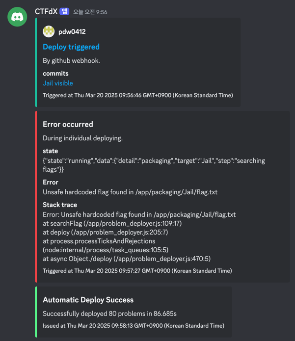
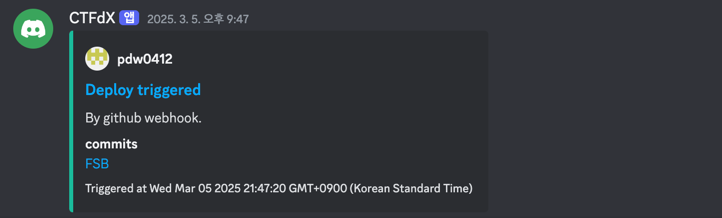
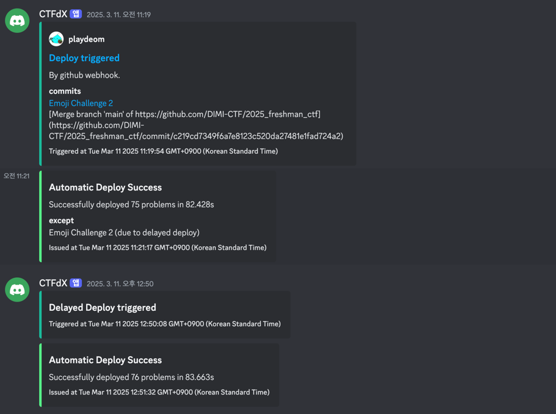
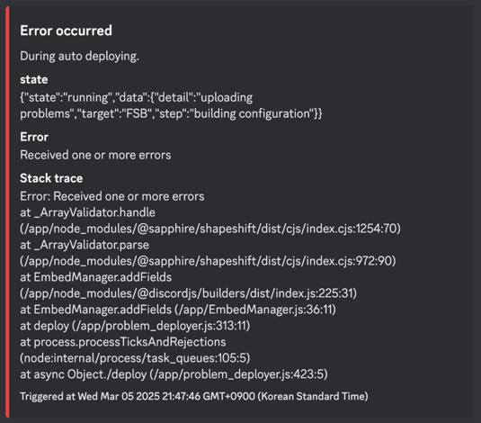
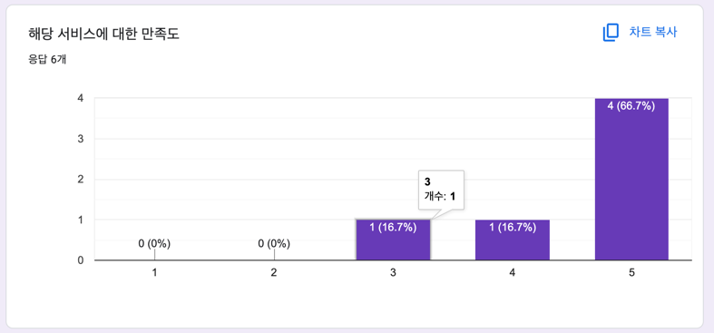
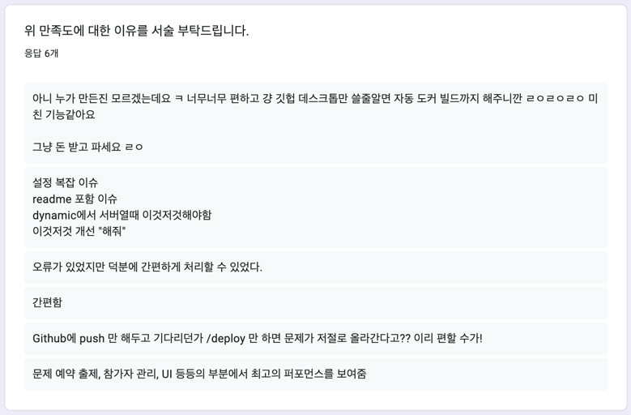

::github{repo="DIMI-CTF/CTFdX"}
:::important
본 글은 2025년도에 한국디지털미디어고등학교의 정보보안 동아리의 신입생 ctf중 테스트되었고,
그에 기반한 실제 데이터를 이용하여 작성되었음을 밝힌다.
:::

# 2025 신입생 dimi-ctf
2025년들어 우리 동아리에서 있었던 가장 큰 이슈는 단연코 신입생을 대상으로한 2025년 제 1회 dimi-ctf였다.
2024년부터 여러 문제를 출제하며 열심히 준비했던 대회인데, 3월달에 가까워지며 ctf 플랫폼에 대하여 고민해야하는 시기가 찾아왔다. 해당 플랫폼을 고르는 것 자체는 어렵지 않았다.
이미 세간에서 많이 쓰고 있는 CTFd라는 플랫폼을 사용할 것이었는데, 여기서 한가지 아이디어가 떠올랐다. 내 생각의 흐름을 더 잘 이해하기 위해 당시의 상황을 알려주자면,
1. 우리는 이번 신입생들과 앞으로 있을 새로운 동아리원들이 많은 문제와 아이디어를 접할 수 있도록 모든 문제를 github에 모아서 보관하기로 하였다.
2. ctfd라는 플랫폼을 사용하기로 했다. 그리고 해당 플랫폼은 api를 사용하기 쉽도록 api-docs가 잘 짜여져이었다.
3. 문제의 자유도를 높이기 위해서, 그리고 풀이자의 편의성을 높이기 위해서 대부분의 문제는 docker를 이용하여 사용자가 문제마다 컨테이너를 생성해서 풀이할 수 있도록 하였다.
4. docker 컨테이너를 사용자별로 생성해주려면, 문제를 생성하고, 문제파일을 서버에 업로드해서 도커를 빌드함과 동시에 ctfd에 문제를 업로드해야했다. 굉장히 불편한 방법이다.
5. 소규모 ctf라서 문제의 수정과 추가가 자주 이루어지는데, 그러면 수정/추가 할때마다 깃허브에도 업로드하고, 서버에도 업로드해서 도커를 빌드해야하고, ctfd에도 문제를 업로드해야한다.

그래서 이러한 불편한 과정을 최소화하기 위해서 어떤 방법이 있을까 모색하다가 개발계쪽에서는 흔해졌다고 할 수 있는 cicd 시스템이 해킹계에는 한번도 적용된 사례를 찾을 수 없다는 사실을 인지하고 바로 ctf용 cicd 서비스 개발에 착수하였다.

:::tip
ctf는 capture the flag의 약자로, 운영진이 여러 해킹 문제를 출제하고, 참가자들은 해당 문제를 해결하고 얻은 flag(일종의 증표)를 플랫폼에 제출하여서 점수를 획득하여 가장 높은 점수순으로 순위가 매겨지는 해킹 대회이다.
:::

&nbsp;

# Deploy Flow
## ctfd 구성 설정
가장 먼저 생각한 것은 당연히 ctfd api였다. api-docs가 있어서 비교적 사용하기 쉬웠지만, api-docs에 없는 엔드포인트와 일부 중요한 엔드포인트에는 payload 형식이 없었다.
그래서 테스트용으로 ctfd 서버를 열어 직접 프론트엔드에서 개발자 도구를 사용하여 엔드포인트와 페이로드 형식을 땄다.

그리고 .env 파일 비슷하게 .ctfdx.cfg 파일을 통하여 유저한테 문제 정보를 간단하게 입력받아, 변환하여 ctfd 서버에 전송하는 방식을 사용하였다.

`.ctfdx.cfg`
```dotenv title=".ctfdx.cfg"
# ctfdx 구성을 이용하기 위한 설정파일 탬플릿 #

#####################################################
#                      배포 설정
#####################################################

# 플래그
FLAG=

# 파일 내용이 공개되면 안되는 파일. 예를들면 flag.txt
# 경로로 입력해줘야함. 예) ./flag.txt
# 쉼표로 구분
REDACTED_FILE=

# 플래그가 그대로 노출되도 되는 파일
# 기본적으로 플래그가 노출되어있는 파일이 있으면 오류를 발생시킴
# 쉼표로 구분
SAFE_FLAG_FILE=

# 플래그가 발견되면 오류내지 말고 [REDACTED]로 바꿀지 말지
# true, false
REPLACE_FLAG=

# 유저에게 문제파일을 제공할지 기본적으로 true
# true, false
POST_FILE_FOR_USER=


#####################################################
#                   CTFd 문제 설정
#####################################################

######## 모두 해당되는 설정 ########

# [standard, container, dynamic]
# standard: 문제풀면 점수주는거
# container: 문제풀때 드림핵 문제처럼 도커 컨테이너가 사용자별로 생성되는거. prototype pollution 같은 문제에 쓰기 좋음. 웹 문제나 포너블 문제는 거의다 이걸로 해야할 듯
# dynamic: 풀면 점수 떨어지는 문제
CHALLENGE_TYPE=

# 카테고리 적으면 됨. 기본적으로 모두 대문자로 통일하자
CHALLENGE_CATEGORY=

# 문제 이름. 공란으로 남겨두면 폴더 이름이 기본적으로 지정됨.
CHALLENGE_NAME=

# 문제 본문. 마크다운 형식임. 만약 문제 폴더 바로 하위에 readme.md 파일이 있으면 거기 안에 있는 내용으로 대체됨.
CHALLENGE_MESSAGE=

# 문제 점수
CHALLENGE_SCORE=

# 문제 난이도. 이거 설정하면 다른 점수 설정 무시됨.
# 하드: 1500점, 미디움: 1000, 이지: 500
# hard, medium, easy
CHALLENGE_DIFFICULTY=

# 보이게? 안보이게
# hidden, visible
CHALLENGE_STATE=

# 이 시간 이후에 공개
# YYYY-MM-DDTHH:ss 형식. 24h 형식.
# 예) 2025-03-05T20:00
DEPLOY_AFTER=


######## container 에 해당되는 설정 ########

# 연결 방식
# web, tcp, ssh
# TCP가 포너블. SSH는 특수한 상황
DOCKER_CONNECT_TYPE=

# 컨테이너 expose 포트
DOCKER_PORT=

# 도커에서 실행할 커맨드. 공란 가능
DOCKER_COMMAND=

# 도커파일이 들어있는 디렉토리 경로 비워두면 최상단 폴더로 자동으로 지정됨. 웬만하면 비워둬도 됨
DOCKER_LOCATION=
```

## 문제 불러오기
github에서 레포를 다운로드하기 위해서 github에서 제공하는 api를 사용했다.
flag까지 포함되어있는 ctf 문제들이기 때문에 당연히 private repo일 것이니, github token도 env로 받아서 가져온다.
```typescript
const githubReq = new RequestHelper("https://api.github.com/repos/DIMI-CTF/2025_freshman_ctf");
if (process.env.GITHUB_TOKEN) githubReq.setBearerAuth(process.env.GITHUB_TOKEN);
// ...
const repo_download_res = await githubReq.get("/zipball", null, path.join(__dirname, "./repo.zip"));
if (!repo_download_res.ok) throw new Error("Cannot download repository.");
```

## 플래그 제거
일단, 굳이 출제자가 for_organization, for_user 파일을 따로 생성하여서 업로드할 필요가 없도록, 깃허브에는 문제 원본을 올리고, cicd 시스템이 따로 유저용을 패키징하도록 했다.

그래서 플래그를 유저에게 노출시키지 않기 위해서, 유저에게 제공되는 파일에는 flag를 제외한다.

`problem_deployer.ts` 中
```typescript
// replace REDACTED files
STATE.data.step = "replacing redacted files";

const redacted = config("REDACTED_FILE", true);
fs.rmSync(path.join(packaging_dir, file, ".ctfdx.cfg"), {recursive: true, force: true});
if (redacted) {
  if (typeof redacted === "string")
    fs.writeFileSync(path.join(packaging_dir, file, redacted), "[REDACTED]");
  else {
    for (let j = 0; j < redacted.length; j++) {
      fs.writeFileSync(path.join(packaging_dir, file, redacted[j]), "[REDACTED]");
    }
  }
}
```

## 플래그 검사
하지만 여기서 문제가 발생한다. 위의 설정 파일에 redacted_file을 실수로 다른 것으로 설정했을때, ctfd 서버에 올라갈 문제 파일을 출제가가 검수할 수 없다. 이 문제를 완화하기 위해서 문제 전체에 대한 플래그 검사 로직을 추가하였다.

`problem_deployer.ts` 中
```typescript
const searchFlag = (dir, flag, safes = [], replace) => {
  // flag = /^.+\{(?<target>.+)}$/.exec(flag).groups.target || flag;

  const safeFiles = Array.isArray(safes) ? safes : safes || [];

  const list = fs.readdirSync(dir);
  for (let i = 0; i < list.length; i++) {
    const item = list[i];
    if (fs.lstatSync(path.join(dir, item)).isDirectory()) { searchFlag(path.join(dir, item), flag, safeFiles, replace); continue; }
    if (safeFiles.find(safe => {
      const withoutSlashStart = safe.startsWith("/") ? safe.slice(1, dir.length) : safe;
      const withoutSlashEnd = withoutSlashStart.endsWith("/") ? withoutSlashStart.slice(0, dir.length - 1) : withoutSlashStart;
      return path.join(dir, item).indexOf(withoutSlashEnd) !== -1
    })) continue;

    const searchEncoding = ["ascii", "utf-8", "utf-16le", "ucs-2", "latin1"];
    for (let j = 0; j < searchEncoding.length; j++) {
      const strings = fs.readFileSync(path.join(dir, item), searchEncoding[j]);
      const normalized_decoded_string = strings.normalize("NFC");
      const normalized_flag = flag.normalize("NFC");
      if (normalized_decoded_string.indexOf(normalized_flag) !== -1) {
        if (replace === "true")
          fs.writeFileSync(path.join(dir, item), strings.replaceAll(flag, "[REDACTED]"));
        else
          throw new Error("Unsafe hardcoded flag found in " + path.join(dir, item));
      }
    }
  }

  return true;
}
```
실제로 이러한 플래그 검사 기능이 작동하여 불상사를 막은 사례가 다수 있었다.


## 문제 등록/수정
ctfd에 문제를 업로드할때, 이미 등록이 되어있다면 해당 문제를 새로 등록하는 것이 아니라, patch를 통하여 수정해야한다.
이미 업로드된 문제를 어떤 문제인지 식별하기 위해서 문제 폴더 이름을 sha256으로 해싱한 값을 문제 tag에 넣어 해당 tag값을 비교하게 하였다. 

`problem_deployer.ts` 中
```typescript
// create or modify challenge
STATE.data.step = "creating/patching problem to ctfd";

let challenge_id = "";
const exists = existing_problems.find((e) => e.tags.find((tag) => tag.value === `ctfdx_${sha256_file}`));
if (exists) {
    challenge_id = exists.id;
    await ctfdReq.patch(`/challenges/${challenge_id}`, register_config);
    const get_flag_res = await ctfdReq.get(`/flags?challenge_id=${challenge_id}`);
    if (get_flag_res.json.data.length === 0) {
      await ctfdReq.post("/flags", {challenge: challenge_id, content: config("FLAG"), data: "", type: "static"});
    } else {
      await ctfdReq.patch(`/flags/${get_flag_res.json.data[0].id}`, {
        challenge: challenge_id,
        content: config("FLAG"),
        data: "",
        type: "static"
      });
    }
    const challenge_tags = (await ctfdReq.get(`/challenges/${challenge_id}/tags`)).json.data;
    challenge_tags.forEach((tag) => {
      ctfdReq.delete(`/tags/${tag.id}`);
    });
    await ctfdReq.post("/tags", {challenge: challenge_id, value: `difficulty: ${difficulty}`});
    await ctfdReq.post("/tags", {challenge: challenge_id, value: `ctfdx_${sha256_file}`});
} else {
    challenge_id = (await ctfdReq.post("/challenges", register_config)).json.data.id;
    await ctfdReq.post("/tags", {challenge: challenge_id, value: `difficulty: ${difficulty}`});
    await ctfdReq.post("/tags", {challenge: challenge_id, value: `ctfdx_${sha256_file}`});
    await ctfdReq.post("/flags", {challenge: challenge_id, content: config("FLAG"), data: "", type: "static"});
}
```

## for_user 파일 업로드
파일을 업로드할떄는 multipart/form-data 형식으로 파일을 전송해야하는데, 직접만든 라이브러리인 webhtools의 RequestHelper에서는 해당 기능을 지원하지 않는다. 곧 지원하게 만들 것인데, 결국 아직은 지원하지 않는다는 의미여서
form-data라는 라이브러리의 힘을 빌렸다.
```typescript
STATE.data.step = "uploading for user file to ctfd";

const challenge_files = (await ctfdReq.get(`/challenges/${challenge_id}/files`)).json.data;
challenge_files.forEach((file) => {
  ctfdReq.delete(`/files/${file.id}`);
});
if ((config("POST_FILE_FOR_USER") || "true") === "true") {
  // req helper not work!
  const formData = new FormData();
  formData.append("type", "challenge");
  formData.append("challenge_id", challenge_id);
  formData.append("file", fs.createReadStream(path.join(for_user_dir, `${file}.zip`)), `${encodeURIComponent(file)}.zip`);
  formData.submit({
    method: "POST",
    headers: {
      "Authorization": `Token ${process.env.CTFD_TOKEN}`,
      ...formData.getHeaders(),
    },
    protocol: process.env.CTFD_URI.split("//")[0],
    host: process.env.CTFD_URI.split("//")[1].split(":")[0],
    port: process.env.CTFD_URI.split("//")[1].split(":")[1],
    path: "/api/v1/files"
  });
}
```

:::note
전체적으로 무언가를 업로드할때는, 상태관리를 위해서 이전에 업로드했던 것들을 삭제한다. 
파일의 경우에는 파일을, 태그에 경우에는 태그를, 플래그의 경우에는 플래그를 삭제한다음에 다시 업로드한다.
:::

# Features
## 문제 업로드 기능
앞에서 다뤘듯, 가장 기본적인 기능이자, 이 프로젝트의 핵심이다. 깃허브에서 문제파일들을 불러와, ctfd에 패키징해서 업로드한다.

## Github Webhook
깃허브 웹훅을 통해 자동으로 배포가 트리거된다. 아직 인증이 적용되지않아 취약하다. 개선 예정이다.

```typescript
const webhookListener = new WebhookListener(3000);
webhookListener.set("/deploy", async (req) => {
  const body = JSON.parse(decodeURIComponent(req.body.toString()).replace("payload=", ""));

  const embed = new EmbedManager();
  embed.setTitle("Deploy triggered");
  embed.setURL(body.compare);
  embed.setAuthor({ name: body.sender.login, iconURL: body.sender.avatar_url, url: body.sender.url });
  embed.setDescription("By github webhook.");
  embed.addFields({ name: "commits", value: body.commits.map((c) => `[${(c.message.replace(/\+/g, ' '))}](${c.url})`).join("\n")});
  embed.setFooter({ text: `Triggered at ${new Date()}` });
  embed.setColor("Aqua");
  await discord_client.channels.cache.get(discord_log_channel).send({ embeds: [embed] });
  try {
    await deploy();
  }catch (e) {
    console.error(e);
    await sendError("automatic", e);

    STATE.state = "error";
    STATE.data.detail = "Error occurred during deploying. Waiting for next deploy.";
    STATE.data.target = null;
    STATE.data.step = null;
  }
  return 200;
});
```


## 난이도별 점수설정
```typescript
const SCORES = {
  init: {
    superhard: 3000,
    hard: 2000,
    medium: 1500,
    easy: 1000,
  },
  low: {
    superhard: 2000,
    hard: 1000,
    medium: 500,
    easy: 100,
  }
}
```
이런식으로 문제 난이도별로 점수를 설정하여 간편하게 사용할 수 있다. 이것에 구애받지 않고 각 .ctfdx.cfg에 직접 점수를 입력할 수도 있다.

## 지연 배포
특정 문제의 배포를 어떤 시간 후로 설정한다. 특정시간에 문제를 공개한다거나 특정 시간 후에 문제를 수정할때 요긴하게 쓰인다.
```dotenv
DEPLOY_AFTER=2025-03-08T18:00
```
```typescript
setInterval(async () => {
  if (STATE.state === "running") return;
  if (deploy_reservation_generated.some(drg => isAfter(drg))) {
    const embed = new EmbedManager();
    embed.setTitle("Delayed Deploy triggered");
    embed.setFooter({ text: `Triggered at ${new Date()}` });
    embed.setColor("Aqua");
    await discord_client.channels.cache.get(discord_log_channel).send({ embeds: [embed] });
    await deploy();
  }
}, 10000);
```


## 도커 자동 빌드
문제가 container 형식이라면 도커파일을 이용해서 자동으로 빌드한다.
```typescript
const debug1 = await new Promise((accept) => {
  child_process.exec(`docker build . -t "${sha256_file}"`, {cwd: config("DOCKER_LOCATION") ? path.join(problem_dir, file, config("DOCKER_LOCATION")) : path.join(problem_dir, file)}, accept);
});
```

## 오류보고
빌드중 오류가 발생하면 해당 오류를 리포트하고 해당 문제를 제외한 다른 문제를 배포한다


# 반응


~~설정이 복잡하다는데... 얼마나 간소화시킨건데!~~\
전체적으로 반응은 좋았다.

# 향후 계획
.ctfdx.cfg의 설정이 부족하다는 피드백과, 더러운 코드 구조를 리팩토링 할 예정이다.

이걸로 논문도 써봐야지 헿.