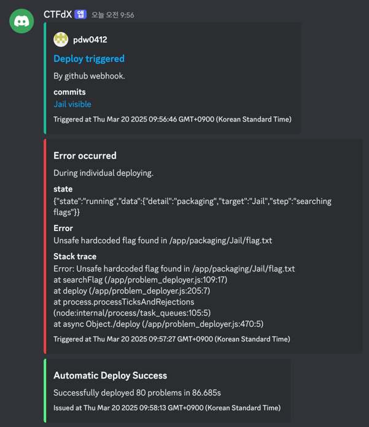
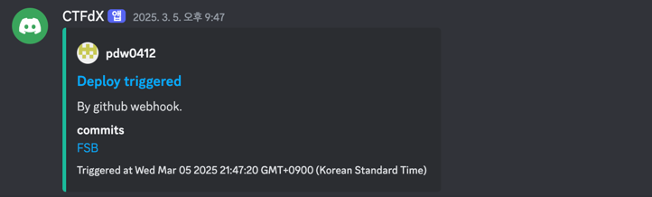
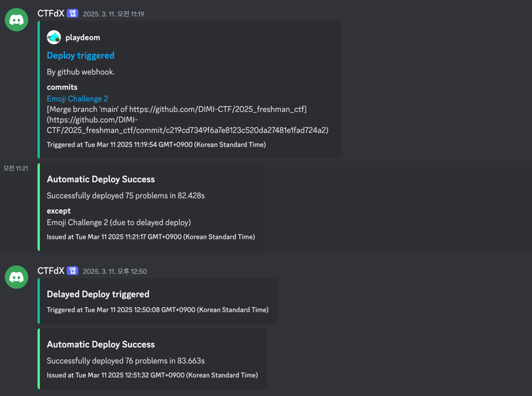
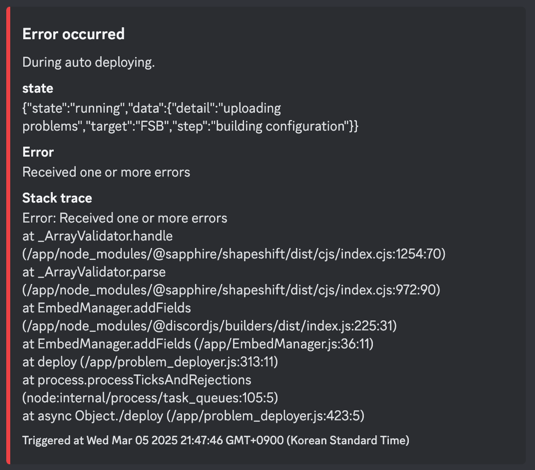
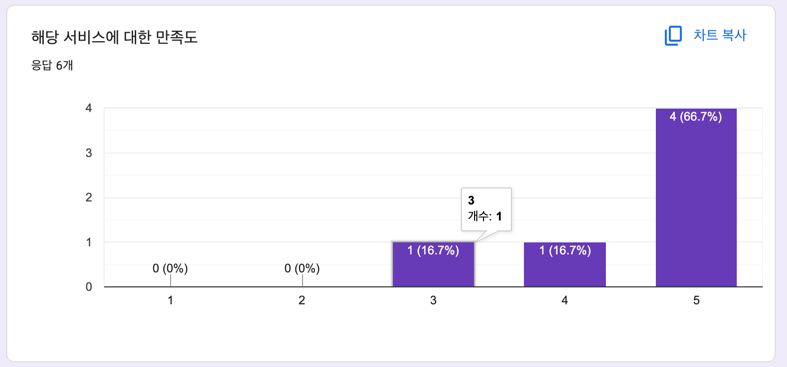
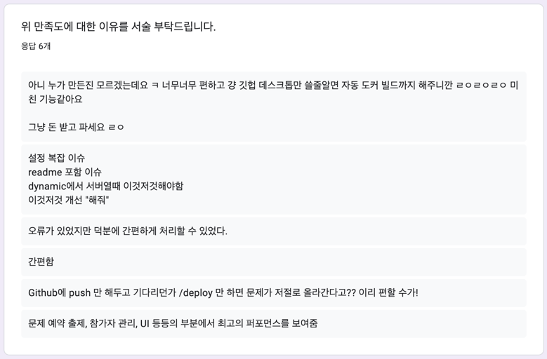

::github{repo="DIMI-CTF/CTFdX"}

:::::locale{lang=ko}
:::important
본 글은 2025년도에 한국디지털미디어고등학교의 정보보안 동아리의 신입생 ctf중 테스트되었고,
그에 기반한 실제 데이터를 이용하여 작성되었음을 밝힌다.
:::
:::::

:::::locale{lang=en}
:::important
Note that this post was written using real data gathered while testing during the 2025 freshman CTF run by the information security club at Korea Digital Media High School.
:::
:::::

:::::locale{lang=ko}
# 2025 신입생 dimi-ctf
:::::

:::::locale{lang=en}
# The 2025 freshman dimi-ctf
:::::

:::::locale{lang=ko}
2025년들어 우리 동아리에서 있었던 가장 큰 이슈는 단연코 신입생을 대상으로한 2025년 제 1회 dimi-ctf였다.
2024년부터 여러 문제를 출제하며 열심히 준비했던 대회인데, 3월달에 가까워지며 ctf 플랫폼에 대하여 고민해야하는 시기가 찾아왔다. 해당 플랫폼을 고르는 것 자체는 어렵지 않았다.
이미 세간에서 많이 쓰고 있는 CTFd라는 플랫폼을 사용할 것이었는데, 여기서 한가지 아이디어가 떠올랐다. 내 생각의 흐름을 더 잘 이해하기 위해 당시의 상황을 알려주자면,
:::::

:::::locale{lang=en}
The biggest thing to happen in our club in 2025 was, without question, the 1st dimi-ctf of 2025, aimed at incoming freshmen.
We'd been preparing hard since 2024, writing many challenges, and as March approached it came time to think about the CTF platform. Choosing the platform itself wasn't hard.
We were going to use CTFd, already widely used out there — and that's where an idea struck. To help you follow my train of thought, here's the situation at the time:
:::::

:::::locale{lang=ko}
1. 우리는 이번 신입생들과 앞으로 있을 새로운 동아리원들이 많은 문제와 아이디어를 접할 수 있도록 모든 문제를 github에 모아서 보관하기로 하였다.
2. ctfd라는 플랫폼을 사용하기로 했다. 그리고 해당 플랫폼은 api를 사용하기 쉽도록 api-docs가 잘 짜여져이었다.
3. 문제의 자유도를 높이기 위해서, 그리고 풀이자의 편의성을 높이기 위해서 대부분의 문제는 docker를 이용하여 사용자가 문제마다 컨테이너를 생성해서 풀이할 수 있도록 하였다.
4. docker 컨테이너를 사용자별로 생성해주려면, 문제를 생성하고, 문제파일을 서버에 업로드해서 도커를 빌드함과 동시에 ctfd에 문제를 업로드해야했다. 굉장히 불편한 방법이다.
5. 소규모 ctf라서 문제의 수정과 추가가 자주 이루어지는데, 그러면 수정/추가 할때마다 깃허브에도 업로드하고, 서버에도 업로드해서 도커를 빌드해야하고, ctfd에도 문제를 업로드해야한다.
:::::

:::::locale{lang=en}
1. We decided to collect and store every challenge on GitHub so that this year's freshmen and future club members could be exposed to lots of problems and ideas.
2. We decided to use the CTFd platform. And that platform had well-written API docs making the API easy to use.
3. To give challenges more freedom and to make life easier for solvers, most challenges used Docker so that a container is spun up per user per challenge.
4. To create Docker containers per user, you had to create the challenge, upload the challenge files to the server and build the Docker image, and upload the challenge to CTFd — all at once. A very inconvenient process.
5. Being a small CTF, challenges get edited and added frequently, which means every edit/addition requires uploading to GitHub, uploading to the server and building Docker, *and* uploading the challenge to CTFd.
:::::

:::::locale{lang=ko}
그래서 이러한 불편한 과정을 최소화하기 위해서 어떤 방법이 있을까 모색하다가 개발계쪽에서는 흔해졌다고 할 수 있는 cicd 시스템이 해킹계에는 한번도 적용된 사례를 찾을 수 없다는 사실을 인지하고 바로 ctf용 cicd 서비스 개발에 착수하였다.
:::::

:::::locale{lang=en}
So while looking for ways to minimize this inconvenient process, I realized that CI/CD — which you could call commonplace in the development world — had no precedent of being applied in the hacking world, and I immediately set about building a CI/CD service for CTFs.
:::::

:::::locale{lang=ko}
:::tip
ctf는 capture the flag의 약자로, 운영진이 여러 해킹 문제를 출제하고, 참가자들은 해당 문제를 해결하고 얻은 flag(일종의 증표)를 플랫폼에 제출하여서 점수를 획득하여 가장 높은 점수순으로 순위가 매겨지는 해킹 대회이다.
:::
:::::

:::::locale{lang=en}
:::tip
CTF stands for capture the flag — a hacking competition where organizers author various hacking challenges, and participants solve them and submit the flag (a kind of proof) they obtain to the platform to earn points, with rankings ordered by highest score.
:::
:::::

&nbsp;

# Deploy Flow

:::::locale{lang=ko}
## ctfd 구성 설정
:::::

:::::locale{lang=en}
## Configuring CTFd
:::::

:::::locale{lang=ko}
가장 먼저 생각한 것은 당연히 ctfd api였다. api-docs가 있어서 비교적 사용하기 쉬웠지만, api-docs에 없는 엔드포인트와 일부 중요한 엔드포인트에는 payload 형식이 없었다.
그래서 테스트용으로 ctfd 서버를 열어 직접 프론트엔드에서 개발자 도구를 사용하여 엔드포인트와 페이로드 형식을 땄다.
:::::

:::::locale{lang=en}
The first thing I thought of was, naturally, the CTFd API. The API docs made it relatively easy to use, but some endpoints were missing from the docs, and some important endpoints had no payload format documented.
So I stood up a CTFd server for testing and pulled the endpoints and payload formats straight out of the frontend using devtools.
:::::

:::::locale{lang=ko}
그리고 .env 파일 비슷하게 .ctfdx.cfg 파일을 통하여 유저한테 문제 정보를 간단하게 입력받아, 변환하여 ctfd 서버에 전송하는 방식을 사용하였다.
:::::

:::::locale{lang=en}
Then, similar to a .env file, I used a .ctfdx.cfg file to take simple challenge information from the user, convert it, and send it to the CTFd server.
:::::

`.ctfdx.cfg`

:::::locale{lang=ko}
```dotenv title=".ctfdx.cfg"
# ctfdx 구성을 이용하기 위한 설정파일 탬플릿 #

#####################################################
#                      배포 설정
#####################################################

# 플래그
FLAG=

# 파일 내용이 공개되면 안되는 파일. 예를들면 flag.txt
# 경로로 입력해줘야함. 예) ./flag.txt
# 쉼표로 구분
REDACTED_FILE=

# 플래그가 그대로 노출되도 되는 파일
# 기본적으로 플래그가 노출되어있는 파일이 있으면 오류를 발생시킴
# 쉼표로 구분
SAFE_FLAG_FILE=

# 플래그가 발견되면 오류내지 말고 [REDACTED]로 바꿀지 말지
# true, false
REPLACE_FLAG=

# 유저에게 문제파일을 제공할지 기본적으로 true
# true, false
POST_FILE_FOR_USER=


#####################################################
#                   CTFd 문제 설정
#####################################################

######## 모두 해당되는 설정 ########

# [standard, container, dynamic]
# standard: 문제풀면 점수주는거
# container: 문제풀때 드림핵 문제처럼 도커 컨테이너가 사용자별로 생성되는거. prototype pollution 같은 문제에 쓰기 좋음. 웹 문제나 포너블 문제는 거의다 이걸로 해야할 듯
# dynamic: 풀면 점수 떨어지는 문제
CHALLENGE_TYPE=

# 카테고리 적으면 됨. 기본적으로 모두 대문자로 통일하자
CHALLENGE_CATEGORY=

# 문제 이름. 공란으로 남겨두면 폴더 이름이 기본적으로 지정됨.
CHALLENGE_NAME=

# 문제 본문. 마크다운 형식임. 만약 문제 폴더 바로 하위에 readme.md 파일이 있으면 거기 안에 있는 내용으로 대체됨.
CHALLENGE_MESSAGE=

# 문제 점수
CHALLENGE_SCORE=

# 문제 난이도. 이거 설정하면 다른 점수 설정 무시됨.
# 하드: 1500점, 미디움: 1000, 이지: 500
# hard, medium, easy
CHALLENGE_DIFFICULTY=

# 보이게? 안보이게
# hidden, visible
CHALLENGE_STATE=

# 이 시간 이후에 공개
# YYYY-MM-DDTHH:ss 형식. 24h 형식.
# 예) 2025-03-05T20:00
DEPLOY_AFTER=


######## container 에 해당되는 설정 ########

# 연결 방식
# web, tcp, ssh
# TCP가 포너블. SSH는 특수한 상황
DOCKER_CONNECT_TYPE=

# 컨테이너 expose 포트
DOCKER_PORT=

# 도커에서 실행할 커맨드. 공란 가능
DOCKER_COMMAND=

# 도커파일이 들어있는 디렉토리 경로 비워두면 최상단 폴더로 자동으로 지정됨. 웬만하면 비워둬도 됨
DOCKER_LOCATION=
```
:::::

:::::locale{lang=en}
```dotenv title=".ctfdx.cfg"
# Config file template for using a ctfdx setup #

#####################################################
#                  Deploy settings
#####################################################

# The flag
FLAG=

# Files whose contents must not be made public. For example flag.txt
# Must be given as a path. e.g. ./flag.txt
# Comma separated
REDACTED_FILE=

# Files where the flag may be exposed as-is
# By default, any file with an exposed flag raises an error
# Comma separated
SAFE_FLAG_FILE=

# Whether to replace a found flag with [REDACTED] instead of erroring
# true, false
REPLACE_FLAG=

# Whether to give challenge files to users; true by default
# true, false
POST_FILE_FOR_USER=


#####################################################
#                CTFd challenge settings
#####################################################

######## Settings that apply to all ########

# [standard, container, dynamic]
# standard: awards points when solved
# container: spins up a per-user Docker container while solving, like a Dreamhack challenge. Good for things like prototype pollution. Web and pwnable challenges should pretty much all use this
# dynamic: score decreases as people solve it
CHALLENGE_TYPE=

# Just write the category. Keep them all uppercase by convention
CHALLENGE_CATEGORY=

# Challenge name. Leave blank and the folder name is used by default.
CHALLENGE_NAME=

# Challenge body, in markdown. If a readme.md sits directly inside the challenge folder, its contents replace this.
CHALLENGE_MESSAGE=

# Challenge score
CHALLENGE_SCORE=

# Challenge difficulty. Setting this overrides the other score settings.
# hard: 1500 pts, medium: 1000, easy: 500
# hard, medium, easy
CHALLENGE_DIFFICULTY=

# Visible? Hidden?
# hidden, visible
CHALLENGE_STATE=

# Publish after this time
# YYYY-MM-DDTHH:ss format. 24h format.
# e.g. 2025-03-05T20:00
DEPLOY_AFTER=


######## Settings that apply to container ########

# Connection type
# web, tcp, ssh
# TCP is for pwnables. SSH is for special cases
DOCKER_CONNECT_TYPE=

# Container exposed port
DOCKER_PORT=

# Command to run in Docker. May be left blank
DOCKER_COMMAND=

# Path to the directory containing the Dockerfile; leave empty and the top-level folder is used automatically. Usually fine to leave empty
DOCKER_LOCATION=
```
:::::

:::::locale{lang=ko}
## 문제 불러오기
:::::

:::::locale{lang=en}
## Fetching the challenges
:::::

:::::locale{lang=ko}
github에서 레포를 다운로드하기 위해서 github에서 제공하는 api를 사용했다.
flag까지 포함되어있는 ctf 문제들이기 때문에 당연히 private repo일 것이니, github token도 env로 받아서 가져온다.
:::::

:::::locale{lang=en}
I used GitHub's API to download the repository.
Since these are CTF challenges including the flags, the repo is obviously private, so a GitHub token is taken from the environment as well.
:::::

```typescript
const githubReq = new RequestHelper("https://api.github.com/repos/DIMI-CTF/2025_freshman_ctf");
if (process.env.GITHUB_TOKEN) githubReq.setBearerAuth(process.env.GITHUB_TOKEN);
// ...
const repo_download_res = await githubReq.get("/zipball", null, path.join(__dirname, "./repo.zip"));
if (!repo_download_res.ok) throw new Error("Cannot download repository.");
```

:::::locale{lang=ko}
## 플래그 제거
:::::

:::::locale{lang=en}
## Stripping the flag
:::::

:::::locale{lang=ko}
일단, 굳이 출제자가 for_organization, for_user 파일을 따로 생성하여서 업로드할 필요가 없도록, 깃허브에는 문제 원본을 올리고, cicd 시스템이 따로 유저용을 패키징하도록 했다.
:::::

:::::locale{lang=en}
First, so that authors don't have to create and upload separate for_organization and for_user files, the original challenge goes to GitHub and the CI/CD system packages the user-facing version itself.
:::::

:::::locale{lang=ko}
그래서 플래그를 유저에게 노출시키지 않기 위해서, 유저에게 제공되는 파일에는 flag를 제외한다.
:::::

:::::locale{lang=en}
So, to avoid exposing the flag to users, the flag is excluded from the files given to them.
:::::

:::::locale{lang=ko}
`problem_deployer.ts` 中
:::::

:::::locale{lang=en}
From `problem_deployer.ts`:
:::::

```typescript
// replace REDACTED files
STATE.data.step = "replacing redacted files";

const redacted = config("REDACTED_FILE", true);
fs.rmSync(path.join(packaging_dir, file, ".ctfdx.cfg"), {recursive: true, force: true});
if (redacted) {
  if (typeof redacted === "string")
    fs.writeFileSync(path.join(packaging_dir, file, redacted), "[REDACTED]");
  else {
    for (let j = 0; j < redacted.length; j++) {
      fs.writeFileSync(path.join(packaging_dir, file, redacted[j]), "[REDACTED]");
    }
  }
}
```

:::::locale{lang=ko}
## 플래그 검사
:::::

:::::locale{lang=en}
## Flag scanning
:::::

:::::locale{lang=ko}
하지만 여기서 문제가 발생한다. 위의 설정 파일에 redacted_file을 실수로 다른 것으로 설정했을때, ctfd 서버에 올라갈 문제 파일을 출제가가 검수할 수 없다. 이 문제를 완화하기 위해서 문제 전체에 대한 플래그 검사 로직을 추가하였다.
:::::

:::::locale{lang=en}
But there's a problem here. If the author mistakenly points redacted_file at the wrong thing in the config above, they can't review the challenge files that will be uploaded to the CTFd server. To mitigate this, I added flag-scanning logic across the whole challenge.
:::::

:::::locale{lang=ko}
`problem_deployer.ts` 中
:::::

:::::locale{lang=en}
From `problem_deployer.ts`:
:::::

```typescript
const searchFlag = (dir, flag, safes = [], replace) => {
  // flag = /^.+\{(?<target>.+)}$/.exec(flag).groups.target || flag;

  const safeFiles = Array.isArray(safes) ? safes : safes || [];

  const list = fs.readdirSync(dir);
  for (let i = 0; i < list.length; i++) {
    const item = list[i];
    if (fs.lstatSync(path.join(dir, item)).isDirectory()) { searchFlag(path.join(dir, item), flag, safeFiles, replace); continue; }
    if (safeFiles.find(safe => {
      const withoutSlashStart = safe.startsWith("/") ? safe.slice(1, dir.length) : safe;
      const withoutSlashEnd = withoutSlashStart.endsWith("/") ? withoutSlashStart.slice(0, dir.length - 1) : withoutSlashStart;
      return path.join(dir, item).indexOf(withoutSlashEnd) !== -1
    })) continue;

    const searchEncoding = ["ascii", "utf-8", "utf-16le", "ucs-2", "latin1"];
    for (let j = 0; j < searchEncoding.length; j++) {
      const strings = fs.readFileSync(path.join(dir, item), searchEncoding[j]);
      const normalized_decoded_string = strings.normalize("NFC");
      const normalized_flag = flag.normalize("NFC");
      if (normalized_decoded_string.indexOf(normalized_flag) !== -1) {
        if (replace === "true")
          fs.writeFileSync(path.join(dir, item), strings.replaceAll(flag, "[REDACTED]"));
        else
          throw new Error("Unsafe hardcoded flag found in " + path.join(dir, item));
      }
    }
  }

  return true;
}
```

:::::locale{lang=ko}
실제로 이러한 플래그 검사 기능이 작동하여 불상사를 막은 사례가 다수 있었다.
:::::

:::::locale{lang=en}
There were in fact several cases where this flag-scanning feature fired and prevented a disaster.
:::::



:::::locale{lang=ko}
## 문제 등록/수정
:::::

:::::locale{lang=en}
## Creating/updating challenges
:::::

:::::locale{lang=ko}
ctfd에 문제를 업로드할때, 이미 등록이 되어있다면 해당 문제를 새로 등록하는 것이 아니라, patch를 통하여 수정해야한다.
이미 업로드된 문제를 어떤 문제인지 식별하기 위해서 문제 폴더 이름을 sha256으로 해싱한 값을 문제 tag에 넣어 해당 tag값을 비교하게 하였다. 
:::::

:::::locale{lang=en}
When uploading a challenge to CTFd, if it's already registered you must update it via PATCH rather than creating it anew.
To identify which challenge an already-uploaded one is, I put the SHA-256 hash of the challenge folder name into a challenge tag and compare against that tag value.
:::::

:::::locale{lang=ko}
`problem_deployer.ts` 中
:::::

:::::locale{lang=en}
From `problem_deployer.ts`:
:::::

```typescript
// create or modify challenge
STATE.data.step = "creating/patching problem to ctfd";

let challenge_id = "";
const exists = existing_problems.find((e) => e.tags.find((tag) => tag.value === `ctfdx_${sha256_file}`));
if (exists) {
    challenge_id = exists.id;
    await ctfdReq.patch(`/challenges/${challenge_id}`, register_config);
    const get_flag_res = await ctfdReq.get(`/flags?challenge_id=${challenge_id}`);
    if (get_flag_res.json.data.length === 0) {
      await ctfdReq.post("/flags", {challenge: challenge_id, content: config("FLAG"), data: "", type: "static"});
    } else {
      await ctfdReq.patch(`/flags/${get_flag_res.json.data[0].id}`, {
        challenge: challenge_id,
        content: config("FLAG"),
        data: "",
        type: "static"
      });
    }
    const challenge_tags = (await ctfdReq.get(`/challenges/${challenge_id}/tags`)).json.data;
    challenge_tags.forEach((tag) => {
      ctfdReq.delete(`/tags/${tag.id}`);
    });
    await ctfdReq.post("/tags", {challenge: challenge_id, value: `difficulty: ${difficulty}`});
    await ctfdReq.post("/tags", {challenge: challenge_id, value: `ctfdx_${sha256_file}`});
} else {
    challenge_id = (await ctfdReq.post("/challenges", register_config)).json.data.id;
    await ctfdReq.post("/tags", {challenge: challenge_id, value: `difficulty: ${difficulty}`});
    await ctfdReq.post("/tags", {challenge: challenge_id, value: `ctfdx_${sha256_file}`});
    await ctfdReq.post("/flags", {challenge: challenge_id, content: config("FLAG"), data: "", type: "static"});
}
```

:::::locale{lang=ko}
## for_user 파일 업로드
:::::

:::::locale{lang=en}
## Uploading the for_user files
:::::

:::::locale{lang=ko}
파일을 업로드할떄는 multipart/form-data 형식으로 파일을 전송해야하는데, 직접만든 라이브러리인 webhtools의 RequestHelper에서는 해당 기능을 지원하지 않는다. 곧 지원하게 만들 것인데, 결국 아직은 지원하지 않는다는 의미여서
form-data라는 라이브러리의 힘을 빌렸다.
:::::

:::::locale{lang=en}
Uploading a file requires sending it as multipart/form-data, but RequestHelper in webhtools — a library I wrote myself — doesn't support that. I'll add support soon, but for now it doesn't, so
I borrowed the power of the form-data library.
:::::

```typescript
STATE.data.step = "uploading for user file to ctfd";

const challenge_files = (await ctfdReq.get(`/challenges/${challenge_id}/files`)).json.data;
challenge_files.forEach((file) => {
  ctfdReq.delete(`/files/${file.id}`);
});
if ((config("POST_FILE_FOR_USER") || "true") === "true") {
  // req helper not work!
  const formData = new FormData();
  formData.append("type", "challenge");
  formData.append("challenge_id", challenge_id);
  formData.append("file", fs.createReadStream(path.join(for_user_dir, `${file}.zip`)), `${encodeURIComponent(file)}.zip`);
  formData.submit({
    method: "POST",
    headers: {
      "Authorization": `Token ${process.env.CTFD_TOKEN}`,
      ...formData.getHeaders(),
    },
    protocol: process.env.CTFD_URI.split("//")[0],
    host: process.env.CTFD_URI.split("//")[1].split(":")[0],
    port: process.env.CTFD_URI.split("//")[1].split(":")[1],
    path: "/api/v1/files"
  });
}
```

:::::locale{lang=ko}
:::note
전체적으로 무언가를 업로드할때는, 상태관리를 위해서 이전에 업로드했던 것들을 삭제한다. 
파일의 경우에는 파일을, 태그에 경우에는 태그를, 플래그의 경우에는 플래그를 삭제한다음에 다시 업로드한다.
:::
:::::

:::::locale{lang=en}
:::note
Across the board, whenever something is uploaded, previously uploaded items are deleted for state management.
For files, delete the files; for tags, the tags; for flags, the flags — then re-upload.
:::
:::::

# Features

:::::locale{lang=ko}
## 문제 업로드 기능
:::::

:::::locale{lang=en}
## Challenge upload
:::::

:::::locale{lang=ko}
앞에서 다뤘듯, 가장 기본적인 기능이자, 이 프로젝트의 핵심이다. 깃허브에서 문제파일들을 불러와, ctfd에 패키징해서 업로드한다.
:::::

:::::locale{lang=en}
As covered above, this is the most basic feature and the core of the project. It pulls challenge files from GitHub, packages them, and uploads them to CTFd.
:::::

## Github Webhook

:::::locale{lang=ko}
깃허브 웹훅을 통해 자동으로 배포가 트리거된다. 아직 인증이 적용되지않아 취약하다. 개선 예정이다.
:::::

:::::locale{lang=en}
Deployment is triggered automatically via a GitHub webhook. Authentication isn't applied yet, so it's vulnerable. To be improved.
:::::

```typescript
const webhookListener = new WebhookListener(3000);
webhookListener.set("/deploy", async (req) => {
  const body = JSON.parse(decodeURIComponent(req.body.toString()).replace("payload=", ""));

  const embed = new EmbedManager();
  embed.setTitle("Deploy triggered");
  embed.setURL(body.compare);
  embed.setAuthor({ name: body.sender.login, iconURL: body.sender.avatar_url, url: body.sender.url });
  embed.setDescription("By github webhook.");
  embed.addFields({ name: "commits", value: body.commits.map((c) => `[${(c.message.replace(/\+/g, ' '))}](${c.url})`).join("\n")});
  embed.setFooter({ text: `Triggered at ${new Date()}` });
  embed.setColor("Aqua");
  await discord_client.channels.cache.get(discord_log_channel).send({ embeds: [embed] });
  try {
    await deploy();
  }catch (e) {
    console.error(e);
    await sendError("automatic", e);

    STATE.state = "error";
    STATE.data.detail = "Error occurred during deploying. Waiting for next deploy.";
    STATE.data.target = null;
    STATE.data.step = null;
  }
  return 200;
});
```


:::::locale{lang=ko}
## 난이도별 점수설정
:::::

:::::locale{lang=en}
## Scores by difficulty
:::::

```typescript
const SCORES = {
  init: {
    superhard: 3000,
    hard: 2000,
    medium: 1500,
    easy: 1000,
  },
  low: {
    superhard: 2000,
    hard: 1000,
    medium: 500,
    easy: 100,
  }
}
```

:::::locale{lang=ko}
이런식으로 문제 난이도별로 점수를 설정하여 간편하게 사용할 수 있다. 이것에 구애받지 않고 각 .ctfdx.cfg에 직접 점수를 입력할 수도 있다.
:::::

:::::locale{lang=en}
Like this, scores can be set per difficulty for convenience. You can also ignore this entirely and enter a score directly in each .ctfdx.cfg.
:::::

:::::locale{lang=ko}
## 지연 배포
:::::

:::::locale{lang=en}
## Delayed deployment
:::::

:::::locale{lang=ko}
특정 문제의 배포를 어떤 시간 후로 설정한다. 특정시간에 문제를 공개한다거나 특정 시간 후에 문제를 수정할때 요긴하게 쓰인다.
:::::

:::::locale{lang=en}
Sets a given challenge to deploy after a certain time. Handy when publishing a challenge at a specific time, or editing one after a specific time.
:::::

```dotenv
DEPLOY_AFTER=2025-03-08T18:00
```
```typescript
setInterval(async () => {
  if (STATE.state === "running") return;
  if (deploy_reservation_generated.some(drg => isAfter(drg))) {
    const embed = new EmbedManager();
    embed.setTitle("Delayed Deploy triggered");
    embed.setFooter({ text: `Triggered at ${new Date()}` });
    embed.setColor("Aqua");
    await discord_client.channels.cache.get(discord_log_channel).send({ embeds: [embed] });
    await deploy();
  }
}, 10000);
```


:::::locale{lang=ko}
## 도커 자동 빌드
:::::

:::::locale{lang=en}
## Automatic Docker builds
:::::

:::::locale{lang=ko}
문제가 container 형식이라면 도커파일을 이용해서 자동으로 빌드한다.
:::::

:::::locale{lang=en}
If the challenge is the container type, it builds automatically using the Dockerfile.
:::::

```typescript
const debug1 = await new Promise((accept) => {
  child_process.exec(`docker build . -t "${sha256_file}"`, {cwd: config("DOCKER_LOCATION") ? path.join(problem_dir, file, config("DOCKER_LOCATION")) : path.join(problem_dir, file)}, accept);
});
```

:::::locale{lang=ko}
## 오류보고
:::::

:::::locale{lang=en}
## Error reporting
:::::

:::::locale{lang=ko}
빌드중 오류가 발생하면 해당 오류를 리포트하고 해당 문제를 제외한 다른 문제를 배포한다
:::::

:::::locale{lang=en}
If an error occurs during a build, it reports the error and deploys the other challenges, excluding that one.
:::::



:::::locale{lang=ko}
# 반응
:::::

:::::locale{lang=en}
# Reception
:::::




:::::locale{lang=ko}
~~설정이 복잡하다는데... 얼마나 간소화시킨건데!~~\
전체적으로 반응은 좋았다.
:::::

:::::locale{lang=en}
~~They say the configuration is complicated... do you know how much I simplified it!~~\
Overall the reception was good.
:::::

:::::locale{lang=ko}
# 향후 계획
:::::

:::::locale{lang=en}
# Future plans
:::::

:::::locale{lang=ko}
.ctfdx.cfg의 설정이 부족하다는 피드백과, 더러운 코드 구조를 리팩토링 할 예정이다.
:::::

:::::locale{lang=en}
I plan to act on feedback that .ctfdx.cfg lacks options, and to refactor the messy code structure.
:::::

:::::locale{lang=ko}
이걸로 논문도 써봐야지 헿.
:::::

:::::locale{lang=en}
I should write a paper on this too, hehe.
:::::
