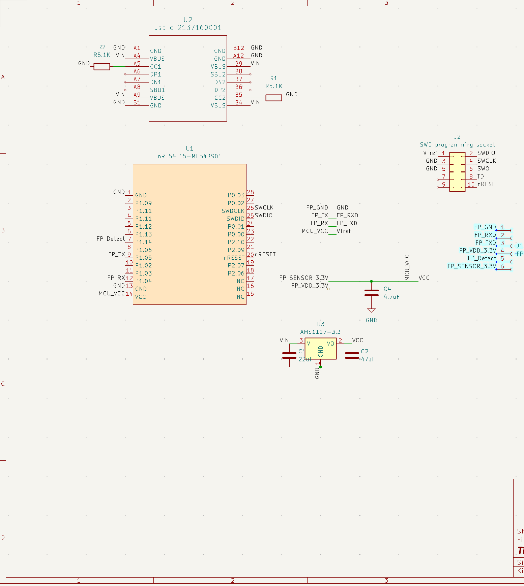
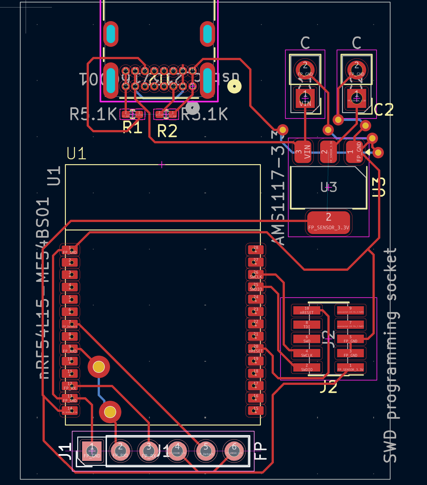

# 발단
2026학년도부터 초·중등교육법 제20조의5에 근거해서 교내에서 스마트폰을 못 쓰게 됐다.

문제는 우리 학교 매점 결제가 DIMIPAY로 돌아간다는 거다. 앱으로 QR 띄워서 찍는 구조인데 폰이 없으면 결제 자체가 성립을 안 한다.
그래서 폰 없이도 본인을 증명할 수단이 필요했고, 그게 지문이었다.

결론부터 말하면 결국 만들어서 매점에 배포했다. 2026년 5월 한 달 동안 전체 결제 7,454건 중 3,199건, 그러니까 43%정도가 지문으로 이루어졌다.

[시연 영상](https://www.youtube.com/watch?v=HWvwYAcl2mI&t=73)  <- 이게 바로 후킹입니다.

# 제약이 좀 많았다
취미 프로젝트면 대충 만들고 끝인데 이건 실제 학생 생체정보를 다루는 시스템이다. 조건이 여러 겹으로 붙었다.

키오스크가 iPad다. MFi 인증 없이는 유선으로 액세서리를 못 붙인다. 그러니까 열려있는 API인 BLE로만 통신해야 한다.
그리고 센서가 직접 사용자를 인증하면 안 된다. 이미지를 서버로 보내서 서버가 인증해야 한다. 센서 안에 지문 DB가 들어가는 순간 관리가 불가능해지니까.

법 쪽도 걸린다. 개인정보보호법 제21조에 따라 목적이 달성돼서 개인정보가 불필요해지면 파기해야 하고, 제29조에 따라 내부 관리계획 수립이랑 접속기록 보관 같은 기술적·관리적·물리적 조치를 해야 한다.
거기에 개인정보보호위원회 생체정보 보호 가이드라인이 원본이 아닌 미뉴티아 추출 후 저장, 그리고 전송구간 암호화를 요구한다.

**그리고 2초 안에 인증이 되어야한다**

# 센서 고르기
필요한 조건은 이랬다. USB를 쓸 거면 프로토콜이 공개된 센서일 것, 아니면 UART / I2C / SPI 같은 평범한 MCU 인터페이스를 지원할 것.
그리고 유사도 Threshold를 높게 잡아도 인증이 되려면 유효면적이 넓어야 한다.

찾다가 두 개를 골랐다.

| 제품 | 인터페이스 | 유효 캡쳐면적 | 역할 |
|---|---|---|---|
| HI-LINK ZW0608 | UART | 12.05×12.05mm² | 결제용. MCU에 직결 |
| ZKTeco LIVE20R | USB 2.0 | 15.24×20.32mm² | 등록용 |

사실 ZKTeco 하나로 다 하고 싶었다. 면적도 넓고 이미지도 좋다. 근데 USB 프로토콜을 공개 안 하고 Windows / Android / Linux SDK로만 준다.

그래서 Wireshark로 USB 패킷 떠서 [프로토콜을 리버싱](https://github.com/yeonfish6040/zkfinger_sdk)해봤는데 안정성이 영 안 나와서 파기했다.
결국 RaspberryPi에 Android 기반 LineageOS를 올려서 벤더 SDK를 그대로 돌리고, 이걸 등록 전용 키오스크로 쓰기로 했다. 등록은 한 번만 하면 되니까 좀 느려도 된다.

큰 이미지로 템플릿을 만들어두면 작은 국소 이미지로도 매칭 스코어가 잘 나올 거라는 계산이었다.

# 매칭 알고리즘
신뢰성이 검증됐을 것, 템플릿 추출이 될 것, 매칭이 빠를 것. 이 세 개를 놓고 두 개를 봤다.

## NFIS
FBI가 쓴다고 알려진 그거다. C로 짜여있어서 매우 빠르고 템플릿 저장도 된다.

근데 직접 빌드해야 하는데 레거시라서 빌드 에러가 산더미였다. 코드량이 너무 많아서 직접 고치는 건 포기하고 도커로 옛날 환경을 만들어서 겨우 빌드해 테스트했다.

그리고 탈락했다. 지원하는 최소 이미지 크기가 ZW0608이 주는 이미지보다 컸다. 애초에 쓸 수가 없는 물건이었다.

## SourceAFIS
Score 조정으로 FAR를 근사치로 직접 조절할 수 있고, 템플릿도 따로 저장되고, 매칭 시간도 굉장히 짧다. 구상 중인 프로젝트에 이상적이었다.

근데 공식 구현체가 Java랑 .NET뿐이다. 우리 백엔드는 Bun 런타임이다.

JS로 포팅하는 것도 생각해봤는데 깡 연산이 JVM보다 느린데다 포팅에 드는 시간과 노력이 너무 컸다.
그래서 그냥 Java 웹서버를 하나 더 띄워서 내부망에서만 접근 가능하게 하는 걸로 갈음했다. 지문 비교/등록/삭제를 지원하는 서버를 만들어서 내부망에 배포했다.

## 캐싱
최적화라고 부르기엔 좀 민망하긴 한데, 지문 템플릿은 DB에 있어야 하고 그렇다고 매 조회마다 DB에 쿼리를 날려서 전부 비교할 수는 없다.

그래서 웹서버 기동할 때 지문 데이터를 전량 조회해서 user id 따로, 미뉴티아 따로 메모리에 올려두고 그 캐시에서 매칭한다.

문제는 런타임에 등록/삭제가 들어올 때다. 순서를 잘못 잡으면 캐시가 DB보다 앞서가버린다.

```text title="런타임 갱신"
등록/삭제 요청
      │
      ▼
 DB 트랜잭션 수행
      │
      ▼
  커밋 성공?
   │      │
  Yes     No
   │      │
   ▼      ▼
캐시 Lock 후   Rollback
등록/삭제 반영  캐시 변경 없음
```

캐시 반영은 무조건 DB 커밋 이후에만 일어난다.

# V1 하드웨어



BLE가 필수니까 BLE integrated MCU를 쓰는 게 맞다고 봤고, 마침 그때 배우고 있던 nRF54L15를 골랐다.

근데 보드를 처음부터 설계할 시간이 없었다. 3학년 1학기 개학이 2주도 안 남았는데 교내 인트라넷 개발 마감이 최우선순위였다.
그래서 MINEWSEMI의 nRF54L15-ME54BS01 모듈을 얹어서 설계했다. RF는 모듈이 알아서 해주니까.

```text title="통신 구조"
SourceAFIS ──Internal HTTP── Core Backend
                                  │
                                HTTPS
                                  │
                                iPad
                                  │
                           BLE (encrypted)
                                  │
                             nRF54L15 ──UART── ZW-0608
```

흐름은 이렇다. ZW-0608의 손가락 인터럽트 라인을 nRF54L15가 구독하고 있다가 인터럽트가 뜨면 iPad 키오스크 앱에 알린다.
키오스크가 마침 상품 결제 단계면 컨트롤러의 지문결제 함수를 호출한다.
그럼 이미지 전송 요청이 내려가고, MCU가 ZW-0608에 capture를 때린 다음 센서 버퍼의 이미지를 UART로 받아온다.
그걸 다시 BLE로 iPad에 넘기고, iPad가 서버로 쏘면 서버가 신원을 확인한다.

깔끔하다. 동작도 했다. 문제는 속도였다.

# 그리고 5.8초
평균 인증 시간이 5.8초 나왔다. 요구조건이 2초인데.

시간을 세세히 분해해봤다.

```text title="V1 인증 시간 (평균 5.8초)"
├────────── 3.8s ──────────┼── 1.0s ──┼─ 0.7s ─┼0.3s┤
       센서 → MCU            MCU→iPad   서버왕복  기타
         (UART)               (BLE)
                  ┊
              요구조건 2.0초
```

전체 시간의 약 3분의 2를 UART 업로드 한 구간이 잡아먹고 있었다.

전송단계에서 압축이든 뭐든 해서 최대한 쥐어짜도 UART baud rate 한계상 3.8초 밑으로는 못 내린다.
이건 최적화로 풀리는 문제가 아니라 인터페이스 선택이 틀린 거다.

속도만 문제였으면 그나마 나은데, 정확도도 애매했다. Live20R의 큰 이미지 덕분에 평균 매칭 스코어는 50점 내외까지 올렸는데 사람마다 지문 퀄리티 편차가 커서 균일한 정확도를 확보하기가 어려웠다.
인식이 한 번에 안 되면 재시도를 해야 하는데 한 번이 5.8초다. 빠른 순환이 필요한 점심 저녁 피크타임 매점에서는 그냥 못 쓴다. 줄이 밀린다.

PCB도 덤으로 문제가 있었다. UART의 RX랑 TX를 반대로 매핑해서 주문했다. 이건 선을 바꿔 끼워서 해결.
그리고 2 layer 보드인데 back layer에 GND pour를 안 한 상태에서 VBUS 5V에서 VDD 3.3V로 바뀌는 LDO 전원블록의 GND를 안 이어줬다. GND pour 없이 GND via만 툭 던져놨더니 생긴 문제였다.... 손납땜으로 이어줘서 해결했다.

# 돌아보며
여러 생각을 했다.

원래는 DK에서 ZW-0901로 테스트를 끝내고 급하게 PCB를 주문했는데, 테스트하던 도중에 다른 사람 지문에서 인식률이 떨어져서 ZW-0901에서 ZW-0608로 급하게 갈아탔다.
그러다 보니 전송속도를 제대로 테스트해볼 시간이 없었다. 데이터양으로 전송속도를 가늠할 수는 있었는데 그때는 트러블슈팅 중이었고, 여러 가지를 따져보지 못한 채 급하게 때웠다. 그게 그대로 터진 게 참 안타까웠다.

PCB도 참사였다. IFA 안테나 근처에 KEEP OUT 영역이 필요한데 안 지켰고, 안테나 바로 아래로 3.3V 전원라인이 지나갔다.
심지어 원래 수제작할 생각이어서 거기 맞춰 잡은 VIA 크기가 주문제작에 그대로 넘어가서 비아가 비정상적으로 커졌고, 급격하게 꺾인 트레이스도 많았다. 임피던스에 민감한 고속 라인이 없었던 게 다행이지 좋은 설계는 아니었다.

참으로 제대로 된 게 없는 설계였는데, 불행중 다행으로? GND pour를 잊어버린 덕분에 RF 성능이 박살나는 참사는 일어나지 않았다. 안테나 밑에 GND가 깔렸으면 그게 더 문제였을 거다.

조금만 더 여유있게 만들었으면 프로토타입을 더 완성도있게 뽑았을 텐데 하는 아쉬움이 남았다.

그래서 V2에서는 센서부터 다시 골랐다. [다음 글](/posts/fingerprint_payment/2_hardware/)에서 계속.
