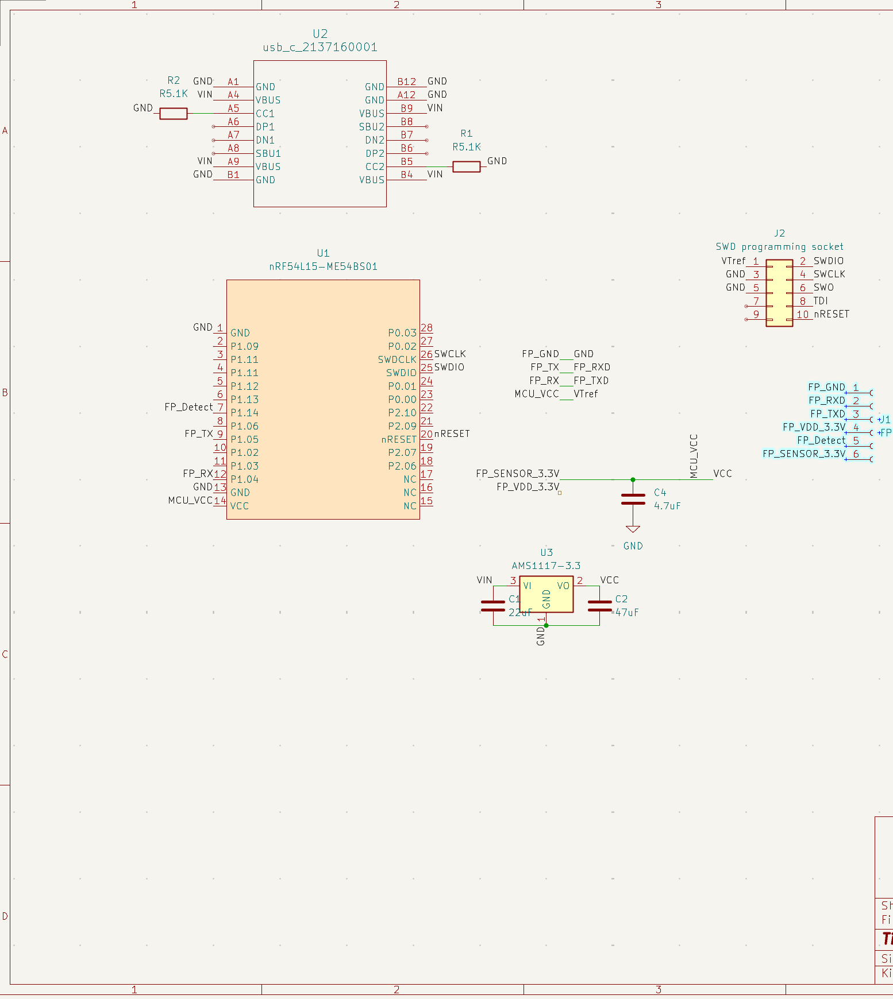
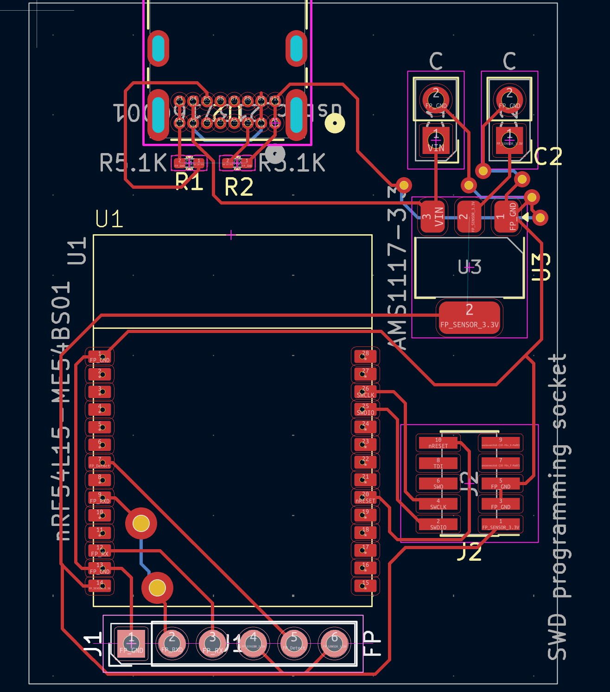

:::::locale{lang=ko}
:::important
GeekNews에는 올리고싶었으나 블로그를 쓰기 귀찮은 관계로 정리해놓은 프로젝트 보고서를 블로그로 AI가 포팅하여
내가 최종적으로 약간의 __자아__를 첨가한 글임을 밝힙니다.

뭔가 사람의 __자아__와 AI의 어투가  느껴진자면 당신은 정확했다. 
:::
:::::

:::::locale{lang=en}
:::important
I wanted to post this on GeekNews, but writing blog posts is a chore — so an AI ported my tidied-up project report into a blog post,
and I finally sprinkled a bit of my own __self__ on top. Just so you know.

If you sense both a human __self__ and an AI's tone in here, you're exactly right.
:::
:::::

:::::locale{lang=ko}
# 발단
:::::

:::::locale{lang=en}
# How it started
:::::

:::::locale{lang=ko}
2026학년도부터 초·중등교육법 제20조의5에 근거해서 교내에서 스마트폰을 못 쓰게 됐다.
:::::

:::::locale{lang=en}
Starting in the 2026 school year, under Article 20-5 of the Elementary and Secondary Education Act, smartphones can no longer be used at school.
:::::

:::::locale{lang=ko}
문제는 우리 학교 매점 결제가 DIMIPAY로 돌아간다는 거다. 앱으로 QR 띄워서 찍는 구조인데 폰이 없으면 결제 자체가 성립을 안 한다.
그래서 폰 없이도 본인을 증명할 수단이 필요했고, 그게 지문이었다.
:::::

:::::locale{lang=en}
The problem is that our school store's payments run on DIMIPAY. You bring up a QR code in the app and scan it — without a phone, payment simply can't happen.
So we needed a way to prove identity without a phone, and that turned out to be the fingerprint.
:::::

:::::locale{lang=ko}
결론부터 말하면 결국 만들어서 매점에 배포했다. 2026년 5월 한 달 동안 전체 결제 7,454건 중 3,199건, 그러니까 43%정도가 지문으로 이루어졌다.
:::::

:::::locale{lang=en}
To skip to the conclusion: I built it and deployed it at the store. Over the single month of May 2026, 3,199 of 7,454 total payments — about 43% — were made by fingerprint.
:::::

:::::locale{lang=ko}
[시연 영상](https://www.youtube.com/watch?v=HWvwYAcl2mI&t=73)  <- 이게 바로 후킹입니다.
:::::

:::::locale{lang=en}
[Demo video](https://www.youtube.com/watch?v=HWvwYAcl2mI&t=73)  <- this right here is the hook.
:::::

:::::locale{lang=ko}
# 제약이 좀 많았다
:::::

:::::locale{lang=en}
# There were quite a few constraints
:::::

:::::locale{lang=ko}
취미 프로젝트면 대충 만들고 끝인데 이건 실제 학생 생체정보를 다루는 시스템이다. 조건이 여러 겹으로 붙었다.
:::::

:::::locale{lang=en}
For a hobby project you'd just hack it together and call it done, but this system handles real students' biometric data. The requirements piled up in layers.
:::::

:::::locale{lang=ko}
키오스크가 iPad다. MFi 인증 없이는 유선으로 액세서리를 못 붙인다. 그러니까 열려있는 API인 BLE로만 통신해야 한다.
그리고 센서가 직접 사용자를 인증하면 안 된다. 이미지를 서버로 보내서 서버가 인증해야 한다. 센서 안에 지문 DB가 들어가는 순간 관리가 불가능해지니까.
:::::

:::::locale{lang=en}
The kiosk is an iPad. Without MFi certification you can't attach a wired accessory, which means communication has to go over BLE — the open API.
Also, the sensor must not authenticate the user itself. It has to send the image to the server and let the server authenticate. The moment a fingerprint DB lives inside the sensor, it becomes unmanageable.
:::::

:::::locale{lang=ko}
법 쪽도 걸린다. 개인정보보호법 제21조에 따라 목적이 달성돼서 개인정보가 불필요해지면 파기해야 하고, 제29조에 따라 내부 관리계획 수립이랑 접속기록 보관 같은 기술적·관리적·물리적 조치를 해야 한다.
거기에 개인정보보호위원회 생체정보 보호 가이드라인이 원본이 아닌 미뉴티아 추출 후 저장, 그리고 전송구간 암호화를 요구한다.
:::::

:::::locale{lang=en}
The legal side applies too. Under Article 21 of the Personal Information Protection Act, personal data must be destroyed once the purpose is fulfilled and the data is no longer needed; under Article 29, you must take technical, administrative, and physical measures such as establishing an internal management plan and retaining access logs.
On top of that, the Personal Information Protection Commission's biometric data protection guidelines require storing extracted minutiae rather than the original, and encrypting data in transit.
:::::

:::::locale{lang=ko}
**그리고 2초 안에 인증이 되어야한다**
:::::

:::::locale{lang=en}
**And authentication has to finish within 2 seconds**
:::::

:::::locale{lang=ko}
# 센서 고르기
:::::

:::::locale{lang=en}
# Picking a sensor
:::::

:::::locale{lang=ko}
필요한 조건은 이랬다. USB를 쓸 거면 프로토콜이 공개된 센서일 것, 아니면 UART / I2C / SPI 같은 평범한 MCU 인터페이스를 지원할 것.
그리고 유사도 Threshold를 높게 잡아도 인증이 되려면 유효면적이 넓어야 한다.
:::::

:::::locale{lang=en}
The requirements were these: if it uses USB, the protocol must be public; otherwise it must support an ordinary MCU interface like UART / I2C / SPI.
And for authentication to succeed even with a high similarity threshold, the effective capture area has to be large.
:::::

:::::locale{lang=ko}
찾다가 두 개를 골랐다.
:::::

:::::locale{lang=en}
After some searching I picked two.
:::::

:::::locale{lang=ko}
| 제품 | 인터페이스 | 유효 캡쳐면적 | 역할 |
|---|---|---|---|
| HI-LINK ZW0608 | UART | 12.05×12.05mm² | 결제용. MCU에 직결 |
| ZKTeco LIVE20R | USB 2.0 | 15.24×20.32mm² | 등록용 |
:::::

:::::locale{lang=en}
| Product | Interface | Effective capture area | Role |
|---|---|---|---|
| HI-LINK ZW0608 | UART | 12.05×12.05mm² | For payment. Wired directly to the MCU |
| ZKTeco LIVE20R | USB 2.0 | 15.24×20.32mm² | For enrollment |
:::::

:::::locale{lang=ko}
사실 ZKTeco 하나로 다 하고 싶었다. 면적도 넓고 이미지도 좋다. 근데 USB 프로토콜을 공개 안 하고 Windows / Android / Linux SDK로만 준다.
:::::

:::::locale{lang=en}
Honestly I wanted to do everything with the ZKTeco. The area is large and the images are good. But they don't publish the USB protocol — they only ship Windows / Android / Linux SDKs.
:::::

:::::locale{lang=ko}
그래서 Wireshark로 USB 패킷 떠서 [프로토콜을 리버싱](https://github.com/yeonfish6040/zkfinger_sdk)해봤는데 안정성이 영 안 나와서 파기했다.
결국 RaspberryPi에 Android 기반 LineageOS를 올려서 벤더 SDK를 그대로 돌리고, 이걸 등록 전용 키오스크로 쓰기로 했다. 등록은 한 번만 하면 되니까 좀 느려도 된다.
:::::

:::::locale{lang=en}
So I captured USB packets with Wireshark and [reverse-engineered the protocol](https://github.com/yeonfish6040/zkfinger_sdk), but stability was nowhere near good enough, so I scrapped it.
In the end I put Android-based LineageOS on a Raspberry Pi to run the vendor SDK as-is, and decided to use that as an enrollment-only kiosk. Enrollment only happens once, so it's allowed to be a bit slow.
:::::

:::::locale{lang=ko}
큰 이미지로 템플릿을 만들어두면 작은 국소 이미지로도 매칭 스코어가 잘 나올 거라는 계산이었다.
:::::

:::::locale{lang=en}
The calculation was that if you build the template from a large image, even a small partial image would still produce a good matching score.
:::::

:::::locale{lang=ko}
# 매칭 알고리즘
:::::

:::::locale{lang=en}
# The matching algorithm
:::::

:::::locale{lang=ko}
신뢰성이 검증됐을 것, 템플릿 추출이 될 것, 매칭이 빠를 것. 이 세 개를 놓고 두 개를 봤다.
:::::

:::::locale{lang=en}
Proven reliability, template extraction support, and fast matching. With those three criteria in hand, I looked at two options.
:::::

## NFIS

:::::locale{lang=ko}
FBI가 쓴다고 알려진 그거다. C로 짜여있어서 매우 빠르고 템플릿 저장도 된다.
:::::

:::::locale{lang=en}
The one the FBI is known to use. It's written in C, so it's very fast, and it supports template storage.
:::::

:::::locale{lang=ko}
근데 직접 빌드해야 하는데 레거시라서 빌드 에러가 산더미였다. 코드량이 너무 많아서 직접 고치는 건 포기하고 도커로 옛날 환경을 만들어서 겨우 빌드해 테스트했다.
:::::

:::::locale{lang=en}
But you have to build it yourself, and being legacy code it threw a mountain of build errors. There was too much code to fix by hand, so I gave up on that and barely managed to build and test it by recreating an old environment in Docker.
:::::

:::::locale{lang=ko}
그리고 탈락했다. 지원하는 최소 이미지 크기가 ZW0608이 주는 이미지보다 컸다. 애초에 쓸 수가 없는 물건이었다.
:::::

:::::locale{lang=en}
And then it was out. Its minimum supported image size was larger than the image the ZW0608 produces. It was unusable from the start.
:::::

## SourceAFIS

:::::locale{lang=ko}
Score 조정으로 FAR를 근사치로 직접 조절할 수 있고, 템플릿도 따로 저장되고, 매칭 시간도 굉장히 짧다. 구상 중인 프로젝트에 이상적이었다.
:::::

:::::locale{lang=en}
You can approximately tune the FAR yourself by adjusting the score, templates are stored separately, and matching time is extremely short. It was ideal for the project I had in mind.
:::::

:::::locale{lang=ko}
근데 공식 구현체가 Java랑 .NET뿐이다. 우리 백엔드는 Bun 런타임이다.
:::::

:::::locale{lang=en}
But the official implementations are only Java and .NET. Our backend runs on Bun.
:::::

:::::locale{lang=ko}
JS로 포팅하는 것도 생각해봤는데 깡 연산이 JVM보다 느린데다 포팅에 드는 시간과 노력이 너무 컸다.
그래서 그냥 Java 웹서버를 하나 더 띄워서 내부망에서만 접근 가능하게 하는 걸로 갈음했다. 지문 비교/등록/삭제를 지원하는 서버를 만들어서 내부망에 배포했다.
:::::

:::::locale{lang=en}
I did consider porting it to JS, but raw computation is slower than on the JVM, and the time and effort the port would take were too great.
So I settled for standing up one more Java web server, accessible only from the internal network. I built a server supporting fingerprint comparison/enrollment/deletion and deployed it internally.
:::::

:::::locale{lang=ko}
## 캐싱
:::::

:::::locale{lang=en}
## Caching
:::::

:::::locale{lang=ko}
최적화라고 부르기엔 좀 민망하긴 한데, 지문 템플릿은 DB에 있어야 하고 그렇다고 매 조회마다 DB에 쿼리를 날려서 전부 비교할 수는 없다.
:::::

:::::locale{lang=en}
It's a bit embarrassing to call this an optimization, but fingerprint templates have to live in the DB, and you obviously can't query the DB and compare everything on every lookup.
:::::

:::::locale{lang=ko}
그래서 웹서버 기동할 때 지문 데이터를 전량 조회해서 user id 따로, 미뉴티아 따로 메모리에 올려두고 그 캐시에서 매칭한다.
:::::

:::::locale{lang=en}
So at web server startup, I load all fingerprint data into memory — user IDs in one array, minutiae in another — and match against that cache.
:::::

:::::locale{lang=ko}
문제는 런타임에 등록/삭제가 들어올 때다. 순서를 잘못 잡으면 캐시가 DB보다 앞서가버린다.
:::::

:::::locale{lang=en}
The problem is when enrollment/deletion comes in at runtime. Get the ordering wrong and the cache runs ahead of the DB.
:::::

:::::locale{lang=ko}
```text title="런타임 갱신"
등록/삭제 요청
      │
      ▼
 DB 트랜잭션 수행
      │
      ▼
  커밋 성공?
   │      │
  Yes     No
   │      │
   ▼      ▼
캐시 Lock 후   Rollback
등록/삭제 반영  캐시 변경 없음
```
:::::

:::::locale{lang=en}
```text title="Runtime refresh"
Enroll/delete request
      │
      ▼
  Run DB transaction
      │
      ▼
  Commit succeeded?
   │      │
  Yes     No
   │      │
   ▼      ▼
Lock cache,   Rollback
apply change  cache untouched
```
:::::

:::::locale{lang=ko}
캐시 반영은 무조건 DB 커밋 이후에만 일어난다.
:::::

:::::locale{lang=en}
Cache updates only ever happen after the DB commit.
:::::

:::::locale{lang=ko}
# V1 하드웨어
:::::

:::::locale{lang=en}
# V1 hardware
:::::




:::::locale{lang=ko}
BLE가 필수니까 BLE integrated MCU를 쓰는 게 맞다고 봤고, 마침 그때 배우고 있던 nRF54L15를 골랐다.
:::::

:::::locale{lang=en}
Since BLE was mandatory, I figured a BLE-integrated MCU was the right call, and picked the nRF54L15 — which I happened to be learning at the time.
:::::

:::::locale{lang=ko}
근데 보드를 처음부터 설계할 시간이 없었다. 3학년 1학기 개학이 2주도 안 남았는데 교내 인트라넷 개발 마감이 최우선순위였다.
그래서 MINEWSEMI의 nRF54L15-ME54BS01 모듈을 얹어서 설계했다. RF는 모듈이 알아서 해주니까.
:::::

:::::locale{lang=en}
But there was no time to design a board from scratch. The start of my third-year first semester was less than two weeks away, and the school intranet development deadline was the top priority.
So I designed around MINEWSEMI's nRF54L15-ME54BS01 module. The module takes care of the RF side.
:::::

:::::locale{lang=ko}
```text title="통신 구조"
SourceAFIS ──Internal HTTP── Core Backend
                                  │
                                HTTPS
                                  │
                                iPad
                                  │
                           BLE (encrypted)
                                  │
                             nRF54L15 ──UART── ZW-0608
```
:::::

:::::locale{lang=en}
```text title="Communication architecture"
SourceAFIS ──Internal HTTP── Core Backend
                                  │
                                HTTPS
                                  │
                                iPad
                                  │
                           BLE (encrypted)
                                  │
                             nRF54L15 ──UART── ZW-0608
```
:::::

:::::locale{lang=ko}
흐름은 이렇다. ZW-0608의 손가락 인터럽트 라인을 nRF54L15가 구독하고 있다가 인터럽트가 뜨면 iPad 키오스크 앱에 알린다.
키오스크가 마침 상품 결제 단계면 컨트롤러의 지문결제 함수를 호출한다.
그럼 이미지 전송 요청이 내려가고, MCU가 ZW-0608에 capture를 때린 다음 센서 버퍼의 이미지를 UART로 받아온다.
그걸 다시 BLE로 iPad에 넘기고, iPad가 서버로 쏘면 서버가 신원을 확인한다.
:::::

:::::locale{lang=en}
The flow goes like this. The nRF54L15 subscribes to the ZW-0608's finger interrupt line, and when the interrupt fires it notifies the iPad kiosk app.
If the kiosk happens to be at the payment step, it calls the controller's fingerprint-payment function.
An image transfer request then goes down, the MCU issues a capture to the ZW-0608, and pulls the image out of the sensor buffer over UART.
That's handed back to the iPad over BLE, the iPad fires it off to the server, and the server verifies the identity.
:::::

:::::locale{lang=ko}
깔끔하다. 동작도 했다. 문제는 속도였다.
:::::

:::::locale{lang=en}
Clean. And it worked. The problem was speed.
:::::

:::::locale{lang=ko}
# 그리고 5.8초
:::::

:::::locale{lang=en}
# And then, 5.8 seconds
:::::

:::::locale{lang=ko}
평균 인증 시간이 5.8초 나왔다. 요구조건이 2초인데.
:::::

:::::locale{lang=en}
Average authentication time came out at 5.8 seconds. The requirement was 2 seconds.
:::::

:::::locale{lang=ko}
시간을 세세히 분해해봤다.
:::::

:::::locale{lang=en}
I broke the time down in detail.
:::::

:::::locale{lang=ko}
```text title="V1 인증 시간 (평균 5.8초)"
├────────── 3.8s ──────────┼── 1.0s ──┼─ 0.7s ─┼0.3s┤
       센서 → MCU            MCU→iPad   서버왕복  기타
         (UART)               (BLE)
                  ┊
              요구조건 2.0초
```
:::::

:::::locale{lang=en}
```text title="V1 authentication time (avg. 5.8s)"
├────────── 3.8s ──────────┼── 1.0s ──┼─ 0.7s ─┼0.3s┤
      Sensor → MCU           MCU→iPad   server   other
         (UART)               (BLE)    round trip
                  ┊
             requirement 2.0s
```
:::::

:::::locale{lang=ko}
전체 시간의 약 3분의 2를 UART 업로드 한 구간이 잡아먹고 있었다.
:::::

:::::locale{lang=en}
The single UART upload segment was eating roughly two-thirds of the total time.
:::::

:::::locale{lang=ko}
전송단계에서 압축이든 뭐든 해서 최대한 쥐어짜도 UART baud rate 한계상 3.8초 밑으로는 못 내린다.
이건 최적화로 풀리는 문제가 아니라 인터페이스 선택이 틀린 거다.
:::::

:::::locale{lang=en}
Even squeezing the transfer stage as hard as possible with compression or whatever else, the UART baud rate ceiling means you can't get below 3.8 seconds.
This isn't a problem optimization can solve — the interface choice was simply wrong.
:::::

:::::locale{lang=ko}
속도만 문제였으면 그나마 나은데, 정확도도 애매했다. Live20R의 큰 이미지 덕분에 평균 매칭 스코어는 50점 내외까지 올렸는데 사람마다 지문 퀄리티 편차가 커서 균일한 정확도를 확보하기가 어려웠다.
인식이 한 번에 안 되면 재시도를 해야 하는데 한 번이 5.8초다. 빠른 순환이 필요한 점심 저녁 피크타임 매점에서는 그냥 못 쓴다. 줄이 밀린다.
:::::

:::::locale{lang=en}
If speed were the only problem that'd be one thing, but accuracy was iffy too. Thanks to the Live20R's large images I got the average matching score up to around 50, but fingerprint quality varies so much between people that uniform accuracy was hard to guarantee.
If recognition fails on the first try you have to retry — and one try is 5.8 seconds. At a store during lunch and dinner peak hours, where fast turnover is essential, it's simply unusable. The line backs up.
:::::

:::::locale{lang=ko}
PCB도 덤으로 문제가 있었다. UART의 RX랑 TX를 반대로 매핑해서 주문했다. 이건 선을 바꿔 끼워서 해결.
그리고 2 layer 보드인데 back layer에 GND pour를 안 한 상태에서 VBUS 5V에서 VDD 3.3V로 바뀌는 LDO 전원블록의 GND를 안 이어줬다. GND pour 없이 GND via만 툭 던져놨더니 생긴 문제였다.... 손납땜으로 이어줘서 해결했다.
:::::

:::::locale{lang=en}
The PCB had problems as a bonus. I ordered it with UART RX and TX mapped backwards. Fixed by swapping the wires.
Also, on a 2-layer board with no GND pour on the back layer, I never tied the GND of the LDO power block that converts VBUS 5V to VDD 3.3V. That happened because I just dropped in a GND via without any GND pour.... Fixed by bridging it with hand soldering.
:::::

:::::locale{lang=ko}
# 돌아보며
:::::

:::::locale{lang=en}
# Looking back
:::::

:::::locale{lang=ko}
여러 생각을 했다.
:::::

:::::locale{lang=en}
I had a lot of thoughts.
:::::

:::::locale{lang=ko}
원래는 DK에서 ZW-0901로 테스트를 끝내고 급하게 PCB를 주문했는데, 테스트하던 도중에 다른 사람 지문에서 인식률이 떨어져서 ZW-0901에서 ZW-0608로 급하게 갈아탔다.
그러다 보니 전송속도를 제대로 테스트해볼 시간이 없었다. 데이터양으로 전송속도를 가늠할 수는 있었는데 그때는 트러블슈팅 중이었고, 여러 가지를 따져보지 못한 채 급하게 때웠다. 그게 그대로 터진 게 참 안타까웠다.
:::::

:::::locale{lang=en}
Originally I finished testing with the ZW-0901 on the DK and rushed the PCB order, but partway through testing the recognition rate dropped on other people's fingerprints, so I hastily switched from the ZW-0901 to the ZW-0608.
As a result there was no time to properly test the transfer speed. I could have estimated it from the data volume, but I was in the middle of troubleshooting and patched things up in a hurry without weighing everything. It was a shame that this blew up exactly as you'd expect.
:::::

:::::locale{lang=ko}
PCB도 참사였다. IFA 안테나 근처에 KEEP OUT 영역이 필요한데 안 지켰고, 안테나 바로 아래로 3.3V 전원라인이 지나갔다.
심지어 원래 수제작할 생각이어서 거기 맞춰 잡은 VIA 크기가 주문제작에 그대로 넘어가서 비아가 비정상적으로 커졌고, 급격하게 꺾인 트레이스도 많았다. 임피던스에 민감한 고속 라인이 없었던 게 다행이지 좋은 설계는 아니었다.
:::::

:::::locale{lang=en}
The PCB was a disaster too. The IFA antenna needs a keep-out area and I didn't respect it, and a 3.3V power line ran right underneath the antenna.
Worse, I had originally planned to hand-fabricate it, so the via sizes I'd chosen for that carried straight over into the fab order, making the vias abnormally large, and there were plenty of sharply bent traces. It was lucky there were no impedance-sensitive high-speed lines — it was not a good design.
:::::

:::::locale{lang=ko}
참으로 제대로 된 게 없는 설계였는데, 불행중 다행으로? GND pour를 잊어버린 덕분에 RF 성능이 박살나는 참사는 일어나지 않았다. 안테나 밑에 GND가 깔렸으면 그게 더 문제였을 거다.
:::::

:::::locale{lang=en}
Truly nothing about the design was right, but as a silver lining(?), forgetting the GND pour meant RF performance was never wrecked. Had there been GND under the antenna, that would have been the bigger problem.
:::::

:::::locale{lang=ko}
조금만 더 여유있게 만들었으면 프로토타입을 더 완성도있게 뽑았을 텐데 하는 아쉬움이 남았다.
:::::

:::::locale{lang=en}
I'm left with the regret that if I'd given myself just a bit more breathing room, I could have turned out a far more polished prototype.
:::::

:::::locale{lang=ko}
그래서 V2에서는 센서부터 다시 골랐다. [다음 글](/posts/fingerprint_payment/2_hardware/)에서 계속.
:::::

:::::locale{lang=en}
So for V2 I started over from the sensor. Continued in the [next post](/en/posts/fingerprint_payment/2_hardware/).
:::::
