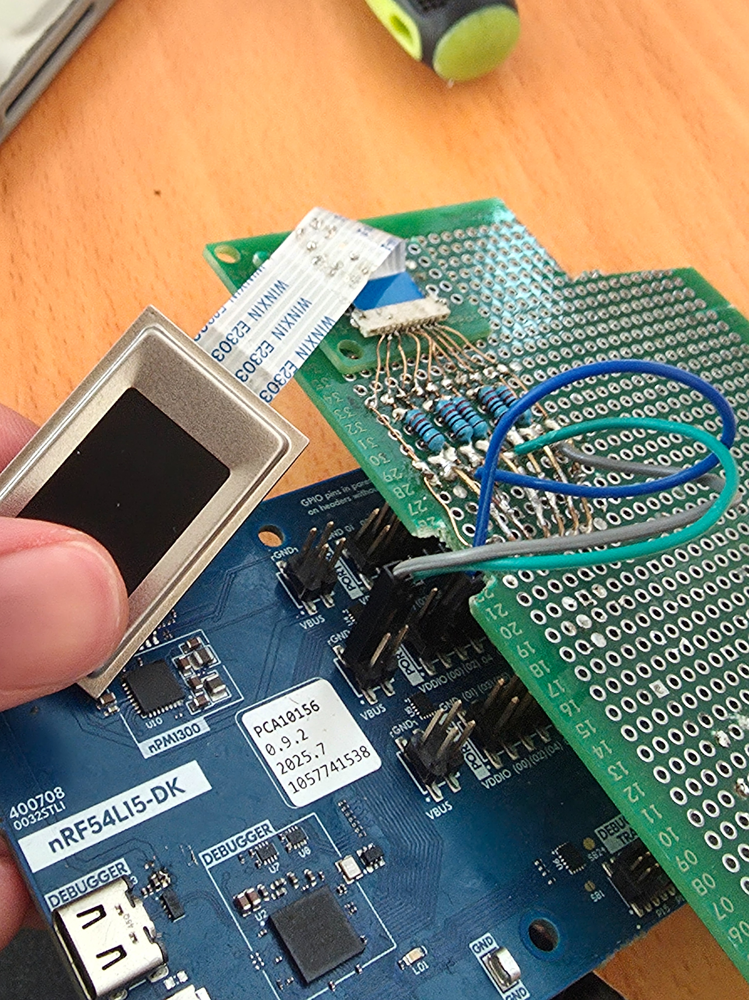
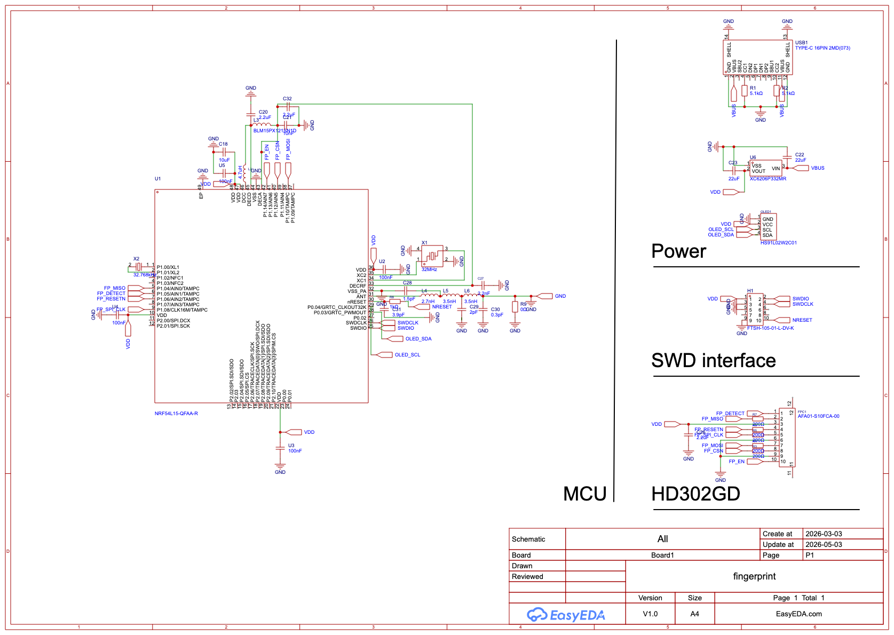
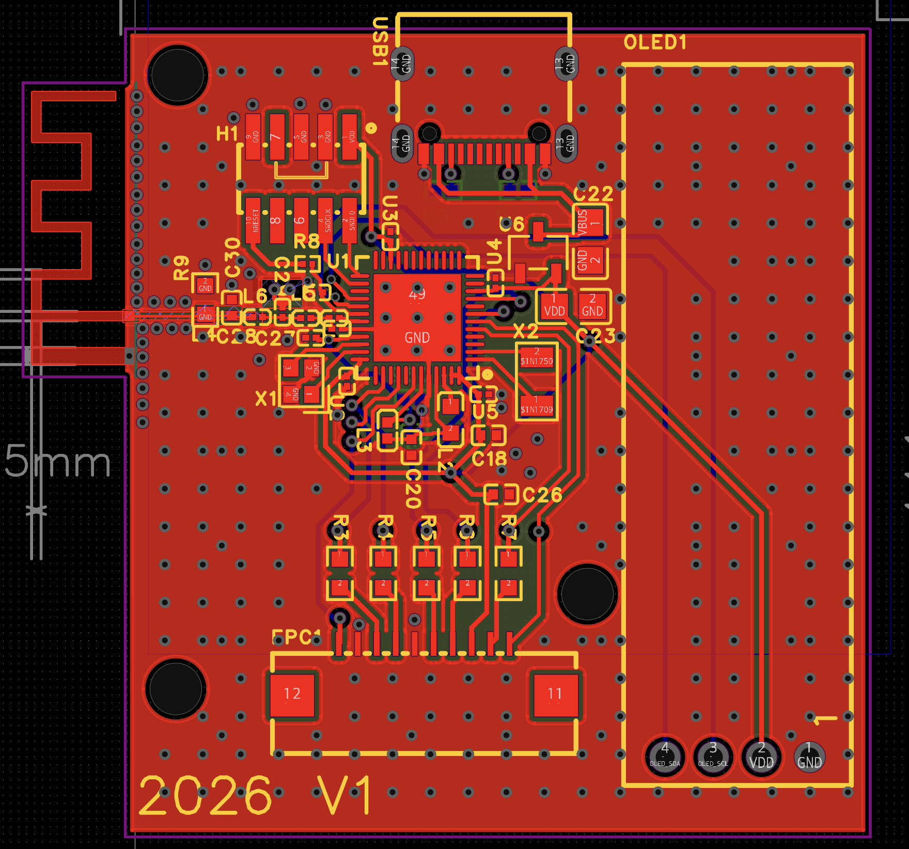
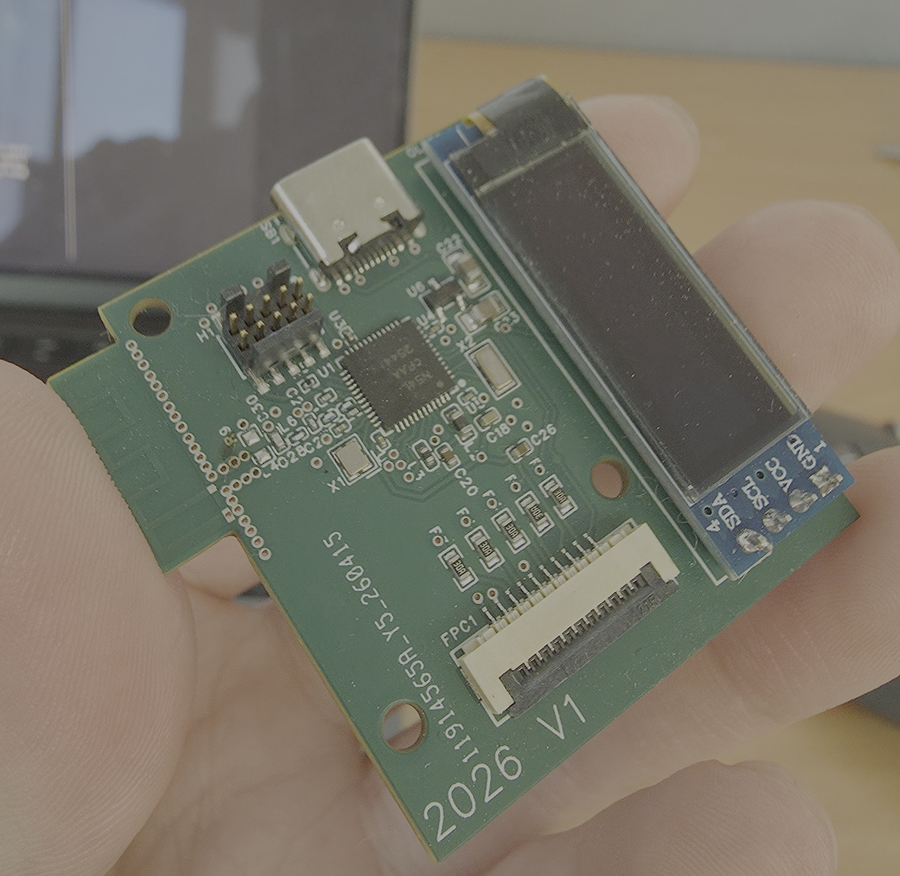
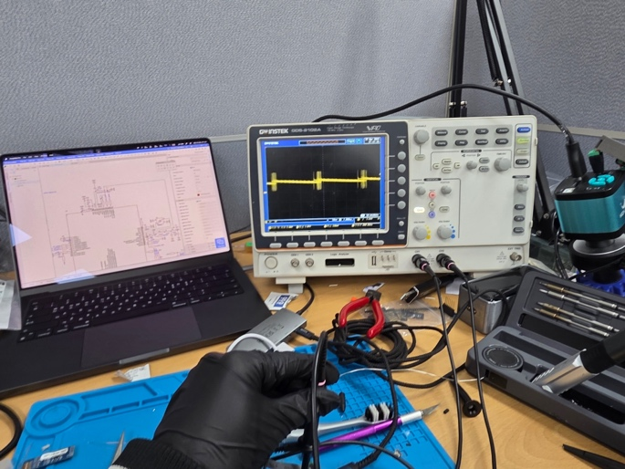
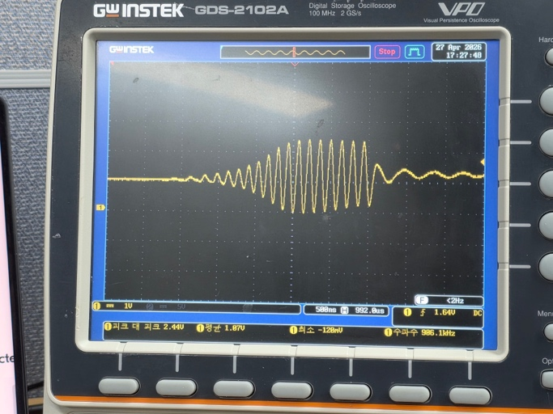
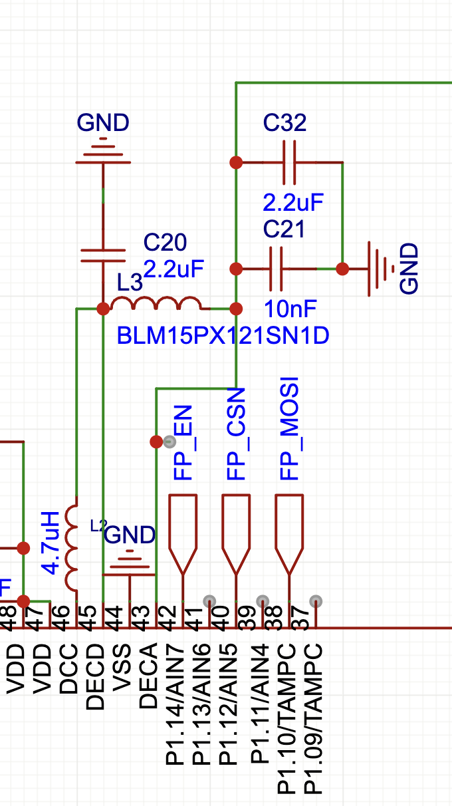
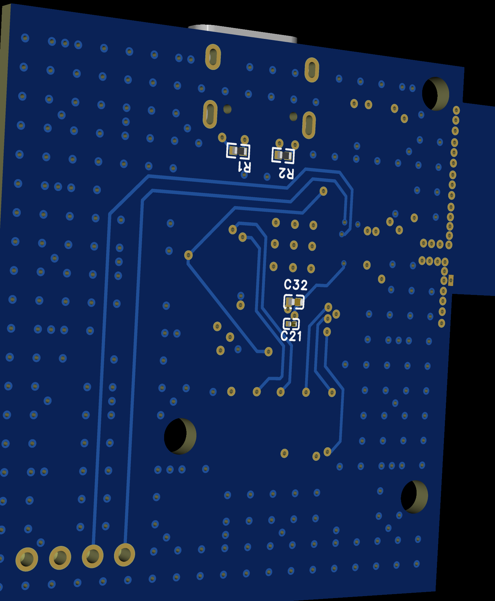

[이전 글](/posts/fingerprint_payment/1_v1/)에서 V1이 UART 때문에 5.8초에 처박힌 얘기를 했다. 이번엔 그걸 갈아엎는 얘기다.

# 요구조건 한 줄 추가
V1 요구조건에 딱 한 줄이 붙었다.

> 12MHz 이상의 SPI 통신을 지원하는 지문센서

3.8초짜리 UART는 두 번 다시 안 쓴다.

# 센서 구하기
시중에서 살 수 있는 지문센서로는 한계가 명확하다는 걸 확인하고 제조업체를 직접 찾기 시작했다.

| 제조사 / 모델 | 인터페이스 | 이미지 | 결과 |
|---|---|---|---|
| CAMABIO | UART, USB (프로토콜 비공개) | - | 센서 자체는 이상적이었는데 SPI 미지원 + USB 프로토콜 비공개로 탈락 |
| Midas Touch MFC-1208GD | - | HF302GD보다 적음 | 픽셀수 부족으로 탈락 |
| Aratek A400-M | - | - | 동작 전압이 MCU랑 안 맞음. 레벨 변환 추가 설계 필요해서 탈락 |
| ADH-TECH HF302GD | SPI 16MHz | 256×360, 508dpi, 최대 9fps | 채택 |

최종적으로 ADH-TECH의 HF302GD로 갔다. SPI 16MHz로 이미지를 받을 수 있고 256×360에 508dpi면 면적도 해상도도 충분하다. 캡쳐도 최대 9fps로 빠르다.

# POC


ADH-TECH에 이메일로 컨택해서 하드웨어 샘플이랑 테스트보드를 사서 받았다.

받자마자 테스트보드에서 FPC 커넥터를 뽑아다가 만능기판에 납땜하고, 전원이랑 SPI 데이터라인을 구성해서 nRF54L15-DK에 물렸다.
이게 하드웨어 POC다. 동작이 확인되니 이제 보드를 설계할 차례다.

# 보드 설계


이번엔 시간이랑 예산이 충분해서 nRF54L15를 직접 올린 보드를 설계해서 PCBA를 맡기기로 했다.
원래 KiCad를 쓰는데 EasyEDA로 그리면 주문할 때 할인이 되길래 EasyEDA로 갈아탔다. KiCad랑 다르게 JLCPCB Components Lib에서 부품을 바로 검색해서 넣을 수 있어서 BOM을 따로 안 써도 되는 건 확실히 편했다.

Nordic의 nRF54L15 데이터시트에 있는 [Reference Circuitry](https://docs.nordicsemi.com/bundle/ps_nrf54L15/page/chapters/ref_circuitry.html)를 참고해서 디자인했고,
전원부랑 필터, RF 서킷은 신뢰성 있는 동작을 보장하려고 데이터시트의 BOM 스펙을 그대로 차용했다. 여기서 창의력을 발휘할 이유가 없다.

2.4GHz 안테나는 간단하게 해결하려고 TI의 [AN043 Application Note](https://www.ti.com/lit/an/swra117d/swra117d.pdf)를 보고 IFA를 서킷에 그대로 옮긴 다음, Nordic Q&A를 통해서 설계를 검증받았다.
지문센서랑 MCU 사이 SPI 라인에는 센서 제조사 데이터시트에 적힌 링잉 억제용 200Ω 저항을 넣었다.



그리고 OLED를 하나 달았다.

개발 인원이 매번 SWD로 붙어서 BLE 인증번호를 확인해 페어링할 수도 없고, 매점에 상주하면서 기기를 관리할 수도 없다.
그래서 매점 상주 인원이 보드만 보고 페어링이랑 상태확인, 트러블슈팅, 개발팀을 위한 오류보고까지 할 수 있게 OLED 모듈을 추가했다.

전원은 보드 상단의 USB-C로 받는다. CC핀에 5.1k를 달아서 USB 2.0 스펙으로 5V를 VBUS에 받고, 이걸 LDO로 3.3V로 내려서 VDD에 공급한다.
LDO 전후단에는 벌크 커패시터를 둬서 공통 전원라인에 버퍼를 만들어줬다.



PCBA로 받은 보드다.

Via도 용도별로 나눴다. 그라운드랑 파워 Plane을 이어주는 Suture Via는 via pad가 노출되지 않게 했고, 디커플링이랑 데이터 라인의 Via는 패드를 노출해서 Test Point 대신 쓸 수 있게 했다.
이게 바로 다음 챕터에서 목숨을 구한다.

# Failed to power up DAP
보드를 받고 전원을 연결한 다음 DAP에 붙어보려는데,

```
TF9FD58C0 005:626.736 Found SW-DP with ID 0x6BA02477
TF9FD58C0 005:628.365 Failed to power up DAP
TF9FD58C0 005:680.817 ConfigTargetSettings() start
TF9FD58C0 005:681.040 InitTarget() start
TF9FD58C0 005:682.630 InitTarget() end - Took 1.53ms
TF9FD58C0 005:788.991 Failed to attach to CPU. Trying connect under reset.
TF9FD58C0 005:790.139 Found SW-DP with ID 0x6BA02477
TF9FD58C0 005:790.720 SWD speed too high. Reduced from 4000 kHz to 2700 kHz for stability
TF9FD58C0 005:791.796 Failed to power up DAP
TF9FD58C0 005:791.837 - 169.767ms returns 0xFFFFFEFB
```

SW-DP는 찾는데 파워업이 안 된다. 그리고 리턴받은 값이 랜덤성을 띄었다. 정상적으로 결과값을 못 돌려주고 있다는 뜻이다. DAP 자체가 응답을 못 하는 상황으로 판단했다.

## 1차 용의자는 당연히 전원
에러에 Power가 있으니까 제일 먼저 전원을 의심했다.

찾아보니 실제로 10번핀에 매핑한 100nF 디커플링에 3.3V 전원라인 연결을 실수로 빼먹었더라. 아 이거구나 싶었는데,
오실로스코프로 찍어보니 전압은 안정적이었고 연결을 해줘도 결과가 다르지 않았다.

원인이 아니었다.

## DECA가 발진한다
프로브를 여기저기 옮겨 찍어가며 디버깅을 이어가다가 (아까 만든 Test Point가 여기서 빛을 발했다) 발견했다.




DECA 라인이 8MHz로 발진하고 있었다.

이후 여러 부품들을 리솔더링 해가며 원인규명을 시작했고,



위 회로의 C21을 제거하니까 발진이 사라지는 걸 발견했다. C32는 원인규명이랑 문제해결 이후에 생산에서 문제를 없애려고 추가한 컴포넌트다. 실제 PCB에는 없다.



보드 뒷면에 애매하게 붙어있던 그 10nF이다.

## 첫 번째 가설,
여기서 이렇게 생각했다.

주파수가 8MHz면 LC 공진으로 보기는 좀 어렵다. 그보다는 벅컨버터 출력이 C21에 의해 아주 조금 스무딩된 거라고 봤다.

nRF54L15는 내부 전원단에 LDO랑 벅컨버터가 둘 다 있다. 스타트업할 때 LDO로 전원을 받으면서 벅컨버터 출력단에 LC 회로가 있는지를 감지하고, 감지가 안 되면 LDO로 계속 동작한다.
근데 이 인덕터 감지 회로는 인덕터 자체를 보는 게 아니라 LC 회로가 발생시키는 발진을 감지하는 쪽에 가깝다.
그럼 보드 뒷면에 애매하게 붙은 10nF 때문에 감지가 된 상태가 돼버렸고, 벅컨버터가 동작하면서 저 주파수로 발진이 일어나는 건가?

그래서 ref circuitry랑 내 회로를 한 줄씩 비교해봤고, 2.2uF(C31)이 빠진 걸 확인하고 추가한 이후 문제가 해결됐다.
[Nordic DevZone에 올린 질문](https://devzone.nordicsemi.com/f/nordic-q-a/127910/nRF54L15-cannot-use-swd-interface)에도 C31이 빠졌다는 답변을 받아서 회로 자체는 확인받았다.

근데 문제 해결 이후에 이걸 돌아보다가, 내 판단에 문제가 있었다는 걸 발견했다.

[regulator 다이어그램](https://docs.nordicsemi.com/r/bundle/ps_nrf54l15/page/regulators.html)을 다시 보면 벅컨버터 스위치 출력은 DCC핀이고 거기엔 이미 커패시터랑 인덕터가 연결되어 있다.
그리고 DECA는 LDO에 직결된 라인이다. 즉 DECA에서 발진이 보였다는 건 벅컨버터가 아니라 스타트업 과정이나 아날로그 Peripheral 초기화 단계에서 문제가 났다는 뜻이다.

RF 쪽도 배제했다. 원인규명 단계에서 DECRF 연결부 트레이스를 끊고 테스트했을 때 DECRF 라인은 안정적이었고 DECA만 여전히 불안정했다.

여기서 논리가 꼬인다. 전원 안정화 실패가 원인이라면 10nF(C21)을 제거했을 때 오히려 동작을 안 하는 게 이상적이다. 근데 빼니까 발진이 멈췄다. 왜?

## 답은 한참 뒤에 나왔다
이걸 의문으로 남겨둔 채 다른 프로젝트를 하다가, 문득 "LDO에 디커플링 커패시터가 왜 있어야 하는가"에 대한 의문이 생겨서 조금 파고들어봤다.

그동안 나는 LDO를 그냥 수동적인 소자로 생각했다. 5V 넣으면 3.3V 나오는 상자. 그래서 여기에 의문을 품지 않았다.

근데 아니었다. LDO는 피드백 루프를 이용해서 내부 P-MOS 게이트를 조절해 저항을 만들어내고, 그 분압으로 타깃 전압을 만들어내는 구조다. 능동 소자다.
그리고 이걸 알고 나니까 출력단 커패시터의 정체도 보였다. 부하의 증감으로 인해 LDO의 피드백 루프가 적용되기 전, 저항값이 변하고 있을 때의 전압 상승/하강을 억제하기 위한 소자다.

여기까지 오니까 8MHz가 설명됐다. 10nF은 너무 작아서 그 구간의 변동을 못 잡아준다.
그래서 출력 전압의 변화와 피드백 루프로 인해 변하는 저항값의 변화가 서로 반전되면서 발진을 일으켰고, 이걸 억제해줄 2.2uF이 부재해서 나타난 현상이었다.

C21만 빼도 발진이 멈춘 것도 같은 이유다. 발진 루프에 참여하던 소자가 사라졌으니까. 정답은 C21을 빼는 게 아니라 C31을 넣는 거였고, 결과적으로 그렇게 고쳤다.

교훈이라면 Reference Circuitry의 BOM은 그대로 따르라고 있는 거라는 것. 커패시터 하나 빠뜨렸다고 SWD가 안 붙는다. ~~ㅈㄹ맞네~~

다음 글에서는 [펌웨어랑 지문 이진화](/posts/fingerprint_payment/3_firmware/) 얘기를 한다.
