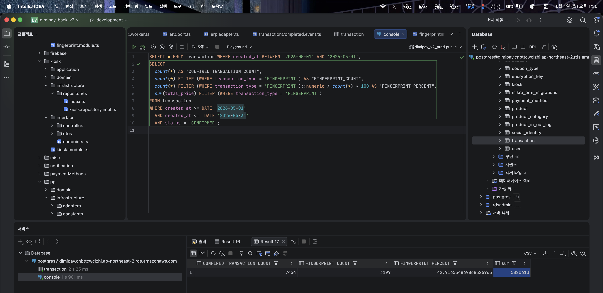

[이전 글](/posts/fingerprint_payment/3_firmware/)까지 해서 단말은 완성됐다. 이제 서버 쪽이다.

# 생체정보를 다룬다는 것
이 프로젝트에서 제일 신경 쓴 부분이다. 학생들 지문이다.

지문 DB는 개인정보보호위원회 생체정보 보호 가이드라인에 따라 Dimipay 서비스의 다른 DB랑 완전히 분리된 독립 DB로 구성했고 AWS RDB를 쓴다.
저장되는 정보는 암호화되고, 인바운드 트래픽은 디미페이 서버 IP로 제한이 걸리고, 아웃바운드는 아예 허용하지 않는다.

지문 DB랑 직접 커넥션을 맺는 SourceAFIS Java 웹서버는 V1이랑 같은 구성이다.
내부망에만 올라와있고, 혹시 모를 SSRF 공격에 대비해서 내부망 안에서도 토큰 인증을 쓴다. "내부망이니까 괜찮겠지"는 SSRF 앞에서 아무 의미가 없다.

# 지문 등록
사용자는 기본적으로 별도 등록 키오스크에서 등록을 수행한다. 결제 단말이 아니다.

최소 3장의 지문 이미지를 앞 글에서 말한 3장 평균 캡쳐로 받는다. 그리고 각 지문 이미지끼리 매칭을 진행해서 score가 지문 승인 threshold를 못 넘으면 추가 캡쳐를 받는다.
결론적으로 3개의 이미지로 상호 매칭했을 때 threshold를 넘는 조합이 나올 때까지 반복되고, 이게 10번 이상 반복되면 기준미달로 등록을 거부한다.

품질 나쁜 템플릿을 등록해두면 그 사람은 결제할 때마다 FRR로 고통받는다. 등록 단계에서 걸러야 한다.

퀄리티 높은 이미지를 확보한 다음엔 사용자의 결제 QR을 인식받아서 계정에 등록한다.

여기서 하나 더 한다. 등록 시점에 지문 DB 전체에 대해서 등록될 지문을 매칭한다.
그래서 안전 threshold 점수를 넘는데 그 지문이 이미 다른 사용자 계정에 등록되어 있으면 등록을 거부한다. 타인 계정에 대한 지문 등록 차단이다.

그리고 한 유저는 같은 name을 가진 미뉴티아 레코드 묶음을 여러 개 가질 수 있다.
이걸로 같은 손가락을 같은 이름으로 여러 번 등록해서 FRR을 완화할 수도 있고, 다른 손가락은 이름을 나눠서 분리 등록할 수도 있다.

# 지문 삭제
앱에서 지문 그룹을 관리할 수 있다. 삭제나 그룹 이름 변경 같은 게 가능하다.

유저가 더 이상 지문결제를 쓰고 싶지 않아서 앱에서 삭제를 요청하거나, 졸업해서 해당 개인정보가 불필요해진 경우에는 개인정보보호법 제21조에 따라 운영 DB에서 즉시 삭제한다.

다만 시스템 장애 복구를 위한 백업본에는 백업 순환 주기에 따라 최대 3일간 잔존할 수 있다.
이 기간 동안 해당 정보는 서비스에서 접근하거나 처리할 수 없고, 백업 보존기간이 만료되는 즉시 영구적으로 파기된다.

# DFU
이건 유지보수하다가 추가한 기능이다.

펌웨어 하나 고칠 때마다 매점 가서 단말 분해하고 J-Link 꽂아서 굽고 다시 조립하는 게 상당히 비효율적이었다.
그래서 블루투스를 통해서 키오스크로 일괄 업데이트가 가능하게 구성했다.

```text title="빌드 / 배포"
Firmware 개발 ──Tag Push──▶ GitHub ──▶ Dokploy 자동 Build ──▶       RustFS
                                            ▲                  (firmware.bin)
                                            │                        │
                                   Internal Registry                 │
                                   (NCS Toolchain Image)             │
                                                                     │
                   Backend ──버전 정보──▶ Kiosk ◀──── Firmware ───────┘
                                           │
                                           ▼
                                     Version 동일?
                                      │        │
                                     Yes       No
                                      │        │
                                      ▼        ▼
                                 기존 유지    DFU 수행
```

펌웨어를 작성해서 커밋에 태그를 붙여 깃허브에 올리면 Dokploy가 빌드한 다음 .bin 파일을 내부 RustFS에 배포한다.
키오스크는 일정 주기로 지문센서랑 백엔드로부터 중계받은 활성 펌웨어 버전을 비교하고, 다르면 백엔드로부터 펌웨어 Presigned url을 받아서 펌웨어를 받는다.

여기서 문제가 하나 있었는데, nRF54L15 펌웨어를 빌드하려면 NCS(nRF Connect SDK)가 필요한데 이 환경 조성을 매 빌드마다 하면 빌드가 너무 길어진다.
그래서 해당 환경이 세팅된 도커 이미지를 내부 Registry에 올려두고 그 이미지를 pull해서 쓴다.

키오스크가 받은 펌웨어는 대략 이런 흐름으로 센서에 적용된다.

```text title="센서 측 DFU"
키오스크 업데이트 명령
        │
        ▼
   Ready 응답 수신
        │
        ▼
   펌웨어 전송
        │
        ▼
  Flash Slot 2에 스트리밍
        │
        ▼
     CRC 검증
        │
        ▼
 Slot 2 Pending 표시
        │
        ▼
  상태 보고 후 Reset
        │
        ▼
 MCUboot 신규 펌웨어 적용
```

Slot 2에 다 받고 CRC까지 통과한 다음에야 pending을 찍는다.
전송 중에 BLE가 끊기거나 이미지가 깨져도 pending이 안 찍히니까 리셋되면 기존 펌웨어로 그냥 부팅된다. 벽돌이 안 된다.

[DFU 시연](https://www.youtube.com/watch?v=tb2I9RlrJJ4&t=17s)

# 성능
```text title="V1 vs V2"
V1 ├──────────── 3.80 ────────────┼0.30┼── 1.00 ──┼─0.70─┤  5.80초
V2 ├0.36┼──0.63──┼0.15┼─0.24─┤                          1.38초
                          ┊
                     요구조건 2.0초

   ■ 지문 이미지 읽기  ■ 이미지 처리 · 1bpp 패킹  ■ 단말→iPad(BLE)  ■ 서버 왕복
```

| 구간 | V1 | V2 |
|---|---|---|
| 지문 이미지 읽기 | 3.80s (UART) | 0.36s (SPI) |
| 이미지 처리 · 1bpp 패킹 | 0.30s | 0.63s |
| 단말 → iPad (BLE) | 1.00s | 0.15s |
| 서버 왕복 | 0.70s | 0.24s |
| 합계 | 5.80초 | 1.38초 |

V1의 평균 인증 지연시간 5.8초를 V2에서 1.18초로 단축해서 약 79.7%의 지연시간 감소를 달성했다.
가장 큰 병목이던 센서→MCU 전송은 UART 기반 3.8초에서 SPI 기반 360ms로 약 90.5% 감소했다. 이로써 초기 요구조건인 2초 이내 인증을 만족했다.

재밌는 건 이미지 처리 시간은 오히려 늘었다는 거다(0.30s → 0.63s). local window 표준편차를 픽셀마다 도는 알고리즘이 그만큼 무겁다.
근데 그걸로 8bpp를 1bpp로 줄여서 BLE 전송을 1초에서 150ms로 만들었으니 순수하게 이득이다. 병목을 옮긴 게 아니라 총합을 줄였다.

# 결과


2026년 5월 한 달 동안 있었던 7454건의 성공적인 결제 중에 3199건, 약 43%가 지문인식 결제로 진행됐다.
순수 지문인식 결제로만 582만원의 월간 결제액을 기록했다.

폰 없이도 매점에서 밥을 사먹을 수 있게 됐다.

# 마치며
돌아보면 이 프로젝트의 분기점은 두 개였다.

하나는 V1에서 시간을 구간별로 쪼개서 측정한 것.
"느리다"에서 멈췄으면 압축 알고리즘이나 만지작거리다 끝났을 거다.
3.8초가 UART 한 구간에 몰려있다는 걸 보고 나서야 인터페이스 선택 자체가 틀렸다는 결론이 나왔고, 그래서 센서부터 다시 고르게 됐다.

다른 하나는 DECA 발진의 원인을 문제 해결 이후에도 계속 파고든 것.
C31 넣어서 고쳤으니 거기서 덮었어도 됐다. 근데 내 설명이 다이어그램이랑 안 맞는다는 게 계속 걸렸고, 한참 뒤에 엉뚱한 프로젝트를 하다가 LDO가 능동 소자라는 걸 알게 되고 나서야 앞뒤가 맞았다.

나는 개쩐다.
