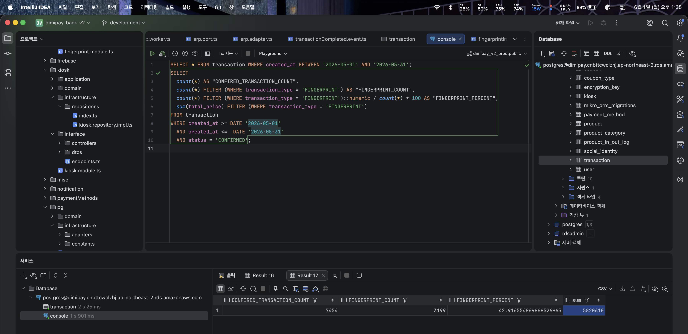

:::::locale{lang=ko}
[이전 글](/posts/fingerprint_payment/3_firmware/)까지 해서 단말은 완성됐다. 이제 서버 쪽이다.
:::::

:::::locale{lang=en}
Through the [previous post](/en/posts/fingerprint_payment/3_firmware/) the device was finished. Now for the server side.
:::::

:::::locale{lang=ko}
# 생체정보를 다룬다는 것
:::::

:::::locale{lang=en}
# What it means to handle biometric data
:::::

:::::locale{lang=ko}
이 프로젝트에서 제일 신경 쓴 부분이다. 학생들 지문이다.
:::::

:::::locale{lang=en}
This is the part I cared about most in this project. These are students' fingerprints.
:::::

:::::locale{lang=ko}
지문 DB는 개인정보보호위원회 생체정보 보호 가이드라인에 따라 Dimipay 서비스의 다른 DB랑 완전히 분리된 독립 DB로 구성했고 AWS RDB를 쓴다.
저장되는 정보는 암호화되고, 인바운드 트래픽은 디미페이 서버 IP로 제한이 걸리고, 아웃바운드는 아예 허용하지 않는다.
:::::

:::::locale{lang=en}
Per the Personal Information Protection Commission's biometric data protection guidelines, the fingerprint DB is a standalone database completely separated from the other Dimipay service DBs, running on AWS RDB.
Stored data is encrypted, inbound traffic is restricted to the Dimipay server IP, and outbound traffic isn't permitted at all.
:::::

:::::locale{lang=ko}
지문 DB랑 직접 커넥션을 맺는 SourceAFIS Java 웹서버는 V1이랑 같은 구성이다.
내부망에만 올라와있고, 혹시 모를 SSRF 공격에 대비해서 내부망 안에서도 토큰 인증을 쓴다. "내부망이니까 괜찮겠지"는 SSRF 앞에서 아무 의미가 없다.
:::::

:::::locale{lang=en}
The SourceAFIS Java web server that connects directly to the fingerprint DB has the same setup as in V1.
It's only reachable on the internal network, and it uses token authentication even within that network in case of an SSRF attack. "It's the internal network, it'll be fine" means nothing in the face of SSRF.
:::::

:::::locale{lang=ko}
# 지문 등록
:::::

:::::locale{lang=en}
# Fingerprint enrollment
:::::

:::::locale{lang=ko}
사용자는 기본적으로 별도 등록 키오스크에서 등록을 수행한다. 결제 단말이 아니다.
:::::

:::::locale{lang=en}
Users enroll at a dedicated enrollment kiosk by default — not at the payment terminal.
:::::

:::::locale{lang=ko}
최소 3장의 지문 이미지를 앞 글에서 말한 3장 평균 캡쳐로 받는다. 그리고 각 지문 이미지끼리 매칭을 진행해서 score가 지문 승인 threshold를 못 넘으면 추가 캡쳐를 받는다.
결론적으로 3개의 이미지로 상호 매칭했을 때 threshold를 넘는 조합이 나올 때까지 반복되고, 이게 10번 이상 반복되면 기준미달로 등록을 거부한다.
:::::

:::::locale{lang=en}
It takes at least three fingerprint images via the three-frame averaged capture described in the previous post. It then cross-matches those images, and if the score doesn't clear the approval threshold it takes additional captures.
In effect it repeats until cross-matching three images yields a combination above the threshold, and if that repeats more than ten times it rejects enrollment as below standard.
:::::

:::::locale{lang=ko}
품질 나쁜 템플릿을 등록해두면 그 사람은 결제할 때마다 FRR로 고통받는다. 등록 단계에서 걸러야 한다.
:::::

:::::locale{lang=en}
Enroll a poor-quality template and that person suffers from FRR on every payment. It has to be filtered at the enrollment stage.
:::::

:::::locale{lang=ko}
퀄리티 높은 이미지를 확보한 다음엔 사용자의 결제 QR을 인식받아서 계정에 등록한다.
:::::

:::::locale{lang=en}
Once high-quality images are secured, the user's payment QR is scanned to register them to the account.
:::::

:::::locale{lang=ko}
여기서 하나 더 한다. 등록 시점에 지문 DB 전체에 대해서 등록될 지문을 매칭한다.
그래서 안전 threshold 점수를 넘는데 그 지문이 이미 다른 사용자 계정에 등록되어 있으면 등록을 거부한다. 타인 계정에 대한 지문 등록 차단이다.
:::::

:::::locale{lang=en}
There's one more step. At enrollment time, the fingerprint being registered is matched against the entire fingerprint DB.
If it clears the safety threshold score but is already registered to another user's account, enrollment is refused. This blocks registering a fingerprint to someone else's account.
:::::

:::::locale{lang=ko}
그리고 한 유저는 같은 name을 가진 미뉴티아 레코드 묶음을 여러 개 가질 수 있다.
이걸로 같은 손가락을 같은 이름으로 여러 번 등록해서 FRR을 완화할 수도 있고, 다른 손가락은 이름을 나눠서 분리 등록할 수도 있다.
:::::

:::::locale{lang=en}
A single user can also hold multiple bundles of minutiae records sharing the same name.
That lets you enroll the same finger several times under one name to mitigate FRR, or enroll different fingers separately under distinct names.
:::::

:::::locale{lang=ko}
# 지문 삭제
:::::

:::::locale{lang=en}
# Fingerprint deletion
:::::

:::::locale{lang=ko}
앱에서 지문 그룹을 관리할 수 있다. 삭제나 그룹 이름 변경 같은 게 가능하다.
:::::

:::::locale{lang=en}
Fingerprint groups can be managed from the app — deletion, renaming a group, and so on.
:::::

:::::locale{lang=ko}
유저가 더 이상 지문결제를 쓰고 싶지 않아서 앱에서 삭제를 요청하거나, 졸업해서 해당 개인정보가 불필요해진 경우에는 개인정보보호법 제21조에 따라 운영 DB에서 즉시 삭제한다.
:::::

:::::locale{lang=en}
If a user requests deletion in the app because they no longer want fingerprint payment, or if they graduate so the data is no longer needed, it is deleted from the operational DB immediately, per Article 21 of the Personal Information Protection Act.
:::::

:::::locale{lang=ko}
다만 시스템 장애 복구를 위한 백업본에는 백업 순환 주기에 따라 최대 3일간 잔존할 수 있다.
이 기간 동안 해당 정보는 서비스에서 접근하거나 처리할 수 없고, 백업 보존기간이 만료되는 즉시 영구적으로 파기된다.
:::::

:::::locale{lang=en}
That said, it may persist in disaster-recovery backups for up to three days, depending on the backup rotation cycle.
During that period the data cannot be accessed or processed by the service, and it is permanently destroyed as soon as the backup retention period expires.
:::::

# DFU

:::::locale{lang=ko}
이건 유지보수하다가 추가한 기능이다.
:::::

:::::locale{lang=en}
This is a feature I added while maintaining the system.
:::::

:::::locale{lang=ko}
펌웨어 하나 고칠 때마다 매점 가서 단말 분해하고 J-Link 꽂아서 굽고 다시 조립하는 게 상당히 비효율적이었다.
그래서 블루투스를 통해서 키오스크로 일괄 업데이트가 가능하게 구성했다.
:::::

:::::locale{lang=en}
Going to the store, disassembling the terminal, plugging in a J-Link, flashing, and reassembling for every single firmware fix was seriously inefficient.
So I set it up so the kiosk can push updates in bulk over Bluetooth.
:::::

:::::locale{lang=ko}
```text title="빌드 / 배포"
Firmware 개발 ──Tag Push──▶ GitHub ──▶ Dokploy 자동 Build ──▶       RustFS
                                            ▲                  (firmware.bin)
                                            │                        │
                                   Internal Registry                 │
                                   (NCS Toolchain Image)             │
                                                                     │
                   Backend ──버전 정보──▶ Kiosk ◀──── Firmware ───────┘
                                           │
                                           ▼
                                     Version 동일?
                                      │        │
                                     Yes       No
                                      │        │
                                      ▼        ▼
                                 기존 유지    DFU 수행
```
:::::

:::::locale{lang=en}
```text title="Build / deploy"
Firmware dev ──Tag Push──▶ GitHub ──▶ Dokploy auto build ──▶       RustFS
                                            ▲                  (firmware.bin)
                                            │                        │
                                   Internal Registry                 │
                                   (NCS Toolchain Image)             │
                                                                     │
                Backend ──version info──▶ Kiosk ◀──── Firmware ──────┘
                                           │
                                           ▼
                                   Versions identical?
                                      │        │
                                     Yes       No
                                      │        │
                                      ▼        ▼
                                  Keep as-is   Run DFU
```
:::::

:::::locale{lang=ko}
펌웨어를 작성해서 커밋에 태그를 붙여 깃허브에 올리면 Dokploy가 빌드한 다음 .bin 파일을 내부 RustFS에 배포한다.
키오스크는 일정 주기로 지문센서랑 백엔드로부터 중계받은 활성 펌웨어 버전을 비교하고, 다르면 백엔드로부터 펌웨어 Presigned url을 받아서 펌웨어를 받는다.
:::::

:::::locale{lang=en}
When I write firmware, tag the commit, and push to GitHub, Dokploy builds it and deploys the .bin to the internal RustFS.
The kiosk periodically compares the active firmware version relayed from the fingerprint sensor and the backend, and if they differ it gets a presigned firmware URL from the backend and downloads the firmware.
:::::

:::::locale{lang=ko}
여기서 문제가 하나 있었는데, nRF54L15 펌웨어를 빌드하려면 NCS(nRF Connect SDK)가 필요한데 이 환경 조성을 매 빌드마다 하면 빌드가 너무 길어진다.
그래서 해당 환경이 세팅된 도커 이미지를 내부 Registry에 올려두고 그 이미지를 pull해서 쓴다.
:::::

:::::locale{lang=en}
There was one problem here: building nRF54L15 firmware requires NCS (the nRF Connect SDK), and setting that environment up on every build makes builds far too long.
So I pushed a Docker image with that environment preconfigured to the internal registry and pull that image instead.
:::::

:::::locale{lang=ko}
키오스크가 받은 펌웨어는 대략 이런 흐름으로 센서에 적용된다.
:::::

:::::locale{lang=en}
The firmware the kiosk downloads is applied to the sensor roughly like this.
:::::

:::::locale{lang=ko}
```text title="센서 측 DFU"
키오스크 업데이트 명령
        │
        ▼
   Ready 응답 수신
        │
        ▼
   펌웨어 전송
        │
        ▼
  Flash Slot 2에 스트리밍
        │
        ▼
     CRC 검증
        │
        ▼
 Slot 2 Pending 표시
        │
        ▼
  상태 보고 후 Reset
        │
        ▼
 MCUboot 신규 펌웨어 적용
```
:::::

:::::locale{lang=en}
```text title="Sensor-side DFU"
Kiosk update command
        │
        ▼
   Receive Ready response
        │
        ▼
   Send firmware
        │
        ▼
  Stream into flash slot 2
        │
        ▼
     CRC verification
        │
        ▼
 Mark slot 2 pending
        │
        ▼
  Report status, then reset
        │
        ▼
 MCUboot applies new firmware
```
:::::

:::::locale{lang=ko}
Slot 2에 다 받고 CRC까지 통과한 다음에야 pending을 찍는다.
전송 중에 BLE가 끊기거나 이미지가 깨져도 pending이 안 찍히니까 리셋되면 기존 펌웨어로 그냥 부팅된다. 벽돌이 안 된다.
:::::

:::::locale{lang=en}
Pending is only marked after everything lands in slot 2 and passes CRC.
If BLE drops mid-transfer or the image is corrupted, pending never gets marked, so on reset it simply boots the existing firmware. No bricking.
:::::

:::::locale{lang=ko}
[DFU 시연](https://www.youtube.com/watch?v=tb2I9RlrJJ4&t=17s)
:::::

:::::locale{lang=en}
[DFU demo](https://www.youtube.com/watch?v=tb2I9RlrJJ4&t=17s)
:::::

:::::locale{lang=ko}
# 성능
:::::

:::::locale{lang=en}
# Performance
:::::

:::::locale{lang=ko}
```text title="V1 vs V2"
V1 ├──────────── 3.80 ────────────┼0.30┼── 1.00 ──┼─0.70─┤  5.80초
V2 ├0.36┼──0.63──┼0.15┼─0.24─┤                          1.38초
                          ┊
                     요구조건 2.0초

   ■ 지문 이미지 읽기  ■ 이미지 처리 · 1bpp 패킹  ■ 단말→iPad(BLE)  ■ 서버 왕복
```
:::::

:::::locale{lang=en}
```text title="V1 vs V2"
V1 ├──────────── 3.80 ────────────┼0.30┼── 1.00 ──┼─0.70─┤  5.80s
V2 ├0.36┼──0.63──┼0.15┼─0.24─┤                          1.38s
                          ┊
                   requirement 2.0s

   ■ Fingerprint image read  ■ Image processing · 1bpp packing  ■ Device→iPad (BLE)  ■ Server round trip
```
:::::

:::::locale{lang=ko}
| 구간 | V1 | V2 |
|---|---|---|
| 지문 이미지 읽기 | 3.80s (UART) | 0.36s (SPI) |
| 이미지 처리 · 1bpp 패킹 | 0.30s | 0.63s |
| 단말 → iPad (BLE) | 1.00s | 0.15s |
| 서버 왕복 | 0.70s | 0.24s |
| 합계 | 5.80초 | 1.38초 |
:::::

:::::locale{lang=en}
| Stage | V1 | V2 |
|---|---|---|
| Fingerprint image read | 3.80s (UART) | 0.36s (SPI) |
| Image processing · 1bpp packing | 0.30s | 0.63s |
| Device → iPad (BLE) | 1.00s | 0.15s |
| Server round trip | 0.70s | 0.24s |
| Total | 5.80s | 1.38s |
:::::

:::::locale{lang=ko}
V1의 평균 인증 지연시간 5.8초를 V2에서 1.18초로 단축해서 약 79.7%의 지연시간 감소를 달성했다.
가장 큰 병목이던 센서→MCU 전송은 UART 기반 3.8초에서 SPI 기반 360ms로 약 90.5% 감소했다. 이로써 초기 요구조건인 2초 이내 인증을 만족했다.
:::::

:::::locale{lang=en}
V1's average authentication latency of 5.8 seconds was cut to 1.18 seconds in V2, achieving roughly a 79.7% reduction in latency.
The biggest bottleneck, sensor→MCU transfer, dropped from 3.8 seconds over UART to 360ms over SPI — about 90.5% less. That satisfied the original requirement of authenticating within 2 seconds.
:::::

:::::locale{lang=ko}
재밌는 건 이미지 처리 시간은 오히려 늘었다는 거다(0.30s → 0.63s). local window 표준편차를 픽셀마다 도는 알고리즘이 그만큼 무겁다.
근데 그걸로 8bpp를 1bpp로 줄여서 BLE 전송을 1초에서 150ms로 만들었으니 순수하게 이득이다. 병목을 옮긴 게 아니라 총합을 줄였다.
:::::

:::::locale{lang=en}
The fun part is that image processing time actually went *up* (0.30s → 0.63s). An algorithm that walks a local-window standard deviation per pixel is that heavy.
But it used that to cut 8bpp down to 1bpp, taking BLE transfer from 1 second to 150ms, so it's a pure win. It didn't move the bottleneck — it reduced the total.
:::::

:::::locale{lang=ko}
# 결과
:::::

:::::locale{lang=en}
# Results
:::::



:::::locale{lang=ko}
2026년 5월 한 달 동안 있었던 7454건의 성공적인 결제 중에 3199건, 약 43%가 지문인식 결제로 진행됐다.
순수 지문인식 결제로만 582만원의 월간 결제액을 기록했다.
:::::

:::::locale{lang=en}
Of the 7,454 successful payments during the single month of May 2026, 3,199 — about 43% — went through fingerprint recognition.
Fingerprint payments alone accounted for ₩5.82 million in monthly transaction volume.
:::::

:::::locale{lang=ko}
폰 없이도 매점에서 밥을 사먹을 수 있게 됐다.
:::::

:::::locale{lang=en}
You can now buy food at the store without a phone.
:::::

:::::locale{lang=ko}
# 마치며
:::::

:::::locale{lang=en}
# Wrapping up
:::::

:::::locale{lang=ko}
돌아보면 이 프로젝트의 분기점은 두 개였다.
:::::

:::::locale{lang=en}
Looking back, this project had two turning points.
:::::

:::::locale{lang=ko}
하나는 V1에서 시간을 구간별로 쪼개서 측정한 것.
"느리다"에서 멈췄으면 압축 알고리즘이나 만지작거리다 끝났을 거다.
3.8초가 UART 한 구간에 몰려있다는 걸 보고 나서야 인터페이스 선택 자체가 틀렸다는 결론이 나왔고, 그래서 센서부터 다시 고르게 됐다.
:::::

:::::locale{lang=en}
One was measuring the time broken down by stage in V1.
Had I stopped at "it's slow," I'd have ended up fiddling with compression algorithms and nothing more.
Only after seeing that 3.8 seconds was concentrated in the single UART segment did I conclude the interface choice itself was wrong, which is what sent me back to picking a sensor.
:::::

:::::locale{lang=ko}
다른 하나는 DECA 발진의 원인을 문제 해결 이후에도 계속 파고든 것.
C31 넣어서 고쳤으니 거기서 덮었어도 됐다. 근데 내 설명이 다이어그램이랑 안 맞는다는 게 계속 걸렸고, 한참 뒤에 엉뚱한 프로젝트를 하다가 LDO가 능동 소자라는 걸 알게 되고 나서야 앞뒤가 맞았다.
:::::

:::::locale{lang=en}
The other was continuing to dig into the cause of the DECA oscillation even after the problem was fixed.
Adding C31 fixed it, so I could have let it go there. But the fact that my explanation didn't match the diagram kept bothering me, and only much later — while working on a completely unrelated project and learning that an LDO is an active device — did it all add up.
:::::

:::::locale{lang=ko}
나는 개쩐다.
:::::

:::::locale{lang=en}
I'm freaking awesome.
:::::
