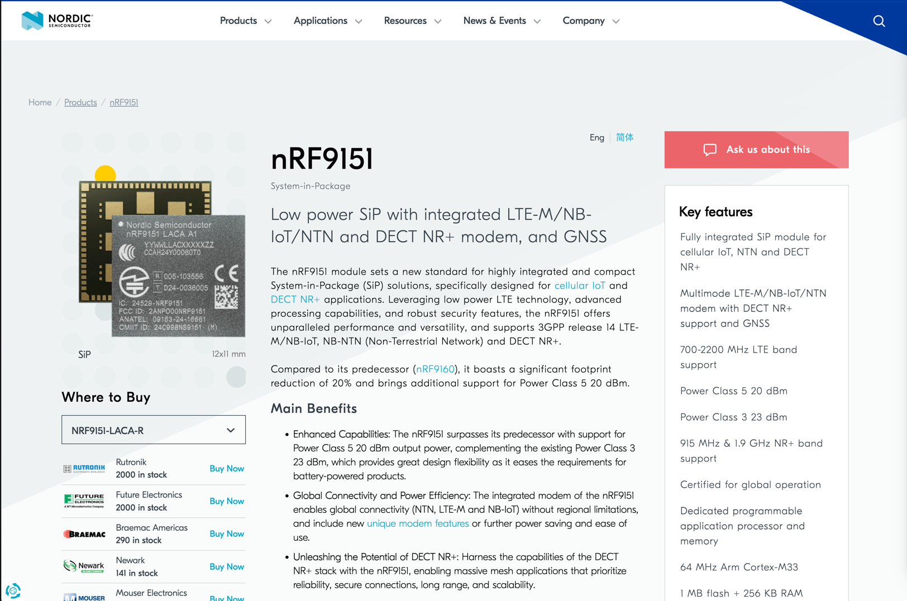
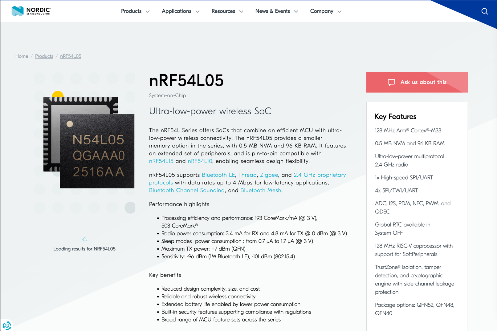

# 안녕하세요? 안녕하시냐구요,,
안녕하세요. 저는 전산과 백엔드 아키텍쳐 설계, 그리고 임베디드 시스템 개발에 대하여 높은 관심을 가지고있는 백엔드 엔지니어 이연준입니다.

지금부터 제가 2026학년도 3학년 1학기에 진행할 이호성 선생님의 1인 1프로젝트를 소개하여보도록 하겠습니다.

# 마라톤 기록 추적기 개발 프로젝트
이 프로젝트를 구상하게 된 계기는 러닝(learning 말고 running)을 좋아하시는 아버지가 제안하신겁니다.  
현 마라톤에서는 rfid를 이용하여 각 포인트마다 기록이 책정되는 방식이었는데 대회에따라서 rfid active 비콘이 적어서 실시간성도 없고 신뢰성도 낮다는 문제가 있었습니다.

그래서 **실시간으로 위치를 업데이트**하며 기록을 저장, 공유할 수 있고 각 개인이 쉽게 기존에 사용하던 healthcare 서비스에 우리의 데이터를 integration할 수 있는 서비스 개발을 시작하게 되었습니다.

# 연구주제
크게 연구 주제로는 nrf9151을 이용한 저전력 설계가 큰 연구 주제가 될 것 같습니다.  

GNSS 모듈을 어떤 모드로 어느시간 켜서 GPS Fix를 어느정도 정확도로 뽑아낼 수 있는가, 각 시나리오별로 전류가 어느정도 요구되는가,
LTE-M의 피크전류가 굉장히 높은데 이 전류를 어떻게 핸들링하며, 전송 주기를 어떻게 최적화하여 전기를 아낄 수 있겠는가

등이 가장 큰 연구 주제가 될 것 같습니다.

작게는 nrf54l05를 이용하여 스마트폰에 연결하여 쉽게 template을 이용하여 각 전송주기나 GPS tracker를 계정에 등록하는 등 사용자 편의에 대하여 다룰 수 있도록 할 예정입니다.

# 최종목표
해당 기기를 양산하여 마라톤 동호회를 통하여 B2C 사업을 시작하고, 기본 quota를 주고 추가 quota를 구독제로 제공하는 사업을 구상중입니다.  
또한 각 마라톤 대회와 B2B 계약을 진행하여 마라톤 주관사가 각 선수들에게 해당 기기를 대회기간동안 제공하여 각 대회에대한 통계등을 대회측에 제공하고 개인의 기록에도 저장할 수 있도록 구상하여 이후 사업 확장을 고려하였습니다.

# 연구 일정
- 3월
  - 저전력 구조를 위한 소프트웨어 최적화
  - 저전력 circuit 구성 연구
- 4월 
  - 태양광을 이용한 전력 보조 고려
  - PCB 디자인 및 PCBA 주문
- 5월
  - 서비스 개발. 백엔드 및 앱 개발
- 6월
  - 각 대회에서 개인으로 프로토타입 테스트
  - 각 대회에서 단체으로 프로토타입 테스트
- 7월
  - 각 대회에서 단체으로 프로토타입 테스트