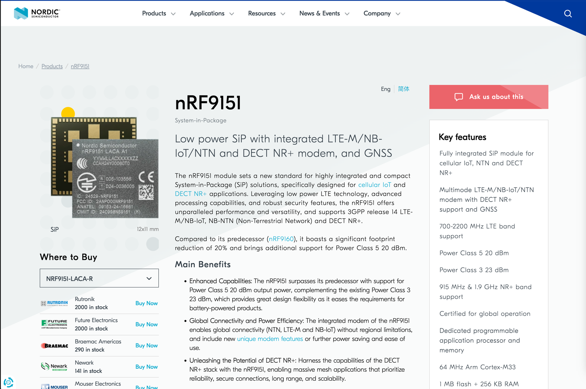
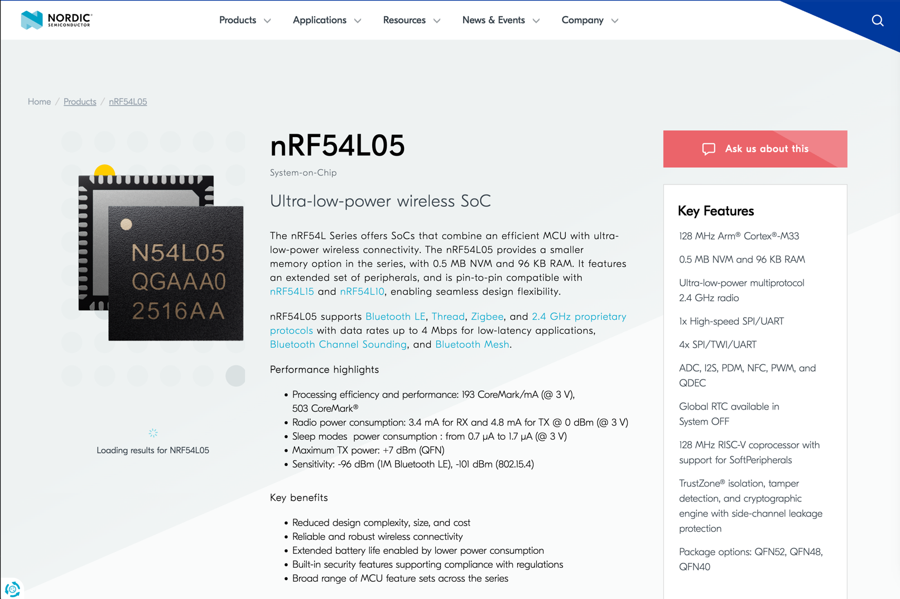

:::::locale{lang=ko}
# 안녕하세요? 안녕하시냐구요,,
:::::

:::::locale{lang=en}
# Hello? I said, hello...
:::::

:::::locale{lang=ko}
안녕하세요. 저는 전산과 백엔드 아키텍쳐 설계, 그리고 임베디드 시스템 개발에 대하여 높은 관심을 가지고있는 백엔드 엔지니어 이연준입니다.
:::::

:::::locale{lang=en}
Hello. I'm Yeonjun Lee, a backend engineer with a strong interest in computing, backend architecture design, and embedded systems development.
:::::

:::::locale{lang=ko}
지금부터 제가 2026학년도 3학년 1학기에 진행할 이호성 선생님의 1인 1프로젝트를 소개하여보도록 하겠습니다.
:::::

:::::locale{lang=en}
Let me introduce the one-person project I'll be working on in the first semester of my third year (2026) under Mr. Hoseong Lee.
:::::

:::::locale{lang=ko}
# 마라톤 기록 추적기 개발 프로젝트
:::::

:::::locale{lang=en}
# A marathon record tracker development project
:::::

:::::locale{lang=ko}
이 프로젝트를 구상하게 된 계기는 러닝(learning 말고 running)을 좋아하시는 아버지가 제안하신겁니다.  
현 마라톤에서는 rfid를 이용하여 각 포인트마다 기록이 책정되는 방식이었는데 대회에따라서 rfid active 비콘이 적어서 실시간성도 없고 신뢰성도 낮다는 문제가 있었습니다.
:::::

:::::locale{lang=en}
The idea came from my father, who loves running (running, not learning).  
Marathons today measure times at each checkpoint using RFID, but depending on the event there are so few active RFID beacons that there's no real-time tracking and reliability is low.
:::::

:::::locale{lang=ko}
그래서 **실시간으로 위치를 업데이트**하며 기록을 저장, 공유할 수 있고 각 개인이 쉽게 기존에 사용하던 healthcare 서비스에 우리의 데이터를 integration할 수 있는 서비스 개발을 시작하게 되었습니다.
:::::

:::::locale{lang=en}
So I started building a service that **updates location in real time**, stores and shares records, and lets each individual easily integrate our data into the healthcare service they already use.
:::::

:::::locale{lang=ko}
# 연구주제
:::::

:::::locale{lang=en}
# Research topics
:::::

:::::locale{lang=ko}
크게 연구 주제로는 nrf9151을 이용한 저전력 설계가 큰 연구 주제가 될 것 같습니다.  
:::::

:::::locale{lang=en}
Broadly, the main research topic will be low-power design using the nRF9151.  
:::::

:::::locale{lang=ko}
GNSS 모듈을 어떤 모드로 어느시간 켜서 GPS Fix를 어느정도 정확도로 뽑아낼 수 있는가, 각 시나리오별로 전류가 어느정도 요구되는가,
LTE-M의 피크전류가 굉장히 높은데 이 전류를 어떻게 핸들링하며, 전송 주기를 어떻게 최적화하여 전기를 아낄 수 있겠는가
:::::

:::::locale{lang=en}
In which mode and for how long should the GNSS module be powered on to get a GPS fix, and at what accuracy? How much current does each scenario require?
LTE-M's peak current is extremely high — how do we handle that current, and how do we optimize the transmission interval to save power?
:::::

:::::locale{lang=ko}
등이 가장 큰 연구 주제가 될 것 같습니다.
:::::

:::::locale{lang=en}
Those will likely be the biggest research topics.
:::::

:::::locale{lang=ko}
작게는 nrf54l05를 이용하여 스마트폰에 연결하여 쉽게 template을 이용하여 각 전송주기나 GPS tracker를 계정에 등록하는 등 사용자 편의에 대하여 다룰 수 있도록 할 예정입니다.
:::::

:::::locale{lang=en}
On a smaller scale, I plan to use the nRF54L05 to connect to a smartphone so users can conveniently use templates to set transmission intervals, register a GPS tracker to their account, and so on.
:::::

:::::locale{lang=ko}
# 최종목표
:::::

:::::locale{lang=en}
# End goal
:::::

:::::locale{lang=ko}
해당 기기를 양산하여 마라톤 동호회를 통하여 B2C 사업을 시작하고, 기본 quota를 주고 추가 quota를 구독제로 제공하는 사업을 구상중입니다.  
또한 각 마라톤 대회와 B2B 계약을 진행하여 마라톤 주관사가 각 선수들에게 해당 기기를 대회기간동안 제공하여 각 대회에대한 통계등을 대회측에 제공하고 개인의 기록에도 저장할 수 있도록 구상하여 이후 사업 확장을 고려하였습니다.
:::::

:::::locale{lang=en}
I'm planning to mass-produce the device, launch a B2C business through running clubs, and offer a base quota with additional quota sold as a subscription.  
I also considered future expansion via B2B contracts with marathon events: the organizer hands the device to each runner for the duration of the race, which lets us provide race-wide statistics to the organizer while the data is also saved to each runner's personal records.
:::::

:::::locale{lang=ko}
# 연구 일정
:::::

:::::locale{lang=en}
# Research schedule
:::::

:::::locale{lang=ko}
- 3월
  - 저전력 구조를 위한 소프트웨어 최적화
  - 저전력 circuit 구성 연구
- 4월 
  - 태양광을 이용한 전력 보조 고려
  - PCB 디자인 및 PCBA 주문
- 5월
  - 서비스 개발. 백엔드 및 앱 개발
- 6월
  - 각 대회에서 개인으로 프로토타입 테스트
  - 각 대회에서 단체으로 프로토타입 테스트
- 7월
  - 각 대회에서 단체으로 프로토타입 테스트
:::::

:::::locale{lang=en}
- March
  - Software optimization for a low-power architecture
  - Research on low-power circuit design
- April
  - Consider solar power assistance
  - PCB design and PCBA order
- May
  - Service development: backend and app
- June
  - Individual prototype testing at races
  - Group prototype testing at races
- July
  - Group prototype testing at races
:::::
