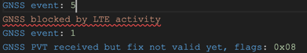
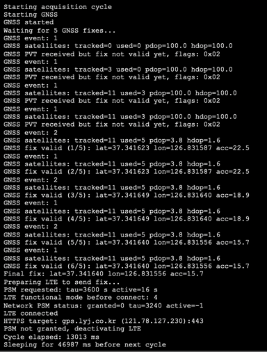

# 일단 위치를 업로드해야겠지??

어떤 방식이 좋을까

일단 LTE를 연결하고.... GPS켜셔 fix를 받고 업로드를 해야겠지?

자 다했다 이제 플래시하고 딱 실행을 시키면??

LTE랑 GNSS를 같이 실행시키면 LTE가 GNSS의 시간창을 뺐어가서 GNSS수신을 못한다!

그러면,,,

GNSS fix를 받고 LTE로 전송을 하는 사이클을 만들어야겠다!

해서 

성공했다!

쉽네 ㅋ
lte 연결 효율은 위해 PSM이 가능하면 동작할 수 있도록 구성하였다.

끗