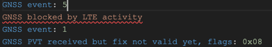
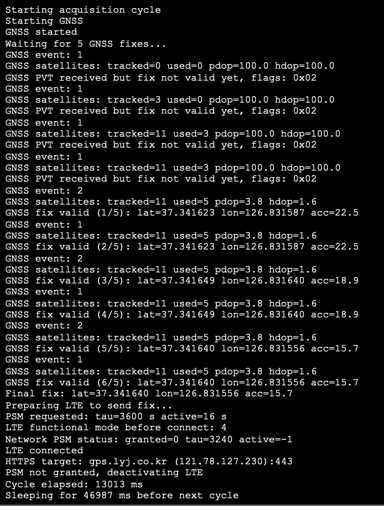

:::::locale{lang=ko}
# 일단 위치를 업로드해야겠지??
:::::

:::::locale{lang=en}
# First things first, we have to upload the location, right??
:::::

:::::locale{lang=ko}
어떤 방식이 좋을까
:::::

:::::locale{lang=en}
What approach would be best?
:::::

:::::locale{lang=ko}
일단 LTE를 연결하고.... GPS켜셔 fix를 받고 업로드를 해야겠지?
:::::

:::::locale{lang=en}
Connect LTE first.... then turn on GPS, get a fix, and upload — right?
:::::

:::::locale{lang=ko}
자 다했다 이제 플래시하고 딱 실행을 시키면??
:::::

:::::locale{lang=en}
Alright, all done — now flash it and run it, and??
:::::

:::::locale{lang=ko}
LTE랑 GNSS를 같이 실행시키면 LTE가 GNSS의 시간창을 뺐어가서 GNSS수신을 못한다!
:::::

:::::locale{lang=en}
If you run LTE and GNSS at the same time, LTE steals GNSS's time windows and GNSS can't receive anything!
:::::

:::::locale{lang=ko}
그러면,,,
:::::

:::::locale{lang=en}
So then...
:::::

:::::locale{lang=ko}
GNSS fix를 받고 LTE로 전송을 하는 사이클을 만들어야겠다!
:::::

:::::locale{lang=en}
I'll build a cycle that gets a GNSS fix first and then transmits over LTE!
:::::

:::::locale{lang=ko}
해서 
:::::

:::::locale{lang=en}
And so...
:::::

:::::locale{lang=ko}
성공했다!
:::::

:::::locale{lang=en}
It worked!
:::::

:::::locale{lang=ko}
쉽네 ㅋ
lte 연결 효율은 위해 PSM이 가능하면 동작할 수 있도록 구성하였다.
:::::

:::::locale{lang=en}
Easy lol
For LTE connection efficiency, I set it up so PSM kicks in whenever it's available.
:::::

:::::locale{lang=ko}
끗
:::::

:::::locale{lang=en}
The end.
:::::
