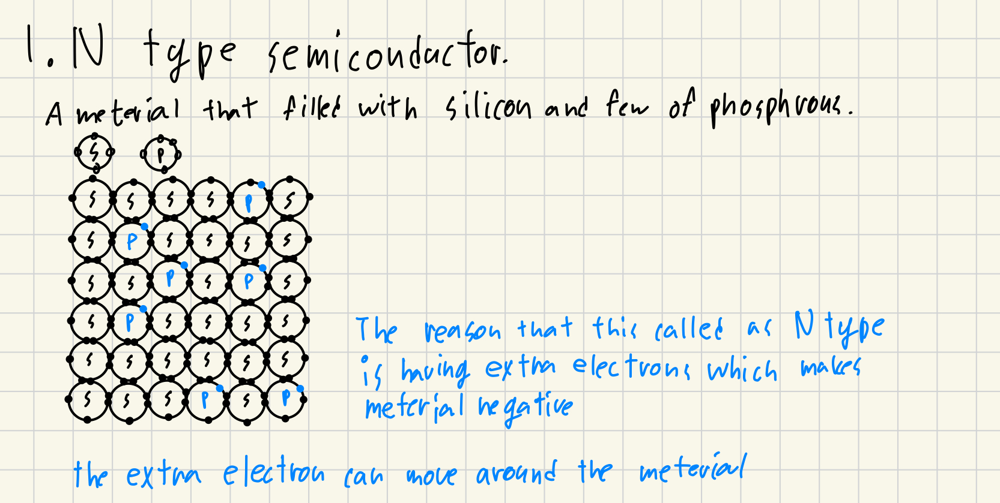
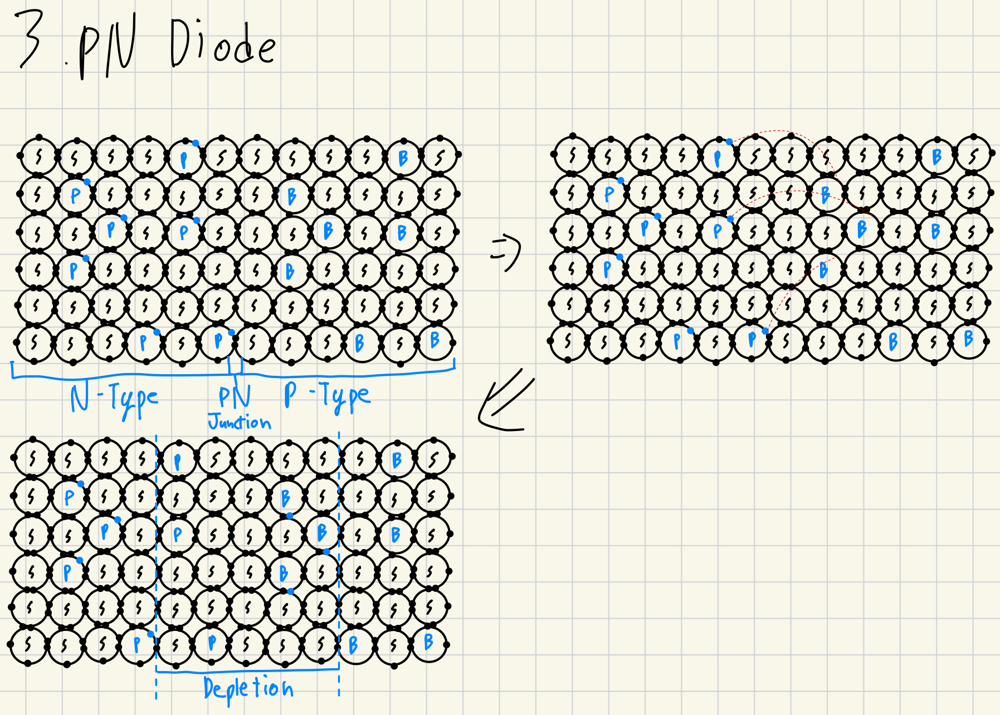
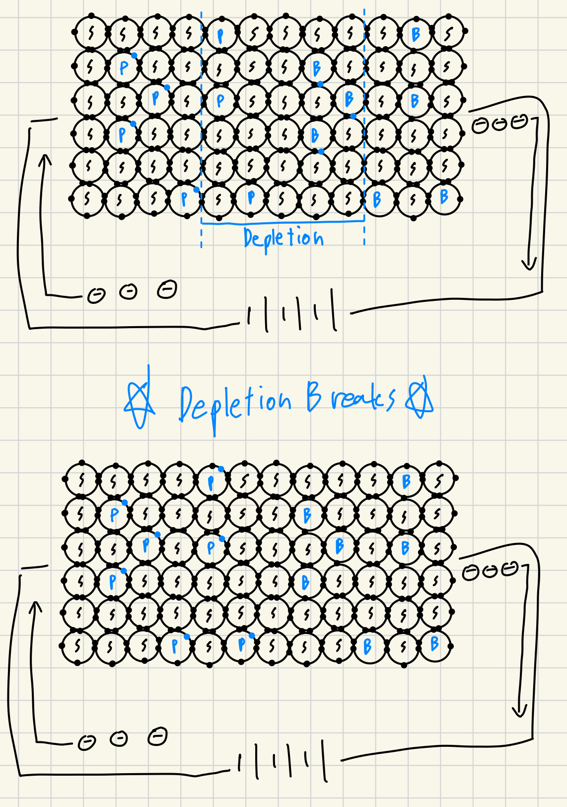
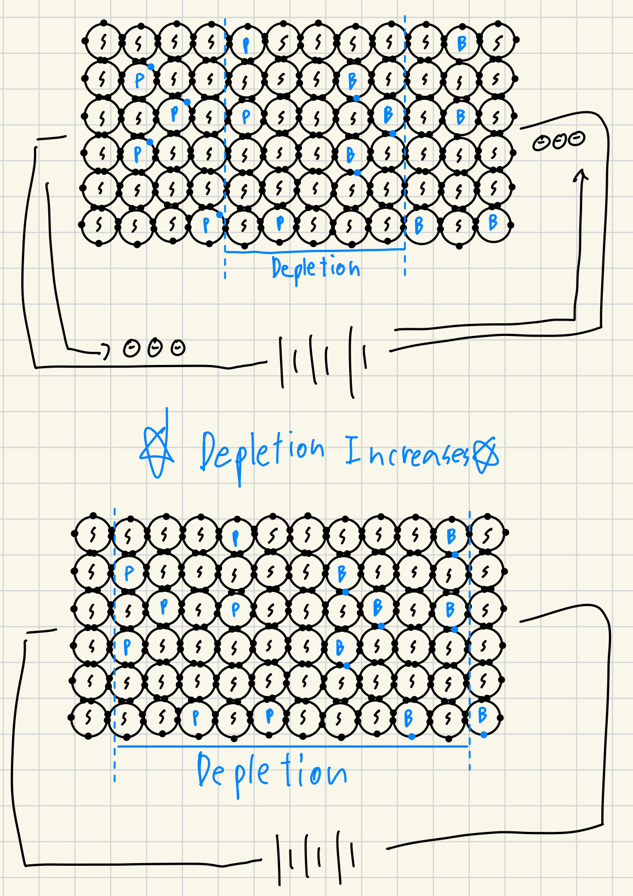

:::important
이 블로그는 Ben eater와 Core dumped의 영상을 보고 해당 내용을 내가 이해한 내용을 바탕으로 재구성한 문서임을 밝힘.
:::

# tl;dr
|     | N형 반도체       | P형 반도체          |
|-----|--------------|-----------------|
| 원소  | 인            | 붕소              |
| 전하  | 음전하          | 양전하             |
| 운반체 | **자유전자**가 이동 | 전자가 **정공**으로 점프 |

- 두 반도체를 연결하고 N형에 음극을, P형에 양극을 연결하면 PN Junction이 앏아지며 결국에는 무너져 전자는 N에서 P의 방향으로 이동. 전류가 흐름.
- 반대로 연결시 PN Junction의 Depletion이 넓어져 전자의 이동이 없어 전류가 흐르지 않음.

# Introduction
반도체는 도핑을 통해 2가지 종류로 나뉜다.. P-Type과 N-Type.

각각은 기본적으로 실리콘으로 이루어진 물질에 어떤 원소가 포함되어있냐에 따라 나뉜다.

# N-type semiconductor (N형 반도체)
N형 반도체는 실리콘으로 이루어진 물질에 인이 포함되어있는 물질을 의미한다.

실리콘으로 이루어진 물질은 서로가 공유결합함으로써 자유전자가 거의 없어 부도체의 특성을 가진 물질이 된다.
하지만 중간중간 전자의 개수가 5개인 인을 첨가함으로써 **잉여전자**가 만들어지고 해당 잉여전자는 물질을 자유롭게 돌아다닐 수 있다.
이로써 해당 물질, 즉 N형 반도체는 **도전성**을 가지게 된다.

:::note
전자의 개수가 많아 음전하를 띄기에 N형 반도체라고 불린다.
:::

# P-Type semiconductor (P형 반도체)
P형 반도체는 실리콘으로 이루어진 물질에 붕소가 포함되어잇는 물질을 의미한다.

N형 반도체의 경우와 같이, 실리콘으로 이루어진 물질은 서로가 공유결합함으로써 자유전자가 거의 없어 부도체의 특성을 가진 물질이 된다.
하지만 중간중간 전자의 개수가 3개인 붕소을 첨가함으로써 **정공**이만들어지고 해당 정공에 다른 전자가 들어차고, 그로인해 생기는 또다른 정공에 다른 전자가 이동한다.
이러한 방식으로 해당 물질, 즉 P형 반도체는 **도전성**을 갖는다.

:::note
전자의 개수가 적어 양전하를 띄기에 P형 반도체라고 불린다.
:::

# 활용 (Diode)
P형 반도체와 N형 반도체를 이용하면 전류를 한 방향으로 흐르게 만들어주는 다이오드를 만들 수 있다.

어떻게 하냐? 붙여버리면 된다!

## PN Diode

두 반도체를 붙이면 N형 반도체의 자유전자가 P형 반도체의 정공으로 이동한다! 그로써 PN Junction (경계)를 중심으로
Depletion(결핍 영역)이 발생하고 안정적인 중앙 영역이 생겨난다.

## 전지를 연결한다면? (양극을 P형 반도체에)

전자가 N형 반도체로 이동하며 고갈영역을 자유전자가 채우고, P형 반도체부분의 전자가 전지로 이동하며 정공이 생긴다.
이로인해 Depletion이 전압에따라 점점 줄어들게 된다. 그리고 전압이 특정 부분에 도달하는 순간 Depletion이 무너지며 전류가 흐르게 된다.

## 전지를 연결한다면? (양극을 N형 반도체에)

N형 반도체의 자유전자가 전지로 이동하고, P형 반도체에 정공에 자유전자가 들어차며 Depletion이 늘어나게 된다. 즉 이 상황에서는 전류를 흘리려고 해도 전류가 흐르지 않는다.
