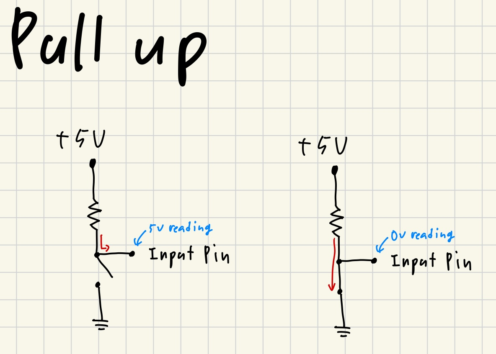
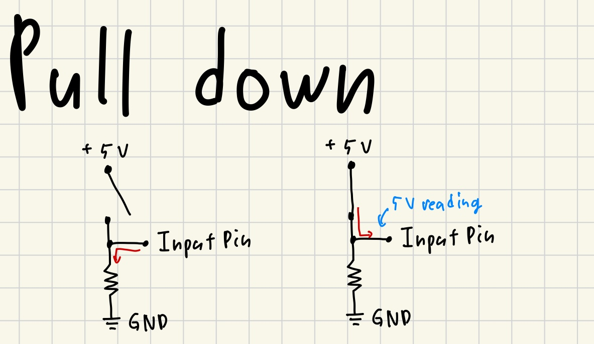

# TL;DR

:::::locale{lang=ko}
- 풀업 저항은 입력 핀의 입력값이 HIGH로 유지되고 스위치를 닫았을때 LOW로 변환되는 구조이다.
- 풀다운 저항은 입력 핀의 입력값이 LOW로 유지되고 스위치를 닫았을때 HIGH로 변환되는 구조이다.
- 신호선 사이에 풀업/풀다운 저항을 걸어놓는다면 풀업/풀다운 저항이 약함으로 출력핀의 출력에 따라 LOW로 전압이 끌어내려지거나 HIGH로 끌어올려진다.
:::::

:::::locale{lang=en}
- A pull-up resistor holds the input pin at HIGH, and the value flips to LOW when the switch is closed.
- A pull-down resistor holds the input pin at LOW, and the value flips to HIGH when the switch is closed.
- If you place a pull-up/pull-down resistor on a signal line, the pull is weak enough that the driving pin still wins: the line gets pulled down to LOW or up to HIGH according to the output pin.
:::::

# Floating

:::::locale{lang=ko}
플로팅 현상은 입력핀에 아무 입력이 없거나 NC 상태일때 입력핀에 전류가 흐르지 않아 전압을 읽을 수 없어 입력핀의 상태를 읽을 수 없는 상태를 의미한다.
이를 방지하기 위하여 풀업/풀다운 저항이 이용된다.
:::::

:::::locale{lang=en}
Floating refers to the state where the input pin has no input at all, or is left not connected, so no current flows and no voltage can be read — meaning the pin's state is unreadable.
Pull-up/pull-down resistors are used to prevent this.
:::::

:::::locale{lang=ko}
# 풀업 저항
:::::

:::::locale{lang=en}
# Pull-up resistor
:::::

:::::locale{lang=ko}
아무 동작도 없을때 Input Pin에 HIGH가 읽히는 구조다. 스위치가 조작되면 LOW가 읽힌다.
:::::

:::::locale{lang=en}
With no action taken, the input pin reads HIGH. When the switch is operated, it reads LOW.
:::::

:::::locale{lang=ko}
# 풀다운 저항
:::::

:::::locale{lang=en}
# Pull-down resistor
:::::

:::::locale{lang=ko}
아무 동작도 없을때 Input Pin에 LOW가 읽히는 구조다. 스위치가 조작되면 HIGH가 읽힌다.
:::::

:::::locale{lang=en}
With no action taken, the input pin reads LOW. When the switch is operated, it reads HIGH.
:::::

:::::locale{lang=ko}
# 어? 그럼 신호가 풀업, 풀다운 때문에 묻히지 않을까?
:::::

:::::locale{lang=en}
# Huh? Won't the pull-up/pull-down bury the signal then?
:::::

:::::locale{lang=ko}
여기서 저항이 큰 일을 하나 해준다. 저항때문에 풀업, 풀다운이 만든 전류가 신호보다 낮아 신호가 바뀌면 신호에 의해 끌어올려지거나 끌어내려진다.
이거 완전 신기하잖아!
:::::

:::::locale{lang=en}
This is where the resistor does its big job. Because of the resistance, the current the pull-up/pull-down creates is weaker than the signal, so when the signal changes, the line gets pulled up or down by the signal itself.
Isn't that just fascinating!
:::::

:::::locale{lang=ko}
# 왜 '저항'이 있는가?
:::::

:::::locale{lang=en}
# Why is there a *resistor* at all?
:::::

:::::locale{lang=ko}
사실 풀업 풀다운 저항은 너무나도 기본이고 그만큼 자주 사용되는 구조이다. ~~그래서 설명을 짧게 휘갈겼다.~~ 그런데 여기서 전기전자에 대한 지식이 부족했던 나는 의문을 하나 품었다.
`왜 꼭 저항이 있어야 하는가?` 여기에 대한 해답은 지금 생각해보면 너무나도 당연하지만 위에 이유 뿐만아니라 아마 쇼트와 과전류도 그 이유중 하나일 것이다.
:::::

:::::locale{lang=en}
Pull-up and pull-down resistors are about as basic as it gets, and they're used just as often. ~~That's why I scribbled the explanation so briefly.~~ But back when my electronics knowledge was lacking, one question nagged at me.
`Why does there have to be a resistor?` In hindsight the answer is obvious, but beyond the reason above, shorts and overcurrent are probably part of it too.
:::::

:::::locale{lang=ko}
우선 내가 왜 저 생각을 했냐면, 저항이 존재하지 않을때 풀업의 경우 스위치가 열려있는 상태에서 MCU가 5V에서 동작시 5V 그대로 Input Pin에 때려박아도 문제가 되지 않는다.
풀다운의 경우에도 비슷하다. 스위치가 열려있는 상태에서 Input Pin이 GND와 직결되기 때문에 문제없이 0V가 읽힐 것이다.
:::::

:::::locale{lang=en}
Here's why I wondered in the first place: with no resistor, in the pull-up case with the switch open and the MCU running at 5V, slamming 5V straight into the input pin causes no problem.
The pull-down case is similar. With the switch open the input pin is tied directly to GND, so 0V is read without any issue.
:::::

:::::locale{lang=ko}
하지만 스위치를 조작하게되면 문제가 발생하게 된다. 두 경우 모두 5V가 GND에 직결되어 쇼트가 일어나고 도선은 대체로 저항이 매우 작음으로 과전류가 흐르게 될 것이다.
이는 도선 뿐만아니라 MCU에도 손상을 줄 수 있기에 저항이 사용되는 것이다.
:::::

:::::locale{lang=en}
The problem shows up the moment you operate the switch. In both cases 5V is tied directly to GND, creating a short, and since wire resistance is generally very small, an overcurrent flows.
That can damage not just the wire but the MCU as well — which is exactly why the resistor is there.
:::::
