:::tip
Special thanks for [EasyEDA](https://easyeda.com) for CAD [JLCPCB](https://jlcpcb.com) for reliable PCBA
:::
::github{repo="yeonfish6040/step_controller"}

:::::locale{lang=ko}
# 신뢰성 있고 고도로 통합된 스텝드라이버의 필요 
:::::

:::::locale{lang=en}
# The need for a reliable, highly integrated stepper driver
:::::

:::::locale{lang=ko}
~~근데 내가 만든 스텝드라이버를 신뢰성 있다고 생각해도 될까~~
:::::

:::::locale{lang=en}
~~Though can a stepper driver I built myself really be called reliable~~
:::::

:::::locale{lang=ko}
자자 차치하고, TB6600 9개를 사서 사용중이었다! 근데 이상한놈한테서 사서 그런지 하나둘 계속 죽어가는거 아닌가! **이런!**\
그래서 스텝드라이버가 점점 수가 줄어들고 심지어 TB6600은 전원에 연결하고 Nucleo-f446re에 와이어링하기 극도로 불편하고 귀찮았기 때문에.
:::::

:::::locale{lang=en}
Anyway, setting that aside — I'd bought nine TB6600s and was using them! But maybe because I bought them from a sketchy seller, they kept dying one by one! **SHIT!**\
So my stepper driver count kept shrinking, and on top of that the TB6600 was extremely inconvenient and annoying to power and wire up to a Nucleo-F446RE.
:::::

:::::locale{lang=ko}
이럴바에 하나 만들어버리자!라고 생각해서 설계를 시작했다.
:::::

:::::locale{lang=en}
So I thought, if it's going to be like this, let's just build one! — and started designing.
:::::

:::::locale{lang=ko}
굳이 상용 제품을 또 사지 않고 직접 만든 이유는, 프로젝트 하나 할 때마다 회로 설계 역량이 눈에 보이게 쌓이는 게 그대로 동기부여가 되기 때문이다.
:::::

:::::locale{lang=en}
The reason I built it myself rather than buying another commercial product is that with each project my circuit design skills visibly accumulate, and that itself is motivating.
:::::

:::::locale{lang=ko}
처음 잡은 요구사항은 이 정도였다.
:::::

:::::locale{lang=en}
The initial requirements were roughly these.
:::::

:::::locale{lang=ko}
- 쓰는 모터가 다 달라서 채널별로 전류 제한이 가능할 것
- 고속 토크 확보를 위해 36V 정도(새한전자 스텝모터 typ.)는 버틸 것
- 인코더 입력을 받을 I2C 인터페이스가 있을 것
:::::

:::::locale{lang=en}
- Per-channel current limiting, since the motors I use are all different
- Tolerate around 36V (typical for Saehan Electronics steppers) to secure high-speed torque
- An I2C interface to take encoder input
:::::

:::::locale{lang=ko}
## 주요 구성
:::::

:::::locale{lang=en}
## Main configuration
:::::

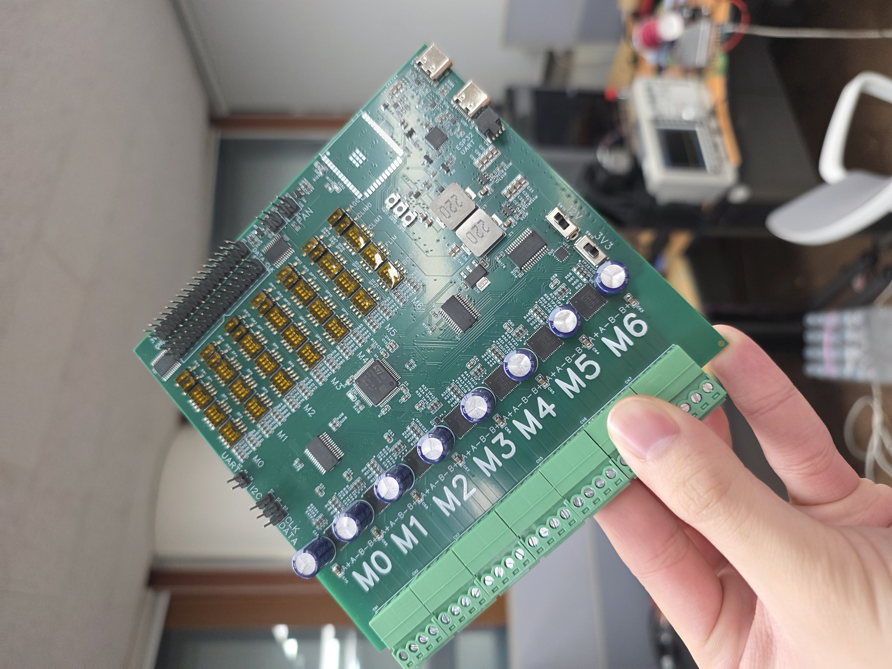
:::::locale{lang=ko}
~~AI 아님~~
:::::
:::::locale{lang=en}
Not an AI...
:::::
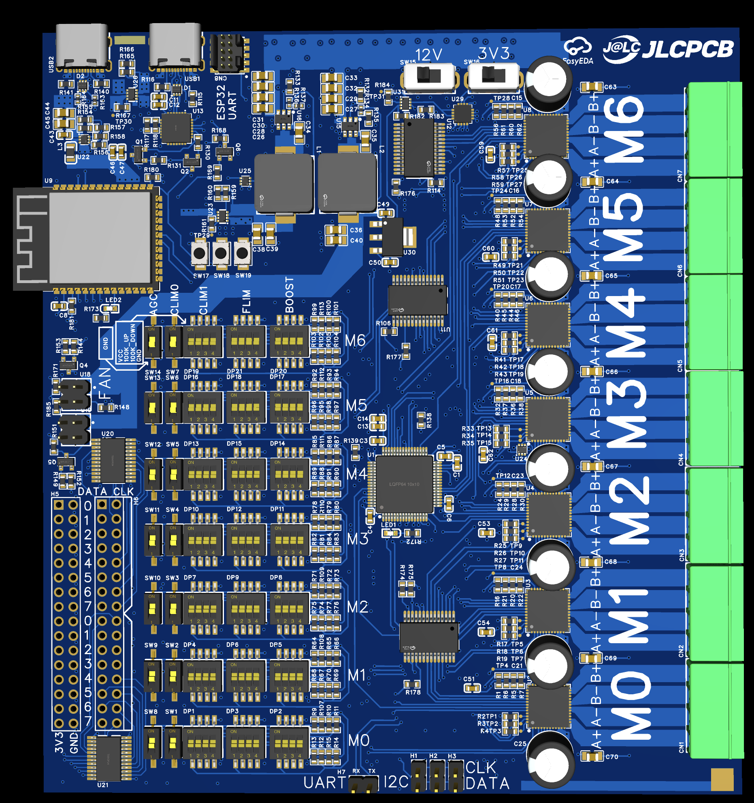

:::::locale{lang=ko}
- Dimension: 121 x 132 mm^2
- STM32F446RE Low level driver
- ESP32-S3 Communication / IK Solver
- x7 TB67S249FTG Step Controller
- x2 TCA9548A I2C Mux
- x2 PWM Fan Interface
:::::

:::::locale{lang=en}
- Dimension: 121 x 132 mm^2
- STM32F446RE Low level driver
- ESP32-S3 Communication / IK Solver
- x7 TB67S249FTG Step Controller
- x2 TCA9548A I2C Mux
- x2 PWM Fan Interface
:::::

:::::locale{lang=ko}
설계 시 잡은 전원 범위는 이렇다.
:::::

:::::locale{lang=en}
The power range set during design is as follows.
:::::

:::::locale{lang=ko}
- Voltage: 12V ~ 46V
- Maximum current: 35A(Driver) + 3A(Peripheral) = 38A
:::::

:::::locale{lang=en}
- Voltage: 12V ~ 46V
- Maximum current: 35A (driver) + 3A (peripheral) = 38A
:::::

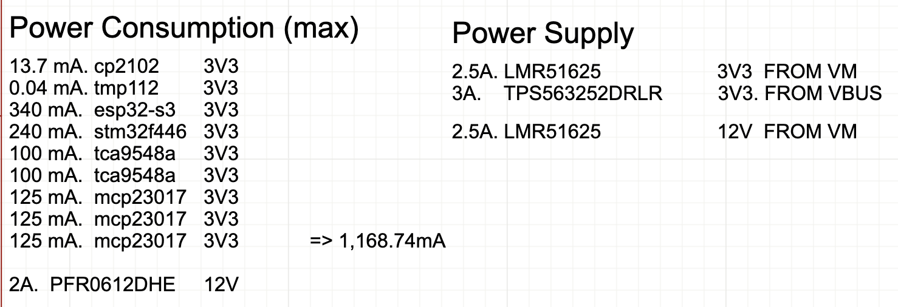

:::::locale{lang=ko}
Peripheral 쪽은 3V3 도메인에서 1.168A / 3.8544W, 12V 도메인에서 최대 2A / 24W로 총 28W 정도 쓴다.
12V 기준으로 환산하면 2.3A 정도인데, 나중에 I2C 센서를 더 달 수도 있으니 여유를 둬서 3A로 잡았다.
(peripheral 전류 소모는 입력 전압에 따라 달라질 수 있다.)
:::::

:::::locale{lang=en}
The peripheral side draws 1.168A / 3.8544W on the 3V3 domain and up to 2A / 24W on the 12V domain, about 28W total.
Converted to a 12V basis that's about 2.3A, but since I might add more I2C sensors later I left headroom and set it at 3A.
(Peripheral current draw can vary with input voltage.)
:::::

:::::locale{lang=ko}
# 이중 도메인 제어부
:::::

:::::locale{lang=en}
# A dual-domain control section
:::::

:::::locale{lang=ko}
이 기판은 STM32F446을 모터 제어 전담 **컨트롤러**로, ESP32-S3를 외부 기기와 붙어서 명령을 받고 IK를 푸는 **프로세서**로 쓴다.
:::::

:::::locale{lang=en}
This board uses the STM32F446 as a dedicated motor-control **controller**, and the ESP32-S3 as the **processor** that interfaces with external devices, receives commands, and solves IK.
:::::

:::::locale{lang=ko}
```
외부 호스트 ──USB/Wi-Fi── ESP32-S3 ──SPI+UART── STM32F446 ──CLK/DIR/EN── 드라이버 x7
              (프로세서)              (컨트롤러)
```
:::::

:::::locale{lang=en}
```
External host ──USB/Wi-Fi── ESP32-S3 ──SPI+UART── STM32F446 ──CLK/DIR/EN── drivers x7
               (processor)             (controller)
```
:::::

:::::locale{lang=ko}
나눈 이유는 저레벨에서 모터 제어에만 전념하면서 실시간으로 목표 각이나 속도를 받아 실행하는 도메인과, 네트워크·USB·역기구학처럼 지연이 생길 수 있는 도메인을 분리하려고 하였다.
~~근데 왜 이 단계에서 i2c 지연은 생각하지 못했을까...~~
:::::

:::::locale{lang=en}
I split them to separate the domain that focuses purely on low-level motor control, receiving target angles or speeds in real time and executing them, from the domain where latency can creep in — networking, USB, inverse kinematics.
~~But why did I not think about I2C latency at this stage...~~
:::::

:::::locale{lang=ko}
두 칩 사이는 SPI로 통신한다. 프로세서가 상태값을 읽어 오거나, 순서에 맞는 관절 목표값을 컨트롤러에 넘길 때 이 라인을 쓴다.
:::::

:::::locale{lang=en}
The two chips communicate over SPI. This line is used when the processor reads status values or hands sequenced joint targets to the controller.
:::::

:::::locale{lang=ko}
추가로 프로세서에서 컨트롤러의 `STM_NRESET_FROM_ESP`, `BOOT0`를 직접 흔들 수 있게 배선해서 원격으로 컨트롤러를 통째로 관리할 수 있게 하려고 했는데,
SPI2의 두 배선 중 부트로더가 쓰는 쪽을 착각하는 바람에 결국 펌웨어 업데이트는 SWD로만 가능하게 됐다. 아쉽다.
:::::

:::::locale{lang=en}
I also wired the processor so it could drive the controller's `STM_NRESET_FROM_ESP` and `BOOT0` directly, intending to manage the whole controller remotely —
but I mixed up which of SPI2's two wirings the bootloader uses, so firmware updates ended up being SWD-only. A shame.
:::::

:::::locale{lang=ko}
# 전원: 모터 전원과 USB 전원을 같이 쓰기
:::::

:::::locale{lang=en}
# Power: using motor power and USB power together
:::::

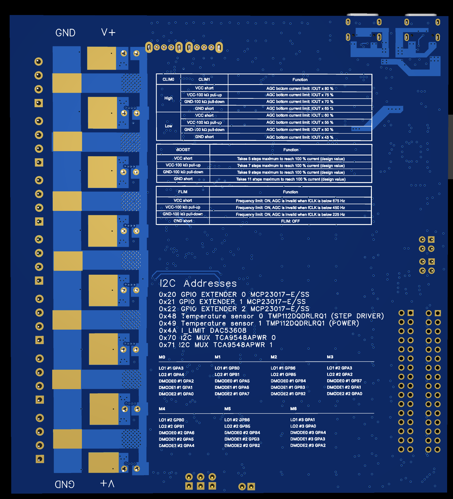

:::::locale{lang=ko}
전원은 보드 뒷면 솔더마스크를 벗겨 표면처리한 구리 Plane에 **구리 버스바를 납땜**해서, 그 버스바로 공급받는다.
:::::

:::::locale{lang=en}
Power comes in via a **copper busbar soldered** to a surface-finished copper plane exposed by stripping the solder mask on the back of the board.
:::::

:::::locale{lang=ko}
최대 40A를 흘려야 하는데 이걸 기판 내부 동박만으로 감당하려면 동박 폭을 넓히거나 두께를 늘려야 하고, 그러면 제작 단가가 확 올라간다.
그래서 메인 전류는 외부 버스바로 흐르게 했다. DRC 우회하려고 내부적으로 네트는 이어주고 신호선보다 넓은 Plane을 깔아두긴 했는데, 거기가 메인 전류 구간은 아니다.
:::::

:::::locale{lang=en}
Up to 40A has to flow, and handling that with in-board copper alone would require widening or thickening the copper, which sharply raises manufacturing cost.
So I routed the main current through an external busbar. To get past DRC I did tie the nets internally and laid down a plane wider than the signal traces, but that isn't the main current path.
:::::

:::::locale{lang=ko}
이 전원은 스텝 드라이버에 바로 들어가고 거기서 다른 전원 도메인으로 갈라져 나간다.
V<sub>motor</sub> 동박은 Top, Inner2, Bottom 세 층에 깔았고, 드라이버 7개가 늘어선 우측에서 로직이 모인 좌측으로 **한 방향으로만** 흐르게 배치해서 모터 전류의 복귀 경로가 로직 영역을 가로지르지 않게 했다.
:::::

:::::locale{lang=en}
This power feeds the stepper drivers directly and branches off into the other power domains from there.
The V<sub>motor</sub> copper is laid on three layers — top, inner2, and bottom — and arranged to flow in **only one direction**, from the right side where the seven drivers sit toward the left where the logic is, so that the motor current's return path never crosses the logic area.
:::::

:::::locale{lang=ko}
## 전압 트리
:::::

:::::locale{lang=en}
## Voltage tree
:::::

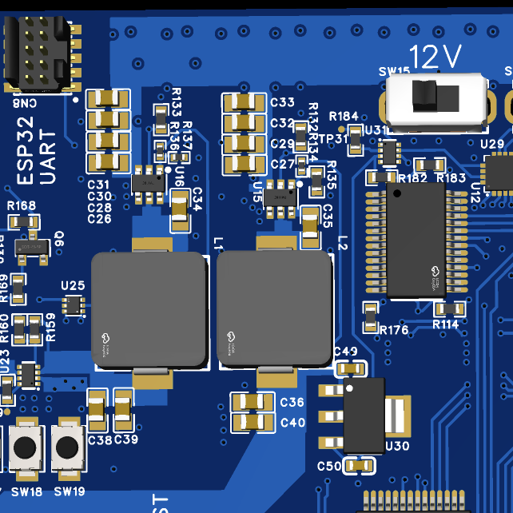

:::::locale{lang=ko}
메인 버스는 두 갈래로 나뉘어 각각 LMR51625를 통해 3V3, 12V로 내려간다.
LMR51625를 고른 이유는 입력 내압이 65V라 설계 상한 46V에 여유가 있고, V<sub>motor</sub>에서 로직 전압까지 한 번에 내릴 수 있어서다.
:::::

:::::locale{lang=en}
The main bus splits in two and steps down to 3V3 and 12V through an LMR51625 each.
I chose the LMR51625 because its 65V input rating leaves headroom over the 46V design ceiling, and because it can drop from V<sub>motor</sub> to logic voltage in a single stage.
:::::

:::::locale{lang=ko}
3V3은 MCU 같은 애들 돌리는 로직 레벨 전원이고, 12V는 그대로 팬을 돌리거나 LDO를 거쳐 DAC로 공급되어 전류제한 기준 전압을 만드는 데 쓴다.
:::::

:::::locale{lang=en}
3V3 is the logic-level rail running things like the MCUs, while 12V either drives the fans directly or passes through an LDO to the DAC, where it's used to generate the current-limit reference voltage.
:::::

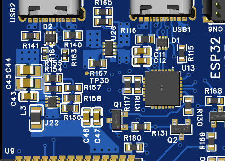

:::::locale{lang=ko}
메인 전원이 없을 때는 USB로 5V를 받아 TPS563252를 거쳐 로직 3V3과 DAC용 5V를 만들 수 있다.
ESP32-S3의 USB PHY에 붙는 USB2의 VBUS가 우선이고, 그게 없으면 USB1의 VBUS를 쓴다. 둘 중 뭘 쓸지는 TPS2116 Power Mux가 골라준다.
:::::

:::::locale{lang=en}
Without main power, it can take 5V from USB and generate logic 3V3 and DAC 5V through a TPS563252.
VBUS from USB2, which attaches to the ESP32-S3's USB PHY, takes priority; failing that, USB1's VBUS is used. A TPS2116 power mux picks between them.
:::::

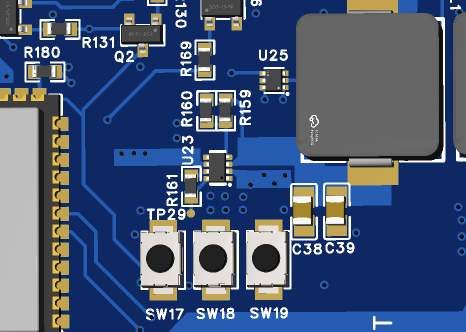

:::::locale{lang=ko}
5V 도메인에서 만든 3V3과 V<sub>motor</sub> 도메인에서 만든 3V3도 마찬가지로 Power Mux가 V<sub>motor</sub> 쪽을 우선해서 고른다.
이렇게 도메인마다 Power Mux를 둔 덕분에 V<sub>motor</sub>가 들어와 있는 상태에서도 USB를 안전하게 꽂을 수 있었다.
:::::

:::::locale{lang=en}
Likewise, between the 3V3 generated from the 5V domain and the 3V3 generated from the V<sub>motor</sub> domain, a power mux selects the V<sub>motor</sub> side by preference.
Thanks to putting a power mux on each domain, USB can be plugged in safely even while V<sub>motor</sub> is present.
:::::

:::::locale{lang=ko}
정리하면 이렇다.
:::::

:::::locale{lang=en}
In summary:
:::::

:::::locale{lang=ko}
```
V_motor 12~46V (Bus Bar) ── LMR51625 U16 ──┐
                                           ├─ TPS2116 U23 ── 3V3 (로직)
USB1/USB2 VBUS ── TPS2116 U26 (5V) ── TPS563252 U22 ──┘
                          │
V_motor (버스바 분기) ── LMR51625 U15 ── 12V ── 팬 x2
                                          │     5V
                                          └─ MCP1799 + TPS2116 (5V_DAC) ── DAC53608 V_REF x7
```
:::::

:::::locale{lang=en}
```
V_motor 12~46V (bus bar) ── LMR51625 U16 ──┐
                                           ├─ TPS2116 U23 ── 3V3 (logic)
USB1/USB2 VBUS ── TPS2116 U26 (5V) ── TPS563252 U22 ──┘
                          │
V_motor (busbar branch) ── LMR51625 U15 ── 12V ── fans x2
                                          │     5V
                                          └─ MCP1799 + TPS2116 (5V_DAC) ── DAC53608 V_REF x7
```
:::::

:::::locale{lang=ko}
DAC 전원만 스위칭이 아니라 LDO에서 뽑은 이유는, 벅컨버터를 하나 더 쓰면 BOM이 눈에 띄게 늘 거라고 생각해서였다.
근데 생각해보면 JLCPCB는 extended 부품을 하나 추가할 때마다 세팅비 \$3가 붙는 구조고, 5V→3V3에 이미 쓴 TPS563252는 공간도 작고 이미 쓴 부품이라 세팅비도 안 붙어서 추가 비용이 \$0.3밖에 안 된다. 심지어 LDO는 하나에 \$1.2였다. 완전히 틀린 판단이었던 것이다...
:::::

:::::locale{lang=en}
I took only the DAC rail from an LDO rather than a switcher because I thought one more buck converter would noticeably inflate the BOM.
But thinking it over, JLCPCB charges a \$3 setup fee for each extended part added, and the TPS563252 already used for 5V→3V3 is small and already in use — so no setup fee, and only \$0.3 extra. Meanwhile the LDO was \$1.2 apiece. It was a completely wrong call...
:::::

:::::locale{lang=ko}
뭐 이미 지나간 일이고, TB67S249FTG의 전류 리밋 입력핀은 HI-Z로 동작해서 전류를 거의 안 먹기 때문에 DAC 입력 쪽 전류는 없다고 봐도 무방하다. 그래서 LDO로도 충분하긴 하다.
:::::

:::::locale{lang=en}
Well, it's water under the bridge, and since the TB67S249FTG's current-limit input pins are hi-Z and draw almost no current, the current on the DAC input side is effectively nil. So the LDO is in fact sufficient.
:::::

:::::locale{lang=ko}
# 드라이버 선택
:::::

:::::locale{lang=en}
# Driver selection
:::::

:::::locale{lang=ko}
드라이버는 TB67S249FTG를 7개 썼다. 고른 이유는
:::::

:::::locale{lang=en}
I used seven TB67S249FTG drivers. Why I picked it:
:::::

:::::locale{lang=ko}
- 외부 FET 불필요
- 높은 전류 Capability
- I2C, SPI 같은 복잡한 구성 없이 dir, step으로 단순 구동 가능
- Microstep 가능
- AGC 지원
:::::

:::::locale{lang=en}
- No external FETs required
- High current capability
- Simple dir/step driving, with no complicated I2C or SPI setup
- Microstepping support
- AGC support
:::::

:::::locale{lang=ko}
이 프로젝트에서 쓰는 스텝모터는 NEMA17, NEMA24 두 가지인데 NEMA17이 정격 전류에서 생각보다 훨씬 뜨거워져서, 데이터시트 Feature에 적혀있던 AGC 기능이 굉장히 매력적으로 보였다.
:::::

:::::locale{lang=en}
This project uses two stepper types, NEMA17 and NEMA24, and the NEMA17 runs far hotter at rated current than expected — which made the AGC feature listed in the datasheet's features section look extremely attractive.
:::::

:::::locale{lang=ko}
근데 지금 생각해보면 외부 FET을 쓰는 편이 열관리에 이점이 있지 않았을까 싶다.
R<sub>ds</sub>가 수 mΩ 수준으로 낮은 모스펫이 정말 많은데, 이런 걸 썼으면 손실을 크게 줄일 수 있었을 것 같다.
발열 해소하겠다고 복잡한 방열 구조를 설계하느니 BOM 조금 늘리고 발열 자체를 줄이는 게 더 효율적이라고 생각한다.
좀 비싸게 가면 B-G431B-ESC에 들어가는 [STL180N6F7](https://www.mouser.kr/ko/ProductDetail/STMicroelectronics/STL180N6F7?qs=vLWxofP3U2xHOjKiB8nfgg%3D%3D) 같은 120A, 1.9mΩ짜리 고성능 모스펫도 있으니 말이다.
:::::

:::::locale{lang=en}
In hindsight, though, I wonder whether external FETs would have had a thermal advantage.
There are plenty of MOSFETs with R<sub>ds</sub> down in the single-digit mΩ range, and using one of those could have cut losses substantially.
Rather than designing a complicated heat-dissipation structure to deal with the heat, I think it's more efficient to grow the BOM a little and reduce the heat itself.
And if you spend a bit more, there are high-performance MOSFETs like the [STL180N6F7](https://www.mouser.kr/ko/ProductDetail/STMicroelectronics/STL180N6F7?qs=vLWxofP3U2xHOjKiB8nfgg%3D%3D) used in the B-G431B-ESC, at 120A and 1.9mΩ.
:::::

:::::locale{lang=ko}
## 전류제한
:::::

:::::locale{lang=en}
## Current limiting
:::::

:::::locale{lang=ko}
축별 전류 제한을 바꾸는 데에는 DAC53608을 썼다.
8채널 I2C DAC의 출력을 각각 `C1_VREF` ~ `C7_VREF`로 뽑아서 드라이버의 `VREFA`, `VREFB`에 같이 물렸다.
:::::

:::::locale{lang=en}
I used a DAC53608 to vary the per-axis current limit.
The 8-channel I2C DAC's outputs are broken out as `C1_VREF` through `C7_VREF` and tied to each driver's `VREFA` and `VREFB` together.
:::::

:::::locale{lang=ko}
덕분에 전류 제한을 소프트웨어에서 자유롭게 조절할 수 있게 됐다.
각 조인트에 뭘 붙일지 확정 안 된 상태에서 설계했기 때문에 꼭 필요한 기능이었고, 나중에 이야기할 방열 실패로 인한 과열 증상도 이걸로 조금이나마 피해갈 수 있었다.
:::::

:::::locale{lang=en}
That made the current limit freely adjustable from software.
It was an essential feature since I designed the board without having settled what would go on each joint, and it also let me partially dodge the overheating symptoms from the thermal failure I'll describe later.
:::::

:::::locale{lang=ko}
## AGC 파라메터
:::::

:::::locale{lang=en}
## AGC parameters
:::::

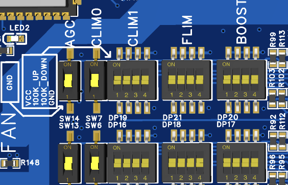

:::::locale{lang=ko}
TB67S249FTG는 `AGC`, `CLIM0`, `CLIM1`, `FLIM`, `BOOST`처럼 AGC 파라메터를 설정하는 핀이 여러 개 있는데, 이 값들은 실제로 모터를 돌려보기 전에는 정하기가 어렵다.
게다가 데이터시트에 구동 중에 바꾸지 말라고 되어있어서, 버그가 있어도 안 변하도록 하드하게 박아넣기로 하고 이 핀들을 전부 기판 위 스위치로 빼뒀다.
:::::

:::::locale{lang=en}
The TB67S249FTG has several pins for configuring AGC parameters — `AGC`, `CLIM0`, `CLIM1`, `FLIM`, `BOOST` — and these values are hard to decide before actually running the motors.
On top of that, the datasheet says not to change them during operation, so I decided to hard-wire them such that they can't change even in the presence of a bug, and broke all of these pins out to on-board switches.
:::::

:::::locale{lang=ko}
`AGC`와 `CLIM0`은 100kΩ 풀업과 슬라이드 스위치로 High/Low 2단을 만들었고,
3단 이상의 입력을 받는 `CLIM1`, `FLIM`, `BOOST`는 4포지션 DIP 스위치를 하나씩 배정해서 **VCC 직결 / 100kΩ 풀업 / 100kΩ 풀다운 / GND 직결** 네 가지를 고를 수 있게 했다.
같은 배열이 M0부터 M6까지 7줄 반복되고, 실크스크린에도 열 이름을 찍어뒀다.
:::::

:::::locale{lang=en}
`AGC` and `CLIM0` get two positions, high/low, via a 100kΩ pull-up and a slide switch,
while `CLIM1`, `FLIM`, and `BOOST`, which take three or more input levels, each get a 4-position DIP switch so you can choose among **direct to VCC / 100kΩ pull-up / 100kΩ pull-down / direct to GND**.
The same arrangement repeats across seven rows, M0 through M6, with column names printed on the silkscreen.
:::::

:::::locale{lang=ko}
## 기타 드라이버 파라메터
:::::

:::::locale{lang=en}
## Other driver parameters
:::::

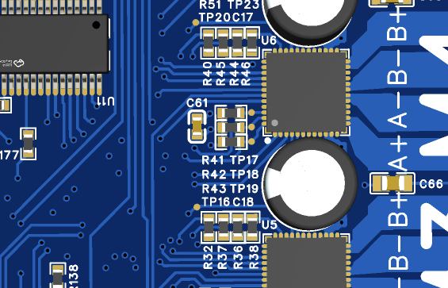

:::::locale{lang=ko}
`LTH` 핀에는 100kΩ을 달아 과전류 래치 시간을 데이터시트 권장값에 맞췄고, `OSCM` 핀(내부 클럭 설정)은 0Ω 저항 3개로 VCC/GND 중 하나를 고를 수 있는 점퍼 배열로 뒀다.
:::::

:::::locale{lang=en}
I put 100kΩ on the `LTH` pin to match the overcurrent latch time to the datasheet's recommended value, and left the `OSCM` pin (internal clock configuration) as a jumper array of three 0Ω resistors for selecting VCC or GND.
:::::

:::::locale{lang=ko}
그래서 보드를 받은 뒤에 쓸 때는 R37, R45 같은 위치의 저항 7개를 떼고 써야 한다. 클럭 설정을 RC로 하기 때문에 0Ω 점퍼를 안 떼면 쇼트가 난다.
:::::

:::::locale{lang=en}
So after receiving the board you have to remove the seven resistors at positions like R37 and R45 before use. Since the clock is configured with an RC network, not removing the 0Ω jumpers causes a short.
:::::

:::::locale{lang=ko}
...그리고 이 저항을 제거하면서 든 생각인데, 라우팅이 좀 복잡해지더라도 이건 왼쪽 끝에 몰아놓을 걸 그랬다. 가운데 껴 있어서 디솔더링하다가 옆 저항 건드리기 딱 좋았고, 실제로도 두 번 건드려서 복구했다.
:::::

:::::locale{lang=en}
...And a thought while removing those resistors: even if routing got messier, I should have grouped them at the left edge. Being stuck in the middle made it all too easy to disturb neighboring resistors while desoldering — and I did in fact disturb two and had to repair them.
:::::

:::::locale{lang=ko}
## 모터 출력 배선과 디커플링
:::::

:::::locale{lang=en}
## Motor output routing and decoupling
:::::

:::::locale{lang=ko}
모터 출력 `OUTA±`, `OUTB±`는 트랙이 아니라 **Plane으로 배선**했다.
폭은 2.8mm 정도인데 [계산기](https://www.digikey.kr/en/resources/conversion-calculators/conversion-calculator-pcb-trace-width)에 넣어보면 4.5A에서 12도 정도 온도 상승이 나오는 구성이다.
물론 IC 핀 쪽 좁은 트레이스에서는 80도까지도 오를 수 있는데, 이어지는 넓은 구리로 열이 빠져나가 방열되도록 구성했다.
터미널 블록은 7개를 기판 우측 변에 세로로 늘어놓아 모터 인터페이스를 만들었다.
:::::

:::::locale{lang=en}
The motor outputs `OUTA±` and `OUTB±` are routed as **planes**, not tracks.
The width is about 2.8mm, and plugging that into a [calculator](https://www.digikey.kr/en/resources/conversion-calculators/conversion-calculator-pcb-trace-width) gives roughly a 12°C rise at 4.5A.
Of course the narrow traces at the IC pins can climb to 80°C, but I arranged things so the heat escapes into the adjoining wide copper and dissipates.
Seven terminal blocks are lined up vertically along the right edge of the board to form the motor interface.
:::::

:::::locale{lang=ko}
디커플링은 채널마다 100µF 전해와 100nF 세라믹을 드라이버 바로 옆에 붙였다. 데이터시트 권장값이다. 100nF 경로가 살짝 멀긴 한데.. 잘 동작했다.
:::::

:::::locale{lang=en}
For decoupling, each channel has a 100µF electrolytic and a 100nF ceramic right next to the driver — the datasheet's recommended values. The 100nF path is a touch long, but... it worked fine.
:::::

:::::locale{lang=ko}
# I2C 확장과 GPIO 확장
:::::

:::::locale{lang=en}
# I2C expansion and GPIO expansion
:::::

:::::locale{lang=ko}
컨트롤러가 다뤄야 하는 드라이버 신호는 채널당 8개, 7채널이면 56개다.
STM32F446RE(LQFP64)의 가용 핀으로는 어림도 없어서 **타이밍이 중요한 신호와 아닌 신호를 나눠서** 배선했다.
:::::

:::::locale{lang=en}
The controller has to handle 8 driver signals per channel — 56 across 7 channels.
That's nowhere near feasible with the available pins on an STM32F446RE (LQFP64), so I routed them by **separating timing-critical signals from the rest**.
:::::

:::::locale{lang=ko}
| 신호 | 경로 | 이유 |
|---|---|---|
| `CLK`, `DIR`, `EN` (x7) | STM32 직결 (21핀) | 스텝 펄스는 타이머로 직접 만들어야 하고 DIR과 CLK는 서로 동기시켜야 함 |
| `DMODE0`~`2` (x7) | MCP23017 3개 (I2C) | 마이크로스텝 분주는 동작 중 자주 안 바뀌어서 I2C 지연이 문제 안 됨 |
| `LO1`, `LO2` (x7) | MCP23017 3개 (I2C) | 과전류·과열 래치 상태는 폴링으로 읽어도 충분 |
:::::

:::::locale{lang=en}
| Signal | Path | Reason |
|---|---|---|
| `CLK`, `DIR`, `EN` (x7) | Direct to STM32 (21 pins) | Step pulses must be generated directly by timers, and DIR and CLK must be synchronized |
| `DMODE0`~`2` (x7) | 3× MCP23017 (I2C) | Microstep division rarely changes during operation, so I2C latency isn't a problem |
| `LO1`, `LO2` (x7) | 3× MCP23017 (I2C) | Overcurrent/overtemperature latch state is fine to read by polling |
:::::

:::::locale{lang=ko}
MCP23017 3개로 GPIO 48개를 확보해서 위의 35개 신호를 받아냈고, 한 I2C 버스에 DAC53608, TCA9548A 2개, TMP112 2개를 같이 물렸다.
결과적으로 **컨트롤러가 직접 잡는 핀은 펄스 계열과 펄스에 동기돼야 하는 DIR뿐이고, 나머지 설정·상태는 전부 I2C 한 쌍**에 물렸다.
:::::

:::::locale{lang=en}
Three MCP23017s provide 48 GPIOs, covering the 35 signals above, and a single I2C bus carries the DAC53608, two TCA9548As, and two TMP112s together.
The result: **the only pins the controller drives directly are the pulse signals and the DIR that must stay synchronized to them; all remaining configuration and status hangs off one I2C pair**.
:::::

:::::locale{lang=ko}
한 버스에 슬레이브가 8개나 붙다 보니 주소 충돌을 피하려고 주소를 미리 배정해뒀다.
:::::

:::::locale{lang=en}
With eight slaves on one bus, I pre-assigned addresses to avoid collisions.
:::::

:::::locale{lang=ko}
| 주소 | 디바이스 | 역할 |
|---|---|---|
| `0x20`~`0x22` | MCP23017 x3 | 드라이버 모드·상태 GPIO 확장 |
| `0x48` | TMP112 #0 | 드라이버 영역 온도 |
| `0x49` | TMP112 #1 | 전원부 영역 온도 |
| `0x4A` | DAC53608 | 축별 전류 제한 기준 전압 |
| `0x70`, `0x71` | TCA9548A x2 | 엔코더 I2C 멀티플렉서 |
:::::

:::::locale{lang=en}
| Address | Device | Role |
|---|---|---|
| `0x20`~`0x22` | MCP23017 x3 | Driver mode/status GPIO expansion |
| `0x48` | TMP112 #0 | Driver-area temperature |
| `0x49` | TMP112 #1 | Power-section temperature |
| `0x4A` | DAC53608 | Per-axis current-limit reference voltage |
| `0x70`, `0x71` | TCA9548A x2 | Encoder I2C multiplexers |
:::::

:::::locale{lang=ko}
조립하거나 디버깅할 때 회로도를 다시 안 열어봐도 되게 **기판 뒷면 실크스크린에 주소표를 찍어**뒀는데, 정작 케이싱을 씌워놓고 쓰니까 회로도 보는 게 더 편했다. 그래도 이 보드를 boardrepo 같은 데 배포할 계획이 있어서 넣어둔 것이니 아주 헛일은 아니다.
:::::

:::::locale{lang=en}
So I wouldn't have to reopen the schematic while assembling or debugging, I **printed the address table on the back silkscreen** — but once the board was in a case, reading the schematic turned out to be easier anyway. Still, I put it there because I plan to publish this board somewhere like boardrepo, so it wasn't entirely wasted.
:::::

:::::locale{lang=ko}
## 엔코더 인터페이스
:::::

:::::locale{lang=en}
## Encoder interface
:::::

:::::locale{lang=ko}
관절 각도 되먹임에 쓰는 자기식 엔코더는 I2C 주소가 고정이라 버스 하나에 여러 개를 붙일 수가 없다.
그래서 TCA9548A I2C 멀티플렉서를 2개 둬서 **같은 주소를 가진 엔코더/센서를 최대 16채널까지** 붙일 수 있게 했다.
:::::

:::::locale{lang=en}
The magnetic encoders used for joint angle feedback have fixed I2C addresses, so you can't put several on one bus.
So I added two TCA9548A I2C multiplexers, allowing **up to 16 channels of identically addressed encoders/sensors**.
:::::

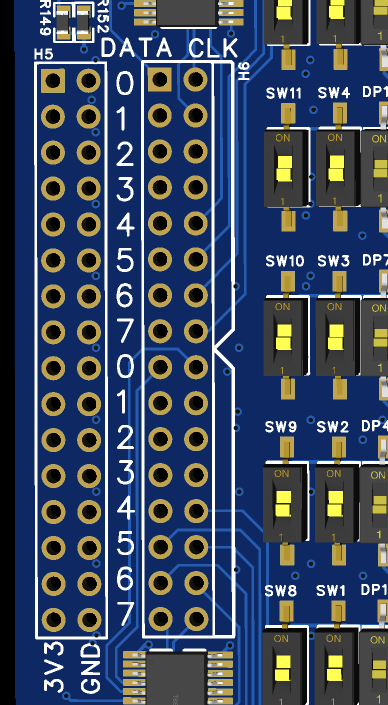

:::::locale{lang=ko}
멀티플렉서의 하위 채널 `SC0`~`SC15`, `SD0`~`SD15`는 32핀 헤더로, 3V3과 GND는 따로 32핀 헤더로 빼서 엔코더 하나당 4핀(3V3, GND, SDA, SCL)을 쓰도록 실크스크린에 번호를 찍어뒀다.
7축이면 7채널이면 되지만, 나중에 그리퍼나 센서를 더 붙일 수도 있으니 16채널을 전부 뽑아뒀다.
:::::

:::::locale{lang=en}
The multiplexers' downstream channels `SC0`~`SC15` and `SD0`~`SD15` come out on a 32-pin header, with 3V3 and GND on a separate 32-pin header, and the silkscreen is numbered so each encoder uses four pins (3V3, GND, SDA, SCL).
Seven axes only need seven channels, but since I might add a gripper or more sensors later, I broke out all 16.
:::::

:::::locale{lang=ko}
## USB 인터페이스
:::::

:::::locale{lang=en}
## USB interface
:::::

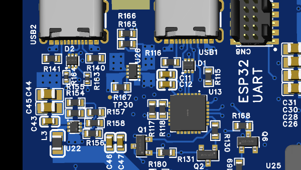

:::::locale{lang=ko}
USB 포트는 두 개다. USB2는 프로세서의 내장 USB PHY에 바로 연결하고, USB1은 CP2102N-A02를 거쳐 컨트롤러의 UART에 연결했다. 두 포트 모두 USBLC6-2P6로 ESD 보호를 넣었다.
:::::

:::::locale{lang=en}
There are two USB ports. USB2 connects directly to the processor's built-in USB PHY, while USB1 goes through a CP2102N-A02 to the controller's UART. Both ports have ESD protection via a USBLC6-2P6.
:::::

:::::locale{lang=ko}
CP2102N의 `DTR`, `RTS`를 MMBT3904 트랜지스터 쌍으로 받아 `BOOT0`과 `NRESET`을 만드는 부트 회로도 넣어서 프로세서를 편하게 업데이트할 수 있게 했다.
:::::

:::::locale{lang=en}
I also added a boot circuit that takes the CP2102N's `DTR` and `RTS` through a pair of MMBT3904 transistors to generate `BOOT0` and `NRESET`, making processor updates convenient.
:::::

:::::locale{lang=ko}
즉 프로세서 직결 USB는 클라이언트와 통신하며 컨트롤러에 명령을 보내는 외부 인터페이스이고, CP2102N을 거치는 USB는 ESP32의 디버깅용 시리얼 포트다.
:::::

:::::locale{lang=en}
In short, the USB wired directly to the processor is the external interface that talks to clients and sends commands to the controller, while the USB going through the CP2102N is the ESP32's debug serial port.
:::::

:::::locale{lang=ko}
여기서 재밌었던 건 ESD 보호 다이오드였다. 문턱전압이 높은 다이오드를 쓰는 줄 알았는데 실제로는 항복전압이 낮은 다이오드를 쓴다는 점이 흥미로웠다.
:::::

:::::locale{lang=en}
The fun part here was the ESD protection diodes. I'd assumed you use diodes with a high threshold voltage, but it was interesting to learn that in practice you use diodes with a low breakdown voltage.
:::::

:::::locale{lang=ko}
# 방열
:::::

:::::locale{lang=en}
# Thermal management
:::::

:::::locale{lang=ko}
## 방열실패
:::::

:::::locale{lang=en}
## Thermal failure
:::::

:::::locale{lang=ko}
보드를 받고 처음 모터에 전류를 흘렸을 때 모터가 2초쯤 돌다가 멈췄다. 도대체 왜인가 하고 디버깅하다가 OverTemperatureProtection이 동작했다는 걸 알게 됐다.
방열판을 추가해봤는데 개선이 조금도 안 느껴졌다. 그래서 본격적으로 원인규명에 들어갔다.
:::::

:::::locale{lang=en}
When I got the board and first put current through a motor, it spun for about two seconds and stopped. While debugging why on earth that was, I found that over-temperature protection had triggered.
I tried adding a heatsink and felt no improvement whatsoever. So I got serious about root-causing it.
:::::

:::::locale{lang=ko}
주된 원인은 **부족한 thermal via**였다.
처음 주문할 때는 EasyEDA 내장 Footprint에 서멀 비아가 9개 기본으로 박혀 있길래 그걸로 충분한 줄 알고 그대로 주문했는데, 반대편이 그렇게 뜨겁지도 않은데 OTP가 걸려버린 거다.
:::::

:::::locale{lang=en}
The main cause was **insufficient thermal vias**.
On the first order, EasyEDA's built-in footprint had nine thermal vias by default, so I assumed that was enough and ordered as-is — and then OTP tripped even though the other side wasn't all that hot.
:::::

:::::locale{lang=ko}
Via 크기 0.3mm, JLCPCB의 Via 구리 두께 18µm 기준으로 Via 하나당 구리 단면적은
:::::

:::::locale{lang=en}
With a 0.3mm via size and JLCPCB's 18µm via copper thickness, the copper cross-section per via is
:::::

$$
A_{via} = \pi \left( \left(\frac{305}{2}\right)^2 - \left(\frac{305 - 2 \times 18}{2}\right)^2 \right) \approx 16230\ \mu m^2
$$

:::::locale{lang=ko}
Via가 9개면 열이 통과할 수 있는 구리 단면적은 ≈146070µm² 정도다.
[TB67S128FTG Application Note](https://toshiba.semicon-storage.com/info/TB67S128FTG_application_note_en_20260731_AKX01501.pdf?did=170510&prodName=TB67S128FTG)에 따르면 3A일 때 예상 발열이 ≈9W이므로, 기판 두께 1.6mm와 구리 열전도율 401 W/m·K로 1차원 열전도 계산을 해보면 Via 양쪽 온도차는
:::::

:::::locale{lang=en}
With nine vias, the copper cross-section available for heat to pass through is ≈146,070µm².
According to the [TB67S128FTG application note](https://toshiba.semicon-storage.com/info/TB67S128FTG_application_note_en_20260731_AKX01501.pdf?did=170510&prodName=TB67S128FTG), expected dissipation at 3A is ≈9W, so running a 1-D heat conduction calculation with a 1.6mm board thickness and copper conductivity of 401 W/m·K, the temperature difference across the vias is
:::::

$$
\Delta T = \frac{9 \times 0.0016}{401 \times 1.4607 \times 10^{-7}} \approx 246\ ^\circ C
$$

:::::locale{lang=ko}
정격상 최악인 4.5A에서는 발열이 ≈19W이므로
:::::

:::::locale{lang=en}
And at 4.5A, the worst case within rating, dissipation is ≈19W, so
:::::

$$
\Delta T = \frac{19 \times 0.0016}{401 \times 1.4607 \times 10^{-7}} \approx 519\ ^\circ C
$$

:::::locale{lang=ko}
TB67S249FTG의 OTP 기준이 160°C인 걸 생각하면, 두 경우 다 Via 9개로는 상온에서 도저히 못 빼는 열이라는 뜻이다.
그래서 서멀 비아를 57개 박은 새 PCB를 다시 주문했다.
:::::

:::::locale{lang=en}
Given the TB67S249FTG's OTP threshold of 160°C, both cases mean nine vias simply cannot shed that heat at room temperature.
So I reordered a new PCB with 57 thermal vias.
:::::

:::::locale{lang=ko}
...위에서 말한 대로 차라리 외부 FET을 썼으면 좋았을 걸.
:::::

:::::locale{lang=en}
...As said above, I really should have just used external FETs.
:::::

:::::locale{lang=ko}
## 서멀 비아를 늘리고 방열판과 팬 붙이기
:::::

:::::locale{lang=en}
## Adding thermal vias, a heatsink, and fans
:::::

:::::locale{lang=ko}
서멀 비아 57개로 3A 기준 다시 계산해보면
:::::

:::::locale{lang=en}
Recalculating at 3A with 57 thermal vias:
:::::

$$
\Delta T_{new} = \frac{9 \times 0.0016}{401 \times 9.2511 \times 10^{-7}} \approx 38.8\ ^\circ C
$$

:::::locale{lang=ko}
최악을 가정한 4.5A 기준으로도
:::::

:::::locale{lang=en}
And assuming the worst case at 4.5A:
:::::

$$
\Delta T_{new} = \frac{19 \times 0.0016}{401 \times 9.2511 \times 10^{-7}} \approx 81\ ^\circ C
$$

:::::locale{lang=ko}
둘 다 방열 설계로 충분히 커버할 수 있는 온도차가 나왔다. IC 위쪽이나 FR4를 통해 빠져나가는 열까지 생각하면 실제로는 여유가 더 있을 거다.
:::::

:::::locale{lang=en}
Both come out as temperature differences a thermal design can comfortably cover. Counting the heat escaping through the top of the IC and through the FR4, there's actually even more margin.
:::::

:::::locale{lang=ko}
드라이버 아래에는 방열용 서멀 비아를 깔고 GND 동박으로 열을 퍼뜨리는 한편, 보드 아래쪽 서멀 비아의 솔더마스크를 열어 0.5T 구리판을 얇게 납땜하고 그 위에 방열판을 올렸다. 그리고 팬 인터페이스로 공랭하는 구조다.
:::::

:::::locale{lang=en}
Under the drivers I laid thermal vias and spread the heat through GND copper; on the underside I opened the solder mask over those vias, soldered a thin 0.5T copper plate on, and mounted a heatsink on top of that. Air cooling then comes via the fan interface.
:::::

:::::locale{lang=ko}
## 온도감지
:::::

:::::locale{lang=en}
## Temperature sensing
:::::

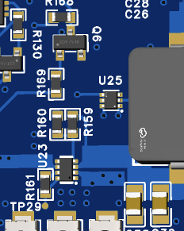
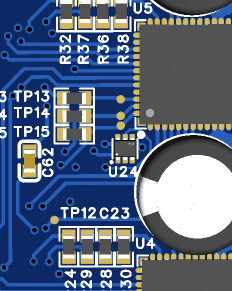

:::::locale{lang=ko}
온도 센서는 TMP112D 두 개(U24, U25)다. I2C로 컨트롤러에 붙고 주기마다 폴링해서 상태값을 갱신한다.
드라이버 열이 몰리는 기판 우측과 전원부가 있는 좌측에 하나씩 나눠 둬서 국소 발열과 기판 전체 온도를 구분해서 볼 수 있게 했다.
:::::

:::::locale{lang=en}
The temperature sensors are two TMP112Ds (U24, U25). They attach to the controller over I2C and are polled each cycle to refresh their state.
One sits on the right side of the board where driver heat concentrates and the other on the left where the power section is, so localized heating and overall board temperature can be told apart.
:::::

:::::locale{lang=ko}
뒤에서도 얘기하겠지만, 온도 센서는 프로세서 쪽에 붙여놓는 편이 더 좋았을 것 같다.
:::::

:::::locale{lang=en}
As I'll mention later, it would have been better to attach the temperature sensors to the processor instead.
:::::

:::::locale{lang=ko}
## 팬 인터페이스
:::::

:::::locale{lang=en}
## Fan interface
:::::

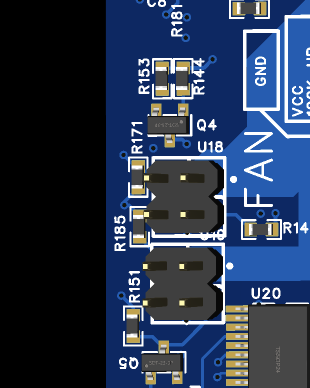

:::::locale{lang=ko}
팬은 2채널이고, 커넥터마다 12V, GND, PWM, 회전수 센스 4핀을 배정했다.
PWM은 MMBT3904로 오픈 드레인 구동해서 12V 팬의 제어 입력을 직접 흔들 수 있게 했고, 센스 라인은 풀업한 뒤 프로세서의 입력 캡처로 받아 실제 RPM을 확인할 수 있게 했다.
:::::

:::::locale{lang=en}
There are two fan channels, each connector carrying four pins: 12V, GND, PWM, and tach sense.
PWM is open-drain driven by an MMBT3904 so it can drive a 12V fan's control input directly, and the sense line is pulled up and fed to the processor's input capture so actual RPM can be read.
:::::

:::::locale{lang=ko}
프로세서 쪽에 연결되며 MCPWM Peripheral을 이용했다. RPM 산출은 MCPWM 타이머의 캡쳐를 이용했다.
:::::

:::::locale{lang=en}
It connects to the processor and uses the MCPWM peripheral. RPM is computed using the MCPWM timer's capture.
:::::

:::::locale{lang=ko}
# 아쉬웠던 점
:::::

:::::locale{lang=en}
# What I regret
:::::

:::::locale{lang=ko}
기판을 만들고 실제로 돌려본 뒤에 알게 된 것들이다.
:::::

:::::locale{lang=en}
Things I learned only after building the board and actually running it.
:::::

:::::locale{lang=ko}
- **온도-팬 제어 루프가 두 칩에 걸쳐 있다.**\
  TMP112는 컨트롤러가 읽는 I2C 버스에 있는데 팬 PWM과 센스는 프로세서에 물려 있다. 그래서 팬 하나 돌리는 데에도 두 칩 사이 통신을 한 번 거쳐야 한다. 온도 감지도 팬과 같은 프로세서 쪽으로 모으는 게 깔끔했다.
  심지어 드라이버는 구동만 담당하는 구조가 좋은데, 온도측정이 드라이버 구동 중 타이머 파라메터 업데이트에 병목이 될 수 있다.
:::::

:::::locale{lang=en}
- **The temperature-fan control loop spans two chips.**\
  The TMP112 sits on the I2C bus the controller reads, while fan PWM and sense hang off the processor. So even spinning a fan requires a round of inter-chip communication. It would have been cleaner to put temperature sensing on the same processor as the fans.
  Moreover, it's better for the driver side to handle driving only — temperature measurement can bottleneck timer parameter updates while the drivers are running.
:::::

:::::locale{lang=ko}
- **방열이 불가능했다.**\
  앞에서 말한 대로 서멀 비아가 한참 부족했다. Application Note는 안 읽고 데이터시트만 읽어서 사용법만 아는 채로 기본 Footprint를 유지한 게 주요 원인이었다.
  솔직히 데이터시트에는 왜 열 관련 파라미터가 안 적혀 있었고, EasyEDA 기본 풋프린트에는 왜 하필 Via가 9개나 미리 박혀 있어서 서멀 비아를 의심조차 못 하게 만들었나 하는 생각이 아직도 남는다. 그래도 이 경험 덕분에 다른 문서들도 꼼꼼히 보는 버릇이 생겼다.
:::::

:::::locale{lang=en}
- **Heat dissipation was impossible.**\
  As described above, the thermal vias were nowhere near enough. The main cause was keeping the default footprint after reading only the datasheet — never the application note — and therefore knowing only how to use the part.
  Honestly, I still wonder why the datasheet omitted thermal parameters, and why EasyEDA's default footprint had to come with nine vias pre-placed, of all things, leaving me with no reason to even suspect the thermal vias. Still, the experience gave me the habit of reading other documents carefully.
:::::

:::::locale{lang=ko}
- **엔코더 입력 지연이 심하다.**\
  지금 설계에서는 실제 관절각을 I2C 자기식 엔코더로 받아오는데 이 때문에 실시간성이 떨어진다. 그렇다고 A/B상을 받아 한 번에 읽으려면 타이머가 7개 더 필요해서 MCU를 하나 더 쓰는 식의 방법이 필요했을 거다.
:::::

:::::locale{lang=en}
- **Encoder input latency is severe.**\
  In the current design, actual joint angles come from I2C magnetic encoders, which hurts real-time performance. But reading A/B phases all at once instead would need seven more timers, which would have meant something like adding another MCU.
:::::

:::::locale{lang=ko}
## 다음에 바꿔보고 싶은 구조
:::::

:::::locale{lang=en}
## An architecture I'd like to try next time
:::::

:::::locale{lang=ko}
위 아쉬운 점 개선은 당연한 거고, 다음에는 STM32F103 같은 MCU를 모터마다 하나씩 두는 구조도 해보고 싶다.
엔코더 입력과 펄스 생성을 각 축에서 알아서 처리하게 하려는 아이디어다.
:::::

:::::locale{lang=en}
Fixing the regrets above goes without saying; next time I'd also like to try an architecture with one MCU like an STM32F103 per motor.
The idea is to let each axis handle encoder input and pulse generation on its own.
:::::

:::::locale{lang=ko}
- 공통 Clock 소스를 두고 HSE Bypass 모드로 동작시켜 클럭을 동기화하고 (당연히 clock 구조는 slave MCU들끼리 동일해야 한다)
- Slave MCU는 특정 시간 동안 스텝모터를 몇 스텝 돌릴지 명령을 받는다. 이 명령들은 큐에 쌓일 수 있다.
- 각 Slave MCU에는 엔코더 입력과 측정 시점 동기화를 위한 핀을 마련한다.
:::::

:::::locale{lang=en}
- Provide a common clock source and run in HSE bypass mode to synchronize clocks (obviously the clock structure must be identical across the slave MCUs)
- Each slave MCU receives a command for how many steps to turn the stepper over a given time. These commands can queue up.
- Each slave MCU gets pins for encoder input and for synchronizing the measurement instant.
:::::

:::::locale{lang=ko}
이렇게 해서 인코더와 타이머 파라메터 변수 조정이 완전 동시에 일어날 수 있는 구조를 나중에 한번 만들어보고 싶다.
:::::

:::::locale{lang=en}
I'd like to build, at some point, an architecture where encoder reads and timer parameter adjustments can happen perfectly simultaneously.
:::::

:::::locale{lang=ko}
# 참고한 데이터시트들
:::::

:::::locale{lang=en}
# Datasheet references
:::::

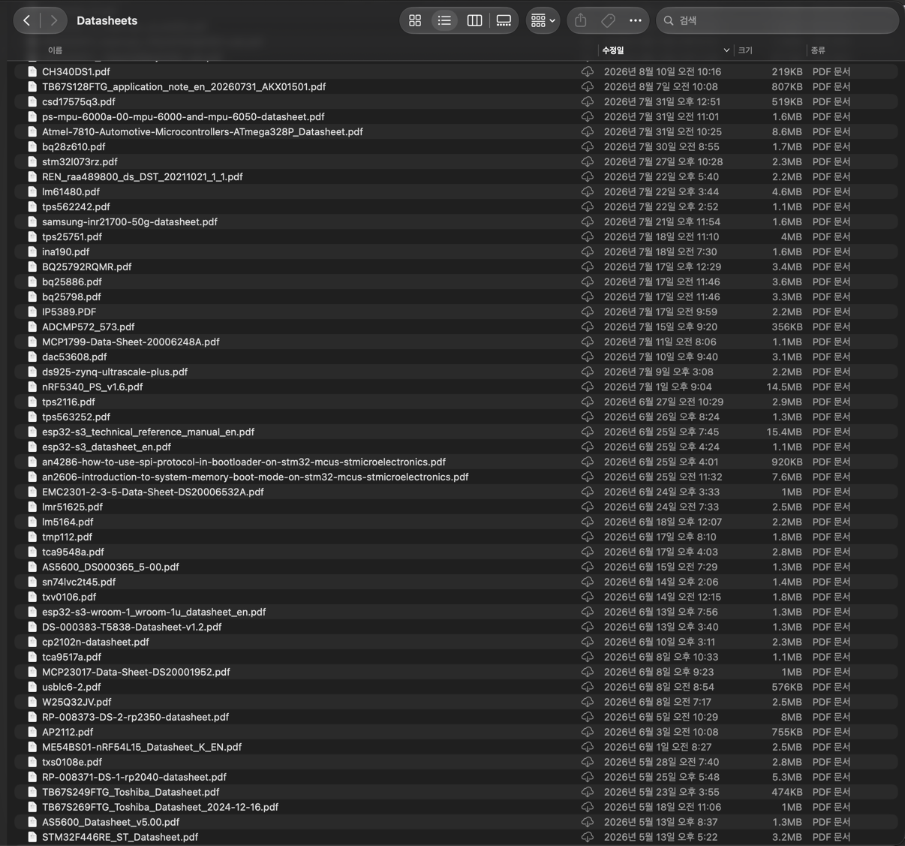